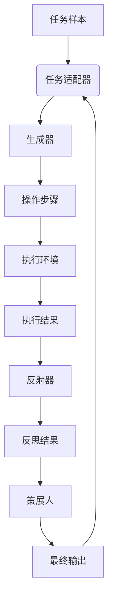
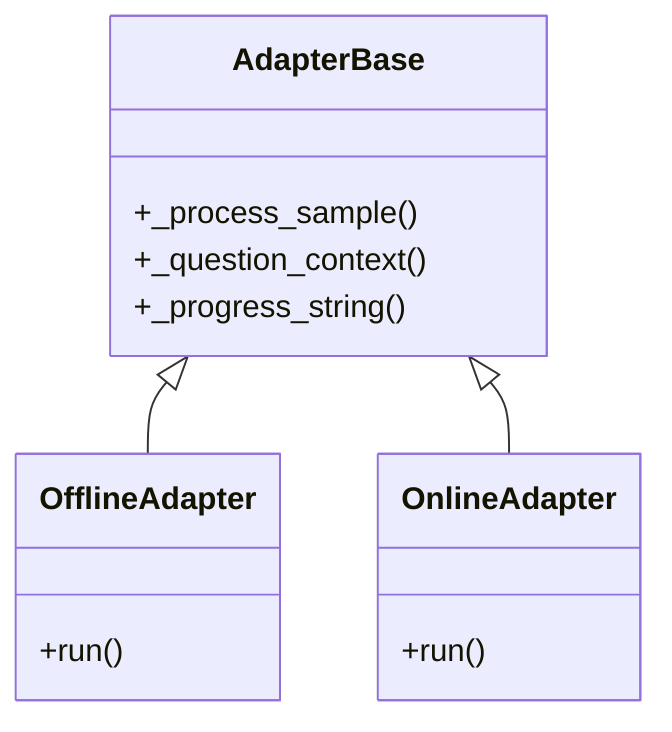
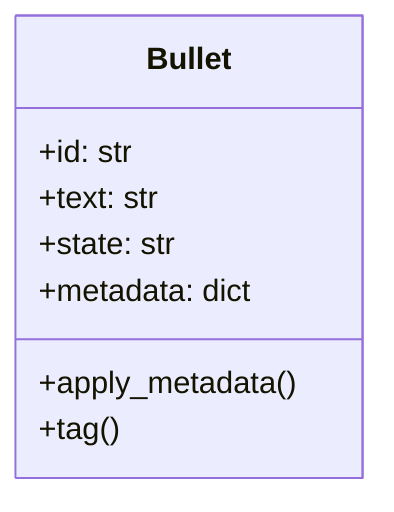
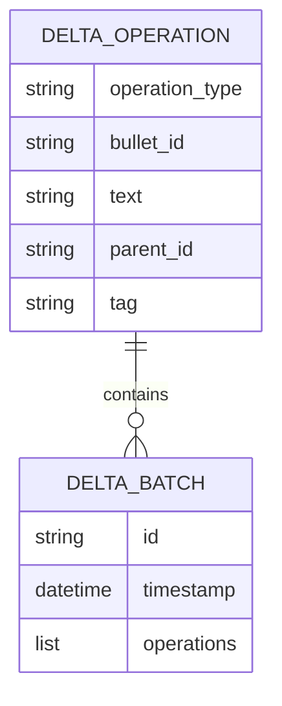
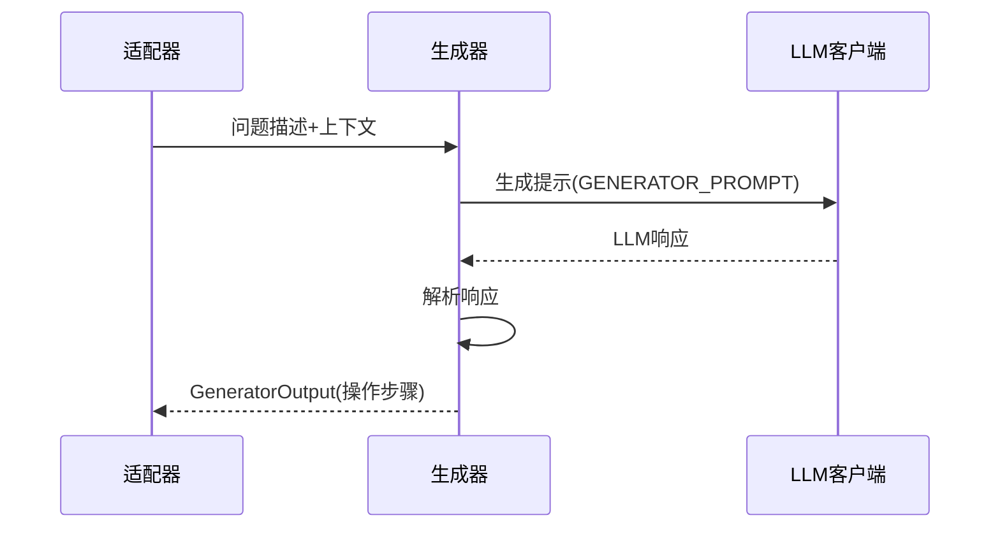
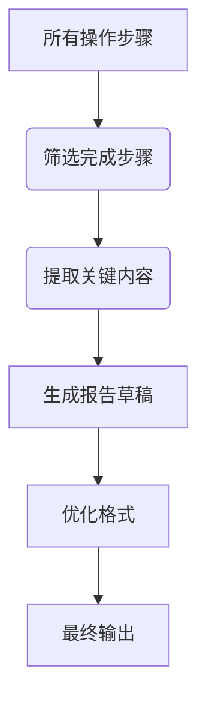
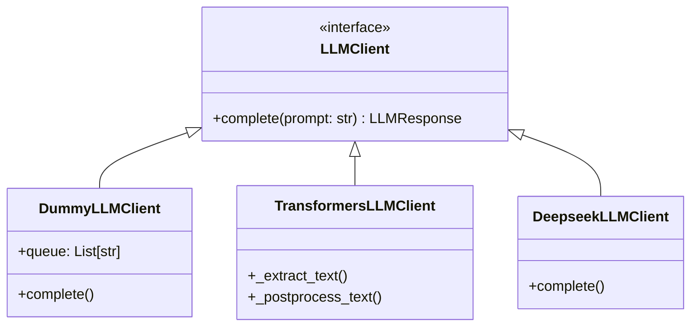

<details>
<summary>相关源文件</summary>

- [ace/adaptation.py](ace/adaptation.py) 定义适配器基类和具体实现（离线/在线适配器），以及任务环境管理
- [ace/delta.py](ace/delta.py) 定义Delta操作和批量操作的数据结构，支持JSON序列化
- [ace/llm.py](ace/llm.py) 定义LLM客户端接口和具体实现（模拟、Hugging Face、Deepseek）
- [ace/playbook.py](ace/playbook.py) 定义操作步骤管理器（Playbook）和单个操作步骤（Bullet）
- [ace/prompts.py](ace/prompts.py) 包含系统提示模板（生成器、反射器、策展人）
- [ace/roles.py](ace/roles.py) 定义核心角色（生成器、反射器、策展人）及其处理逻辑
- [scripts/run_local_adapter.py](scripts/run_local_adapter.py) 展示适配器的简单使用方式
- [scripts/run_questions.py](scripts/run_questions.py) 展示复杂问题处理流程
- [tests/test_adaptation.py](tests/test_adaptation.py) 适配器组件的测试用例

</details>

# 核心组件架构

## 1. 引言

核心组件架构是ACE（Adaptive Cognitive Engine）系统的核心实现，负责处理认知任务的自适应执行流程。该架构基于"生成-反思-策展"的认知循环模型，通过协调多个专业角色（生成器、反射器、策展人）完成复杂问题求解。系统接收问题样本作为输入，通过多轮迭代生成操作步骤，评估执行结果，最终输出结构化解决方案。

整个架构围绕Playbook（操作步骤管理器）展开，通过Delta操作实现步骤的动态更新。系统支持离线批处理和在线交互两种模式，可灵活适应不同应用场景。架构中的关键组件包括任务适配器、LLM客户端、角色处理器和操作管理器，它们协同工作实现端到端的认知任务处理流程。

## 2. 架构概览

### 2.1 核心组件关系


### 2.2 组件功能概述

| 组件 | 主要职责 | 关键类/函数 |
|------|----------|------------|
| 任务适配器 | 协调认知循环执行流程 | AdapterBase, OfflineAdapter, OnlineAdapter |
| LLM集成 | 提供大语言模型访问能力 | LLMClient, TransformersLLMClient, DeepseekLLMClient |
| 角色处理器 | 实现专业角色逻辑 | Generator, Reflector, Curator |
| 操作管理 | 维护操作步骤状态 | Playbook, Bullet |
| Delta系统 | 管理操作变更 | DeltaOperation, DeltaBatch |
| 执行环境 | 评估操作结果 | TaskEnvironment, SimpleQAEnvironment, FireInvestigationEnvironment |

## 3. 任务适配器组件

### 3.1 适配器基类（AdapterBase）

AdapterBase是任务处理的核心协调者，实现了认知循环的主流程：

1. 初始化任务环境
2. 构建问题上下文
3. 调用生成器创建操作步骤
4. 执行操作并评估结果
5. 调用反射器分析结果
6. 调用策展人生成最终输出

关键方法：
- `_process_sample()`: 处理单个样本的完整流程
- `_question_context()`: 构建问题描述上下文
- `_progress_string()`: 生成进度状态描述

<details>
<summary>相关源文件</summary>

- [ace/adaptation.py:104-145](ace/adaptation.py) AdapterBase._process_sample方法实现
- [ace/adaptation.py:91-99](ace/adaptation.py) AdapterBase._question_context方法实现

</details>

### 3.2 适配器实现

系统提供两种适配器实现：

**离线适配器（OfflineAdapter）**
- 批量处理多个样本
- 无用户交互
- 适用于自动化任务处理

**在线适配器（OnlineAdapter）**
- 单样本处理
- 支持实时交互
- 适用于探索性任务



<details>
<summary>相关源文件</summary>

- [ace/adaptation.py:148-170](ace/adaptation.py) OfflineAdapter实现
- [ace/adaptation.py:173-193](ace/adaptation.py) OnlineAdapter实现

</details>

## 4. 操作管理系统

### 4.1 Playbook（操作步骤管理器）

Playbook是操作步骤的核心容器，提供完整的操作管理功能：

- 添加/更新/删除操作步骤
- 标记操作状态
- 序列化/反序列化
- 应用Delta操作
- 生成提示格式

关键特性：
- 每个操作步骤有唯一ID
- 支持操作元数据
- 可生成统计信息

```python
class Playbook:
    def add_bullet(self, text: str, parent_id: str = None) -> Bullet:
        # 添加新操作步骤
        
    def update_bullet(self, bullet_id: str, text: str) -> Bullet:
        # 更新操作内容
        
    def apply_delta(self, delta: DeltaBatch) -> List[Bullet]:
        # 应用Delta操作
```

<details>
<summary>相关源文件</summary>

- [ace/playbook.py:43-215](ace/playbook.py) Playbook类完整实现
- [ace/playbook.py:151-153](ace/playbook.py) apply_delta方法实现

</details>

### 4.2 Bullet（操作步骤）

Bullet表示单个操作步骤，包含：

- 文本内容
- 状态标签（待处理/进行中/完成）
- 元数据（创建时间、更新时间）
- 层级关系（父子步骤）



<details>
<summary>相关源文件</summary>

- [ace/playbook.py:14-40](ace/playbook.py) Bullet类实现

</details>

### 4.3 Delta系统

Delta系统管理操作步骤的变更，支持：

- 操作创建/更新/删除
- 批量操作处理
- JSON序列化/反序列化



<details>
<summary>相关源文件</summary>

- [ace/delta.py:13-43](ace/delta.py) DeltaOperation类实现
- [ace/delta.py:47-67](ace/delta.py) DeltaBatch类实现

</details>

## 5. 角色处理器

### 5.1 生成器（Generator）

生成器负责创建初始操作步骤：

1. 接收问题描述
2. 生成操作步骤草案
3. 解析为结构化操作

关键方法：
- `generate()`: 执行生成流程
- 输出为GeneratorOutput结构



<details>
<summary>相关源文件</summary>

- [ace/roles.py:44-101](ace/roles.py) Generator类实现
- [ace/prompts.py:3-25](ace/prompts.py) GENERATOR_PROMPT模板

</details>

### 5.2 反射器（Reflector）

反射器分析操作执行结果：

1. 接收操作步骤和执行结果
2. 生成反思建议
3. 确定下一步行动

关键能力：
- 识别成功/失败操作
- 提出改进建议
- 决定继续/终止

<details>
<summary>相关源文件</summary>

- [ace/roles.py:121-201](ace/roles.py) Reflector类实现
- [ace/prompts.py:28-55](ace/prompts.py) REFLECTOR_PROMPT模板

</details>

### 5.3 策展人（Curator）

策展人整合最终输出：

1. 收集所有操作步骤
2. 过滤关键信息
3. 生成结构化报告



<details>
<summary>相关源文件</summary>

- [ace/roles.py:210-257](ace/roles.py) Curator类实现
- [ace/prompts.py:58-89](ace/prompts.py) CURATOR_PROMPT模板

</details>

## 6. LLM集成系统

### 6.1 LLM客户端架构



### 6.2 关键实现细节

**TransformersLLMClient**
- 支持本地Hugging Face模型
- 文本提取和后处理
- 可配置生成参数

**DeepseekLLMClient**
- 集成Deepseek API
- 处理API请求/响应
- 错误处理和重试机制

<details>
<summary>相关源文件</summary>

- [ace/llm.py:51-172](ace/llm.py) TransformersLLMClient实现
- [ace/llm.py:175-211](ace/llm.py) DeepseekLLMClient实现

</details>

## 7. 执行环境系统

### 7.1 环境基类（TaskEnvironment）

提供操作执行和评估的抽象接口：

```python
class TaskEnvironment:
    def evaluate(self, playbook: Playbook) -> EnvironmentResult:
        # 执行操作并返回结果
```

### 7.2 环境实现

**简单QA环境（SimpleQAEnvironment）**
- 基于文本匹配的评估
- 支持简单问答场景

**火灾调查环境（FireInvestigationEnvironment）**
- 专业领域实现
- 复杂结果评估
- 生成详细报告

<details>
<summary>相关源文件</summary>

- [scripts/run_local_adapter.py:38-54](scripts/run_local_adapter.py) SimpleQAEnvironment实现
- [scripts/run_questions.py:42-66](scripts/run_questions.py) FireInvestigationEnvironment实现

</details>

## 8. 总结

核心组件架构通过模块化设计实现了自适应认知引擎的核心功能。系统以Playbook为中心，协调生成器、反射器、策展人三个专业角色完成认知循环。Delta系统提供灵活的操作管理，LLM集成支持多种大模型后端，环境系统实现领域特定的执行逻辑。

该架构支持离线批处理和在线交互两种模式，可扩展适应不同应用场景。通过清晰的组件边界和标准接口，系统保持高度可扩展性，新功能可通过实现标准接口无缝集成。测试组件确保核心逻辑的可靠性，示例脚本展示端到端使用场景。

<details>
<summary>相关源文件</summary>

- [tests/test_adaptation.py:30-95](tests/test_adaptation.py) 适配器测试用例
- [scripts/run_questions.py:221-262](scripts/run_questions.py) 问题处理主流程
- [ace/adaptation.py:33-40](ace/adaptation.py) TaskEnvironment接口定义

</details>