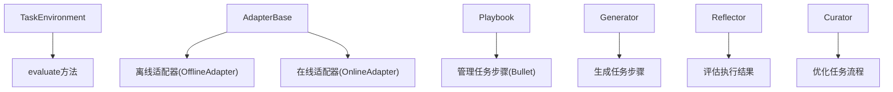
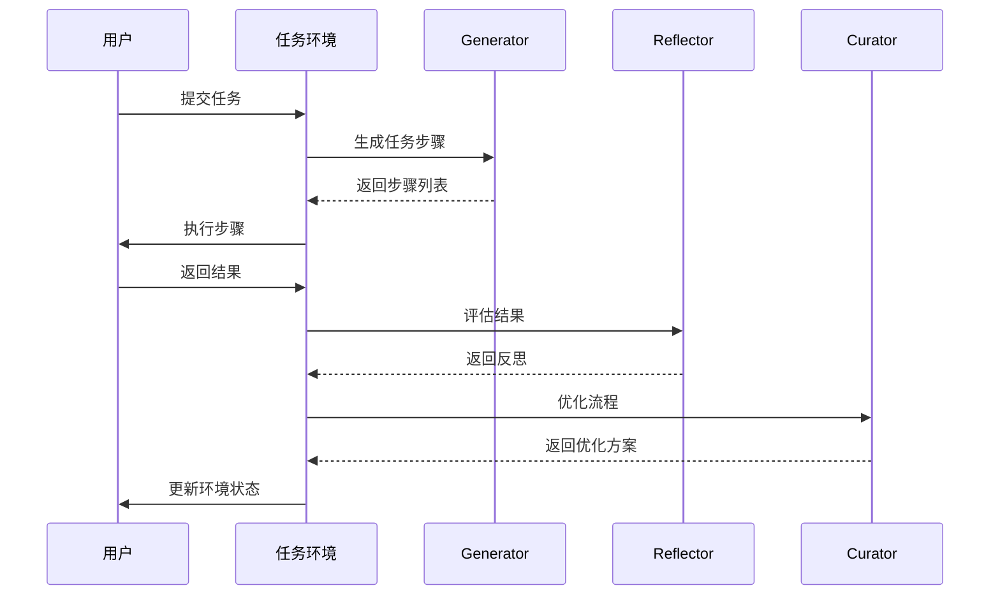

<details>
<summary>相关源文件</summary>

- [ace/adaptation.py](ace/adaptation.py) 定义了任务环境核心类TaskEnvironment和适配器基类AdapterBase
- [ace/playbook.py](ace/playbook.py) 管理任务执行流程，包含添加、更新和标记任务步骤的方法
- [ace/roles.py](ace/roles.py) 定义了任务环境中的关键角色：生成器、反思器和策划者
- [ace/prompts.py](ace/prompts.py) 包含任务环境的关键提示词模板
- [scripts/run_local_adapter.py](scripts/run_local_adapter.py) 实现了自定义任务环境的具体示例

<!-- Add additional relevant files if fewer than 5 were provided -->
</details>

# 自定义任务环境

## 1. 介绍

自定义任务环境是ACE框架的核心组件，负责管理任务执行流程和环境评估。它通过定义任务步骤、角色职责和环境交互规则，为复杂任务提供结构化执行框架。环境的核心是`TaskEnvironment`类，它定义了环境评估的基本接口，而具体实现如`SimpleQAEnvironment`则提供了特定场景下的评估逻辑。

环境工作流程涉及三个关键角色：生成器(Generator)负责创建任务步骤，反思器(Reflector)评估执行结果，策划者(Curator)优化任务流程。这些角色通过提示词模板协同工作，形成闭环的任务执行系统。

<details>
<summary>相关源文件</summary>

- [ace/adaptation.py:33-40]() 定义TaskEnvironment基类
- [scripts/run_local_adapter.py:38-54]() 实现SimpleQAEnvironment具体环境
- [ace/roles.py:44-101,121-201,210-257]() 定义Generator、Reflector和Curator角色
</details>

## 2. 核心架构

### 2.1 任务环境组件



自定义任务环境由以下核心组件构成：
- **TaskEnvironment**：环境基类，定义`evaluate`接口
- **AdapterBase**：适配器基类，实现任务处理核心逻辑
- **Playbook**：管理任务执行流程和步骤
- **角色系统**：Generator、Reflector和Curator协同工作

<details>
<summary>相关源文件</summary>

- [ace/adaptation.py:33-40,53-145]() TaskEnvironment和AdapterBase实现
- [ace/playbook.py:43-215]() Playbook类管理任务步骤
- [ace/roles.py:44-101,121-201,210-257]() 角色系统实现
</details>

### 2.2 环境工作流程



工作流程详解：
1. 用户提交任务到任务环境
2. 环境调用Generator生成任务步骤
3. 用户执行步骤并返回结果
4. 环境调用Reflector评估结果
5. 环境调用Curator优化任务流程
6. 环境更新状态并反馈给用户

<details>
<summary>相关源文件</summary>

- [ace/adaptation.py:104-145]() AdapterBase._process_sample实现流程
- [ace/roles.py:58-101,135-201,224-257]() 各角色核心方法
</details>

## 3. 关键实现

### 3.1 环境评估接口

`TaskEnvironment`基类定义环境评估接口，具体环境需实现`evaluate`方法：

```python
class TaskEnvironment:
    def evaluate(self, sample: Sample) -> EnvironmentResult:
        """评估任务样本并返回环境结果"""
        # 具体实现
```

在`SimpleQAEnvironment`中的实现示例：
```python
class SimpleQAEnvironment(TaskEnvironment):
    def evaluate(self, sample: Sample) -> EnvironmentResult:
        # 实际评估逻辑
        return EnvironmentResult(...)
```

<details>
<summary>相关源文件</summary>

- [ace/adaptation.py:33-40]() TaskEnvironment接口定义
- [scripts/run_local_adapter.py:41-54]() SimpleQAEnvironment具体实现
</details>

### 3.2 提示词模板

任务环境使用预定义的提示词模板指导角色行为：

| 模板类型 | 用途 | 位置 |
|---------|------|------|
| GENERATOR_PROMPT | 指导Generator生成任务步骤 | prompts.py:3-25 |
| REFLECTOR_PROMPT | 指导Reflector评估任务结果 | prompts.py:28-55 |
| CURATOR_PROMPT | 指导Curator优化任务流程 | prompts.py:58-89 |

<details>
<summary>相关源文件</summary>

- [ace/prompts.py:3-89]() 三种提示词模板实现
</details>

## 4. 自定义环境实现

创建自定义任务环境的步骤：
1. 继承`TaskEnvironment`基类
2. 实现`evaluate`方法
3. 定义环境特定的评估逻辑
4. 可选：集成自定义角色或提示词

```python
class CustomEnvironment(TaskEnvironment):
    def __init__(self, config):
        # 初始化配置
        
    def evaluate(self, sample):
        # 自定义评估逻辑
        return EnvironmentResult(...)
```

<details>
<summary>相关源文件</summary>

- [scripts/run_local_adapter.py:38-54]() SimpleQAEnvironment实现参考
</details>

## 5. 总结

自定义任务环境是ACE框架的任务执行引擎，通过定义标准化的环境接口和角色系统，为复杂任务提供灵活的执行框架。核心组件包括：
- TaskEnvironment定义环境评估接口
- Playbook管理任务步骤
- Generator、Reflector和Curator角色协同工作
- 提示词模板指导角色行为

开发者可以通过继承TaskEnvironment并实现evaluate方法，创建特定场景的自定义环境。环境工作流程遵循生成→执行→反思→优化的闭环模式，确保任务高效执行。

<details>
<summary>相关源文件</summary>

- [ace/adaptation.py]() 环境核心实现
- [ace/playbook.py]() 任务流程管理
- [ace/roles.py]() 角色系统
- [ace/prompts.py]() 提示词模板
- [scripts/run_local_adapter.py]() 自定义环境示例
</details>