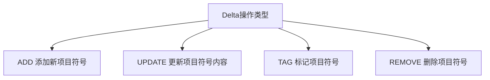
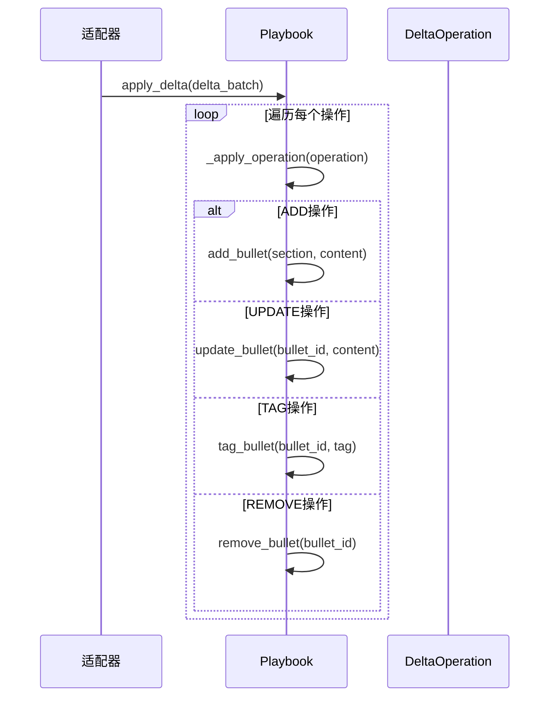
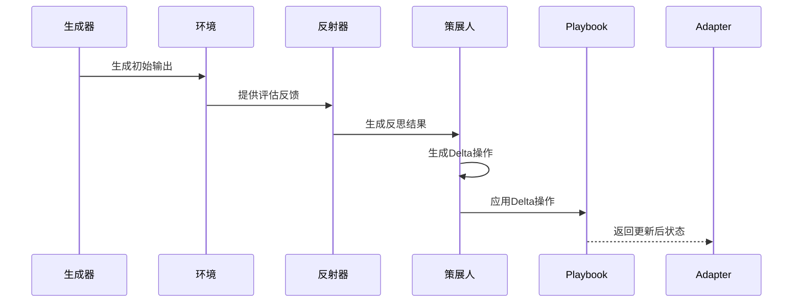

<details>
<summary>相关源文件</summary>

- [ace/delta.py](ace/delta.py) 定义Delta操作的核心数据结构（DeltaOperation和DeltaBatch）
- [ace/playbook.py](ace/playbook.py) 实现Delta操作的应用逻辑（apply_delta和_apply_operation方法）
- [ace/adaptation.py](ace/adaptation.py) 包含Delta操作的生命周期流程（_process_sample方法）
- [ace/roles.py](ace/roles.py) 定义生成Delta操作的策展人角色（Curator类）
- [ace/prompts.py](ace/prompts.py) 提供生成Delta操作的提示词模板（CURATOR_PROMPT等）

</details>

# Delta操作机制

## 1. 介绍

Delta操作机制是ACE系统的核心变更管理框架，负责对Playbook（剧本）进行增量式更新。该机制通过定义标准化的操作类型（ADD/UPDATE/TAG/REMOVE）和批处理结构（DeltaBatch），实现了对Playbook内容的精确修改。Delta操作由Curator（策展人）角色生成，通过Adapter（适配器）应用到Playbook中，形成完整的"生成-评估-反思-应用"工作流。

Delta操作机制的主要特点包括：
- **原子性**：每个DeltaOperation代表一个独立的Playbook变更
- **批处理**：多个操作可打包为DeltaBatch统一应用
- **可追溯**：每个操作包含详细的元数据和推理说明
- **可扩展**：支持多种操作类型满足不同变更需求

## 2. 核心数据结构

### 2.1 DeltaOperation（单个操作）

DeltaOperation表示对Playbook的单个变更操作，包含以下关键属性：

| 属性名 | 类型 | 描述 |
|--------|------|------|
| `type` | OperationType | 操作类型（ADD/UPDATE/TAG/REMOVE） |
| `section` | str | 目标部分名称 |
| `content` | Optional[str] | 操作内容（对于ADD/UPDATE类型） |
| `bullet_id` | Optional[str] | 目标项目符号ID（对于UPDATE/TAG/REMOVE类型） |
| `metadata` | Dict[str, int] | 操作元数据（主要用于TAG操作） |

<details>
<summary>相关源文件</summary>

- [ace/delta.py:13-43]() DeltaOperation类定义
- [ace/delta.py:9]() OperationType枚举定义

</details>

### 2.2 DeltaBatch（操作批处理）

DeltaBatch表示一组相关的Delta操作，包含以下属性：

| 属性名 | 类型 | 描述 |
|--------|------|------|
| `reasoning` | str | 批处理操作的推理说明 |
| `operations` | List[DeltaOperation] | 包含的Delta操作列表 |

```python
class DeltaBatch:
    """Bundle of curator reasoning and operations."""
    
    reasoning: str
    operations: List[DeltaOperation] = field(default_factory=list)
    
    @classmethod
    def from_json(cls, payload: Dict[str, object]) -> "DeltaBatch":
        # 反序列化逻辑
        return cls(reasoning=str(payload.get("reasoning", "")), operations=operations)
    
    def to_json(self) -> Dict[str, object]:
        # 序列化逻辑
        return {
            "reasoning": self.reasoning,
            "operations": [op.to_json() for op in self.operations],
        }
```

<details>
<summary>相关源文件</summary>

- [ace/delta.py:47-67]() DeltaBatch类实现
- [ace/roles.py:205-207]() CuratorOutput类包含DeltaBatch

</details>

## 3. 操作类型与应用

Delta操作机制支持四种基本操作类型：



### 3.1 操作应用流程

Delta操作通过Playbook的apply_delta方法应用到当前Playbook：



<details>
<summary>相关源文件</summary>

- [ace/playbook.py:151-180]() apply_delta和_apply_operation方法实现
- [ace/adaptation.py:137]() 在_process_sample中调用apply_delta

</details>

## 4. 生命周期与工作流

Delta操作在ACE系统中经历完整的生命周期：



1. **生成阶段**：Generator根据问题上下文生成初始响应
2. **评估阶段**：Environment评估生成结果并提供反馈
3. **反思阶段**：Reflector分析评估结果生成反思
4. **策展阶段**：Curator将反思转化为Delta操作
5. **应用阶段**：Adapter将Delta操作应用到Playbook

<details>
<summary>相关源文件</summary>

- [ace/adaptation.py:104-145]() _process_sample方法实现完整生命周期
- [ace/roles.py:210-257]() Curator类生成Delta操作

</details>

## 5. 提示词与生成

Delta操作的生成依赖于精心设计的提示词模板，特别是CURATOR_PROMPT：

```python
CURATOR_PROMPT = """
作为策展人，你的任务是将反思转化为具体的Playbook更新操作：
1. 分析反思中的关键见解
2. 确定需要添加/修改/删除的内容
3. 生成结构化的Delta操作

输出格式：
{
  "reasoning": "你的推理过程",
  "operations": [
    {"type": "ADD/UPDATE/TAG/REMOVE", ...}
  ]
}
"""
```

<details>
<summary>相关源文件</summary>

- [ace/prompts.py:58-89]() CURATOR_PROMPT定义
- [ace/roles.py:224-257]() Curator类使用提示词生成Delta操作

</details>

## 6. 总结

Delta操作机制是ACE系统的核心变更管理框架，通过标准化的操作类型和批处理结构，实现了对Playbook的精确、可追溯的增量式更新。该机制与生成器、反射器和策展人角色紧密协作，形成完整的"生成-评估-反思-应用"工作流，确保Playbook能够持续优化和适应新的需求。

Delta操作机制的主要优势包括：
- 提供结构化、标准化的Playbook变更方式
- 支持批量操作和原子级更新
- 完整的操作生命周期管理和追溯能力
- 与提示词工程结合实现智能化操作生成

<details>
<summary>相关源文件</summary>

- [ace/delta.py:1]() Delta操作模块文档说明
- [ace/__init__.py:4]() 模块导出DeltaOperation和DeltaBatch

</details>