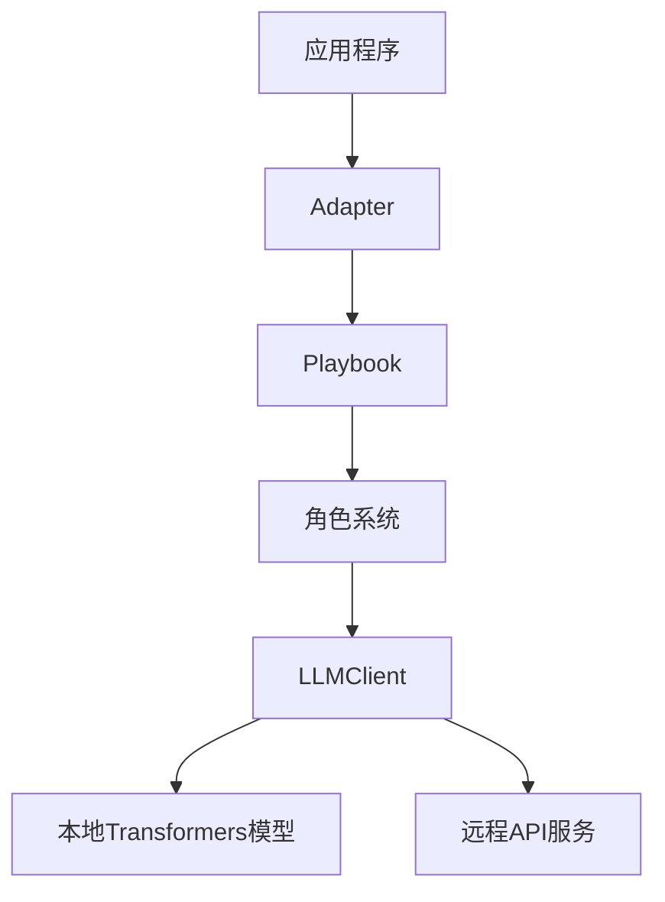
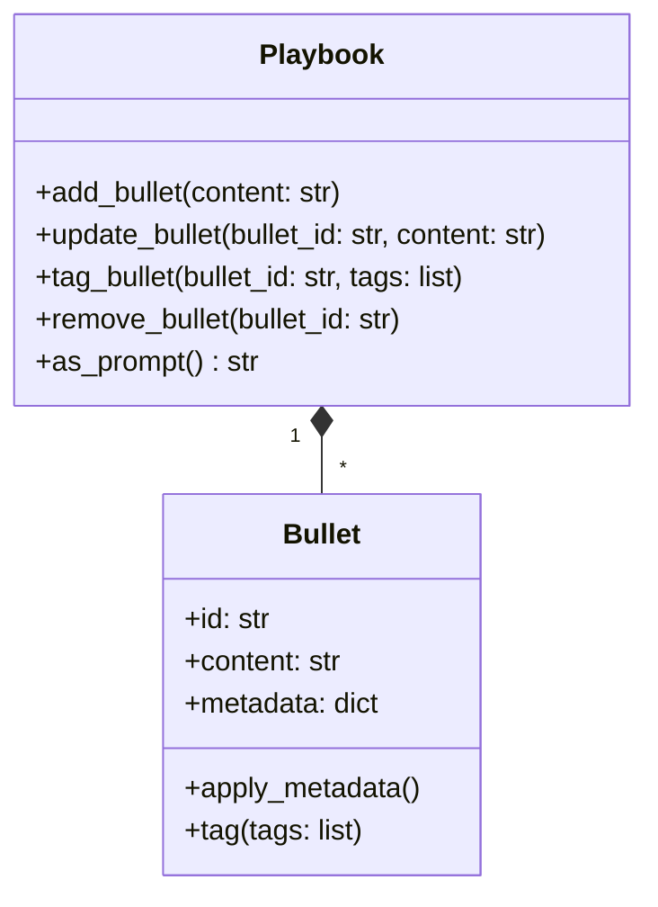
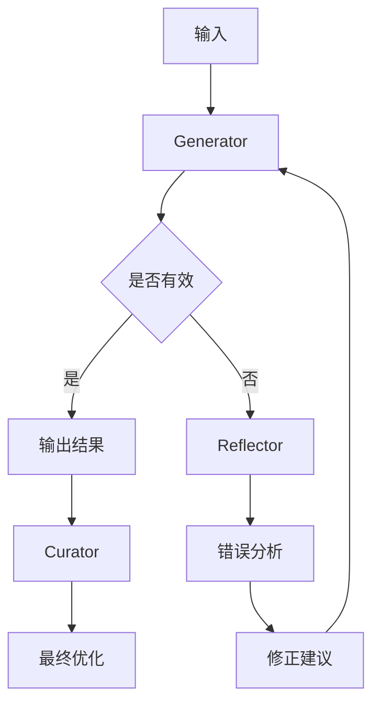
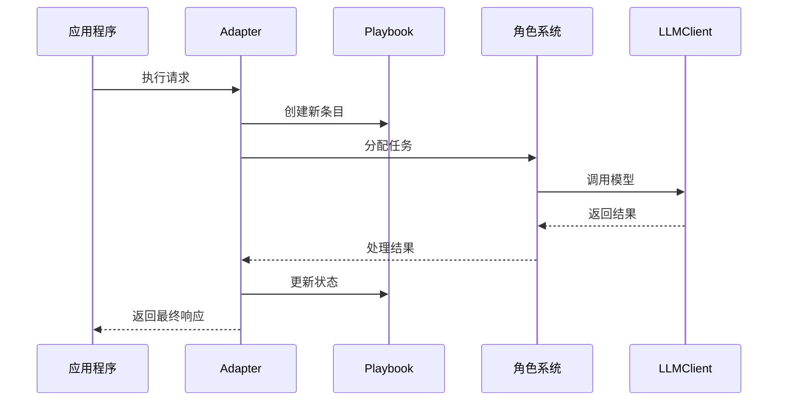
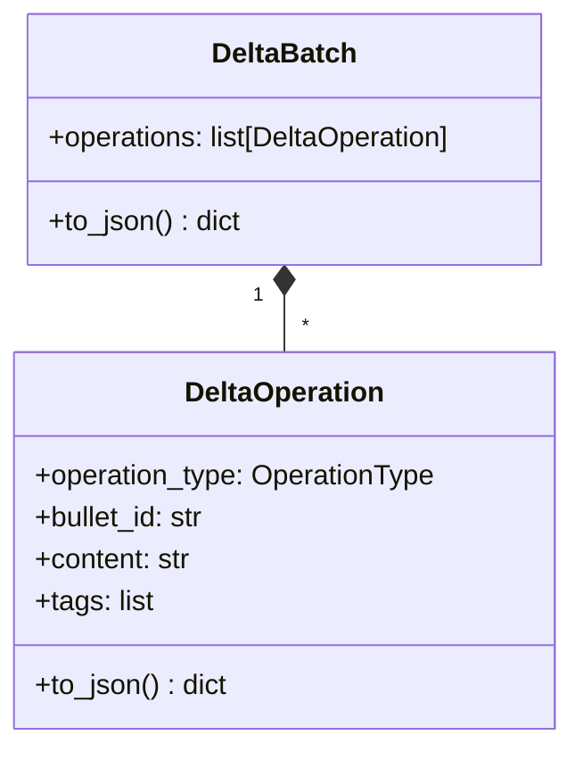

<details>
<summary>相关源文件</summary>

- [ace/llm.py](ace/llm.py) 包含LLM客户端核心实现，定义多种LLM客户端类型
- [ace/adaptation.py](ace/adaptation.py) 实现LLM与环境的交互适配逻辑
- [ace/playbook.py](ace/playbook.py) 管理LLM交互的剧本结构和操作
- [ace/prompts.py](ace/prompts.py) 定义LLM交互使用的提示词模板
- [ace/roles.py](ace/roles.py) 实现LLM交互的三大核心角色
- [ace/delta.py](ace/delta.py) 处理LLM交互中的增量操作

</details>

# LLM客户端集成

## 1. 引言

LLM客户端集成是ACE框架的核心组件，负责连接大型语言模型(LLM)与应用程序逻辑。该模块提供统一的客户端接口，支持多种LLM后端实现，包括本地Transformers模型和远程API服务。通过角色扮演模式(Generator/Reflector/Curator)和剧本管理(Playbook)，实现了结构化的LLM交互流程。

该集成模块位于`ace/`目录下，与[适配器模块](#适配器逻辑)和[角色系统](#角色系统)紧密协作，共同完成LLM的调用、结果处理和错误修正。

## 2. 架构概述

LLM客户端集成采用分层架构设计：


- **应用程序层**：通过Adapter发起LLM请求
- **协调层**：Playbook管理交互状态和操作历史
- **角色层**：Generator/Reflector/Curator处理特定任务
- **客户端层**：统一接口调用不同LLM实现

## 3. 核心组件

### 3.1 LLM客户端 (ace/llm.py)

LLM客户端提供统一的模型调用接口，支持多种实现：

| 客户端类型 | 描述 | 适用场景 |
|------------|------|----------|
| `LLMClient` | 抽象基类 | 定义客户端接口规范 |
| `DummyLLMClient` | 模拟客户端 | 测试和开发 |
| `TransformersLLMClient` | 本地模型客户端 | 离线环境运行 |
| `DeepseekLLMClient` | 特定模型客户端 | Deepseek API集成 |

关键方法：
- `complete(prompt: str) -> LLMResponse`: 执行LLM调用
- `_postprocess_text(text: str) -> str`: 结果后处理

### 3.2 剧本管理 (ace/playbook.py)

Playbook管理LLM交互的结构化记录：



关键功能：
- 维护交互历史记录
- 支持增删改查操作
- 生成上下文提示词

### 3.3 角色系统 (ace/roles.py)

角色系统实现职责分离的LLM交互模式：



#### 3.3.1 Generator角色
- 生成初始响应
- 处理结构化输出
- 错误捕获和重试

#### 3.3.2 Reflector角色
- 分析错误原因
- 生成修正建议
- 维护反思上下文

#### 3.3.3 Curator角色
- 结果精炼优化
- 格式标准化
- 质量保证

## 4. 提示词管理 (ace/prompts.py)

提示词模板使用YAML格式定义，包含：
- 系统角色设定
- 任务描述
- 输出格式要求
- 上下文注入点

```yaml
system: 你是一个经验丰富的软件工程师
task: 分析以下代码并解释其功能
output_format: 
  type: object
  properties:
    summary: 
      type: string
    complexity:
      type: string
      enum: [low, medium, high]
context: ${playbook_excerpt}
```

## 5. 适配器逻辑 (ace/adaptation.py)

适配器桥接应用程序与LLM集成层：



关键类：
- `AdapterBase`: 适配器基类
- `OfflineAdapter`: 离线批处理适配器
- `OnlineAdapter`: 实时交互适配器

## 6. 增量操作处理 (ace/delta.py)

Delta系统管理LLM交互中的增量更新：



支持操作类型：
- 添加条目
- 更新内容
- 标签管理
- 删除条目

## 7. 总结

LLM客户端集成提供了一套完整的解决方案，用于在应用程序中集成大型语言模型。通过角色扮演模式、剧本管理和统一客户端接口，实现了：
1. 标准化的LLM调用流程
2. 结构化的交互历史管理
3. 职责分离的错误处理机制
4. 灵活的后端模型支持

该模块支持从简单的提示词调用到复杂的多轮对话场景，是ACE框架实现自适应能力的关键基础组件。