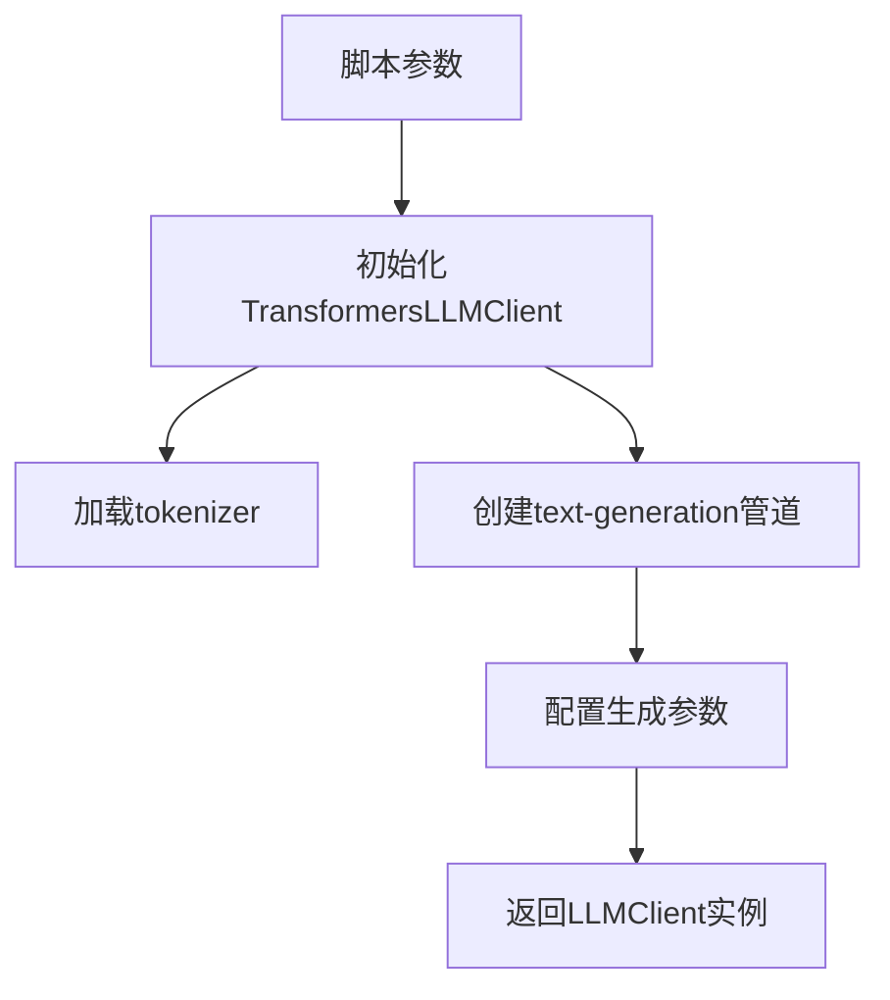
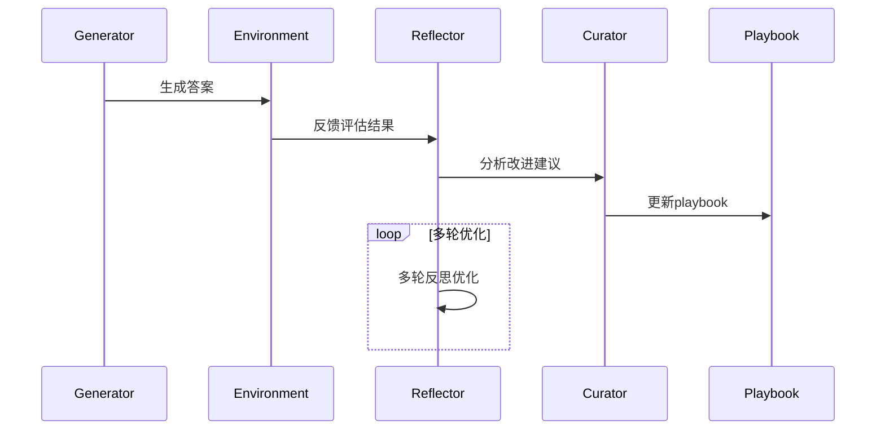

<details>
<summary>相关源文件</summary>

- [scripts/run_local_adapter.py](scripts/run_local_adapter.py) 本地部署核心脚本，实现模型加载和离线适配循环
- [README.md](README.md) 项目基础文档，包含环境要求和部署命令
- [ace/adaptation.py](ace/adaptation.py) ACE适配核心逻辑，定义离线/在线适配器
- [ace/llm.py](ace/llm.py) 模型加载实现，支持本地Transformers和DeepSeek API
- [scripts/run_questions.py](scripts/run_questions.py) 测试部署效果的脚本
</details>

# 本地部署指南

## 1. 简介

本地部署指南提供了在本地环境中运行Agentic Context Engineering (ACE)框架的完整流程。ACE是一个自改进语言模型框架，通过结构化playbook和三个代理角色（生成器、反射器、策展人）实现上下文工程。本地部署主要涉及加载本地模型权重、配置GPU资源以及运行离线适配循环。

本地部署适用于以下场景：
- 在私有环境中运行模型
- 使用自定义模型权重
- 控制GPU资源分配
- 进行离线模型适配实验

## 2. 系统要求

### 2.1 硬件要求
| 组件 | 最低要求 | 推荐配置 |
|------|----------|----------|
| GPU | 1x12GB VRAM | 2x24GB VRAM |
| CPU | 4核 | 8核 |
| 内存 | 16GB | 32GB |
| 存储 | 50GB HDD | 100GB SSD |

### 2.2 软件要求
| 软件 | 版本 | 说明 |
|------|------|------|
| Python | 3.9+ | 开发使用3.12 |
| PyTorch | 2.0+ | 需与CUDA版本匹配 |
| Transformers | 4.30+ | Hugging Face库 |
| CUDA | 11.7+ | GPU加速 |

## 3. 部署流程

### 3.1 环境准备
```bash
# 克隆仓库
git clone https://github.com/your-repo/ACE-open.git
cd ACE-open

# 创建虚拟环境
python -m venv ace-env
source ace-env/bin/activate

# 安装核心依赖
pip install torch transformers
```

### 3.2 模型准备
将模型权重放置在指定目录，支持以下格式：
- Hugging Face格式的完整模型文件
- PyTorch的.bin或.safetensors文件

目录结构示例：
```
/models/
  ├── config.json
  ├── pytorch_model.bin
  └── tokenizer.json
```

### 3.3 配置GPU设备
通过环境变量指定使用的GPU设备：
```bash
# 使用单卡
export CUDA_VISIBLE_DEVICES=0

# 使用多卡
export CUDA_VISIBLE_DEVICES=0,1
```

### 3.4 运行适配脚本
```bash
python scripts/run_local_adapter.py \
  --model-path /path/to/model \
  --cuda-visible-devices 0,1 \
  --max-new-tokens 512 \
  --temperature 0.0
```

## 4. 核心组件

### 4.1 模型加载器 (TransformersLLMClient)


关键配置参数：
| 参数 | 类型 | 默认值 | 说明 |
|------|------|--------|------|
| model-path | str | 无 | 模型权重路径 |
| max-new-tokens | int | 512 | 最大生成token数 |
| temperature | float | 0.0 | 采样温度 |
| torch_dtype | str | "bfloat16" | 计算精度 |
| device_map | str | "auto" | GPU设备映射 |

### 4.2 离线适配器 (OfflineAdapter)


适配流程：
1. 生成器根据问题生成答案
2. 环境评估答案正确性
3. 反射器分析错误原因
4. 策展人更新playbook
5. 循环优化直至达到最大轮数

## 5. 测试部署

### 5.1 运行单元测试
```bash
python -m unittest discover -s tests
```

### 5.2 执行示例问题
```bash
python scripts/run_questions.py \
  --model-path /path/to/model \
  --question-file questions.json
```

### 5.3 验证输出
成功部署后应看到类似输出：
```
Step 1:
  Question: Answer the question by returning the digits 42...
  Model final answer: 42
  Feedback: Prediction matched ground truth.
  Final playbook: Answer 42 when in doubt.
```

## 6. 高级配置

### 6.1 多GPU部署
```python
# 在代码中指定设备映射
client = TransformersLLMClient(
    model_path,
    device_map={
        "transformer.wte": 0,
        "transformer.h.0": 0,
        "transformer.h.1": 1,
        # ... 其他层分配
    }
)
```

### 6.2 混合精度训练
```python
# 使用fp16混合精度
client = TransformersLLMClient(
    model_path,
    torch_dtype="float16"
)
```

### 6.3 自定义playbook
```python
# 初始化时注入自定义playbook
adapter = OfflineAdapter(
    playbook=Playbook(initial_content="自定义指令..."),
    # ...其他参数
)
```

## 7. 故障排除

| 问题 | 解决方案 |
|------|----------|
| CUDA内存不足 | 减少max-new-tokens或使用更大batch size |
| 模型加载失败 | 检查模型路径和文件完整性 |
| 依赖冲突 | 使用虚拟环境或Docker容器 |
| 性能低下 | 启用混合精度或优化设备映射 |

## 8. 总结

本地部署ACE框架使研究人员能够在私有环境中运行和优化大型语言模型。核心流程包括：1) 准备Python环境 2) 加载模型权重 3) 配置GPU资源 4) 运行适配循环。通过TransformersLLMClient支持本地模型加载，OfflineAdapter实现多轮离线优化。部署成功后，可通过测试脚本验证模型性能，并通过高级配置优化资源利用率。