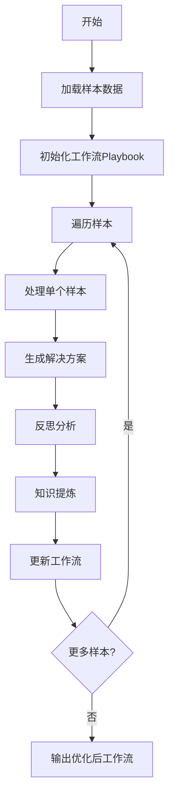
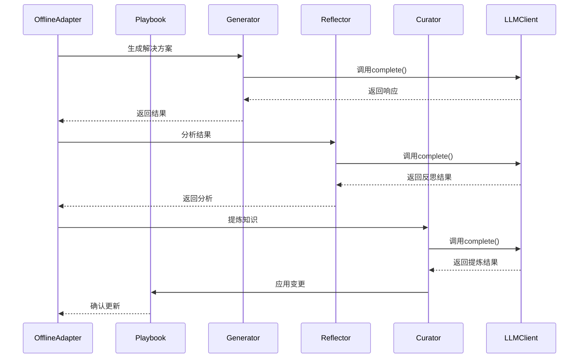

<details>
<summary>相关源文件</summary>

- [ace/adaptation.py](ace/adaptation.py) 包含离线适应循环的核心实现，特别是OfflineAdapter类及其run方法
- [ace/playbook.py](ace/playbook.py) 管理工作流程，包含Playbook类及其as_prompt方法
- [ace/roles.py](ace/roles.py) 定义关键角色如Reflector和Curator，包含反思和知识管理逻辑
- [ace/delta.py](ace/delta.py) 处理工作流变更操作，包含DeltaOperation和DeltaBatch类
- [ace/llm.py](ace/llm.py) 提供与大语言模型的交互接口，包含LLMClient及其实现

</details>

# 离线适应循环

## 1. 引言

离线适应循环是ACE框架中的核心机制，用于在非实时环境中迭代优化问题解决能力。该循环通过处理样本序列，结合反思和知识提炼过程，逐步改进系统的工作流程和决策能力。离线适应循环主要应用于批量数据处理场景，如历史问题分析、模型训练优化等。

系统基于工作流（Playbook）管理，通过Reflector角色进行错误分析和根因诊断，Curator角色提炼关键知识，最终形成可复用的工作流改进方案。整个过程不依赖实时用户交互，适合大规模自动化处理。

## 2. 架构与工作流程

### 2.1 核心组件

离线适应循环由以下关键组件构成：

| 组件 | 类/文件 | 功能描述 |
|------|---------|----------|
| 适配器 | OfflineAdapter (adaptation.py) | 管理整个适应循环的执行流程 |
| 工作流 | Playbook (playbook.py) | 存储和管理当前的工作流程状态 |
| 反思器 | Reflector (roles.py) | 分析错误并识别改进点 |
| 知识提炼器 | Curator (roles.py) | 提炼关键知识并更新工作流 |
| 变更操作 | DeltaOperation (delta.py) | 表示对工作流的增量变更 |
| LLM客户端 | LLMClient (llm.py) | 提供与大语言模型的交互能力 |

### 2.2 工作流程

离线适应循环的工作流程如下：



## 3. 详细实现

### 3.1 离线适配器 (OfflineAdapter)

OfflineAdapter类负责协调整个适应循环的执行。其核心方法是`run()`，实现批量样本的迭代处理：

```python
def run(
    self,
    samples: Sequence[Sample],
    environment: TaskEnvironment,
    epochs: int = 1,
) -> List[AdapterStepResult]:
    results: List[AdapterStepResult] = []
    total_steps = len(samples)
    for epoch_idx in range(1, epochs + 1):
        for step_idx, sample in enumerate(samples, start=1):
            result = self._process_sample(
                sample,
                environment,
                epoch=epoch_idx,
                total_epochs=epochs,
                step_index=step_idx,
                total_steps=total_steps,
            )
            results.append(result)
    return results
```

<details>
<summary>相关源文件</summary>

- [ace/adaptation.py:151-170](ace/adaptation.py) OfflineAdapter.run方法实现

</details>

### 3.2 反思过程 (Reflector)

Reflector类负责分析问题解决过程中的错误，识别根本原因并提炼改进点。核心方法是`reflect()`：

```python
def reflect(
    self,
    *,
    question: str,
    generator_output: GeneratorOutput,
    playbook: Playbook,
    ground_truth: Optional[str],
    feedback: Optional[str],
    max_refinement_rounds: int = 1,
    **kwargs: Any,
) -> ReflectorOutput:
    playbook_excerpt = _make_playbook_excerpt(playbook, generator_output.bullet_ids)
    base_prompt = self.prompt_template.format(
        question=question,
        reasoning=generator_output.reasoning,
        prediction=generator_output.final_answer,
        ground_truth=_format_optional(ground_truth),
        feedback=_format_optional(feedback),
        playbook_excerpt=playbook_excerpt or "(no bullets referenced)",
    )
    # ... (处理逻辑)
```

<details>
<summary>相关源文件</summary>

- [ace/roles.py:135-201](ace/roles.py) Reflector.reflect方法实现

</details>

### 3.3 知识提炼 (Curator)

Curator类负责从反思结果中提炼关键知识，并更新工作流。核心方法是`curate()`：

```python
def curate(
    self,
    *,
    question: str,
    reflection: ReflectorOutput,
    playbook: Playbook,
    **kwargs: Any,
) -> CuratorOutput:
    # 准备提示模板
    prompt = self.prompt_template.format(
        question=question,
        error_identification=reflection.error_identification,
        root_cause_analysis=reflection.root_cause_analysis,
        correct_approach=reflection.correct_approach,
        key_insight=reflection.key_insight,
        playbook_excerpt=_make_playbook_excerpt(playbook),
    )
    # ... (处理逻辑)
```

<details>
<summary>相关源文件</summary>

- [ace/roles.py:224-257](ace/roles.py) Curator.curate方法实现

</details>

### 3.4 工作流管理 (Playbook)

Playbook类管理当前的工作流程状态，核心方法`as_prompt()`将工作流转换为LLM可理解的提示格式：

```python
def as_prompt(self, max_bullets: int = 20) -> str:
    lines = []
    for bullet in self.bullets[:max_bullets]:
        lines.append(f"- {bullet.content}")
        if bullet.metadata:
            lines.append(f"  Metadata: {bullet.metadata}")
    return "\n".join(lines)
```

<details>
<summary>相关源文件</summary>

- [ace/playbook.py:185-196](ace/playbook.py) Playbook.as_prompt方法实现

</details>

### 3.5 变更操作 (DeltaOperation)

DeltaOperation类表示对工作流的增量变更操作，支持JSON序列化：

```python
class DeltaOperation:
    def __init__(
        self,
        operation_type: OperationType,
        bullet_id: str,
        content: Optional[str] = None,
        metadata: Optional[Dict[str, Any]] = None,
        tag: Optional[str] = None,
    ):
        self.operation_type = operation_type
        self.bullet_id = bullet_id
        self.content = content
        self.metadata = metadata
        self.tag = tag
```

<details>
<summary>相关源文件</summary>

- [ace/delta.py:13-43](ace/delta.py) DeltaOperation类实现

</details>

## 4. 数据流与交互

### 4.1 离线适应循环序列图



## 5. 总结

离线适应循环是ACE框架中实现系统自我改进的核心机制，通过迭代处理样本数据，结合反思和知识提炼过程，逐步优化工作流程和决策能力。该机制具有以下特点：

1. **批量处理能力**：支持大规模样本数据的离线处理
2. **工作流驱动**：基于Playbook管理当前状态和变更
3. **角色分工**：Reflector和Curator各司其职，分别负责错误分析和知识提炼
4. **LLM集成**：充分利用大语言模型的分析和生成能力
5. **增量更新**：通过DeltaOperation实现工作流的渐进式改进

该机制适用于需要持续优化的AI系统，特别是在缺乏实时反馈的场景下，通过历史数据分析实现系统能力的持续提升。

<details>
<summary>相关源文件</summary>

- [ace/adaptation.py](ace/adaptation.py) 整体实现
- [ace/roles.py](ace/roles.py) 角色定义
- [ace/playbook.py](ace/playbook.py) 工作流管理
- [ace/delta.py](ace/delta.py) 变更操作
- [ace/llm.py](ace/llm.py) LLM集成

</details>