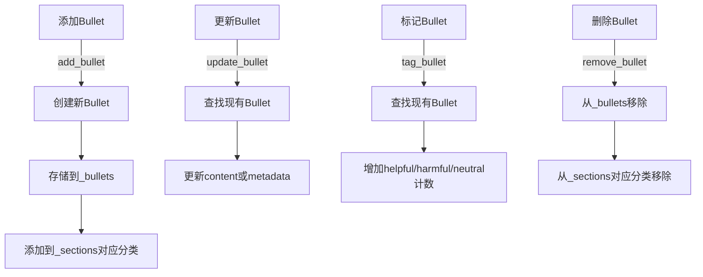
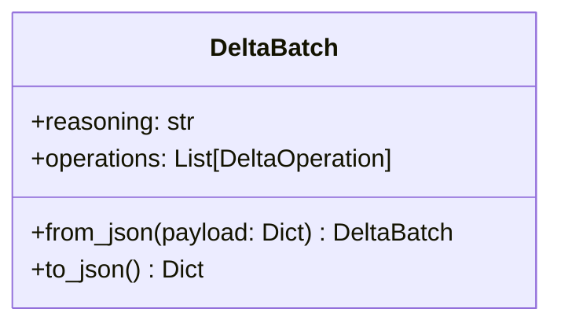
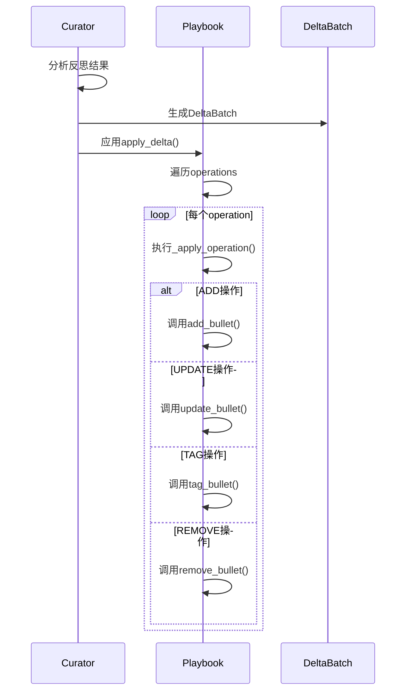
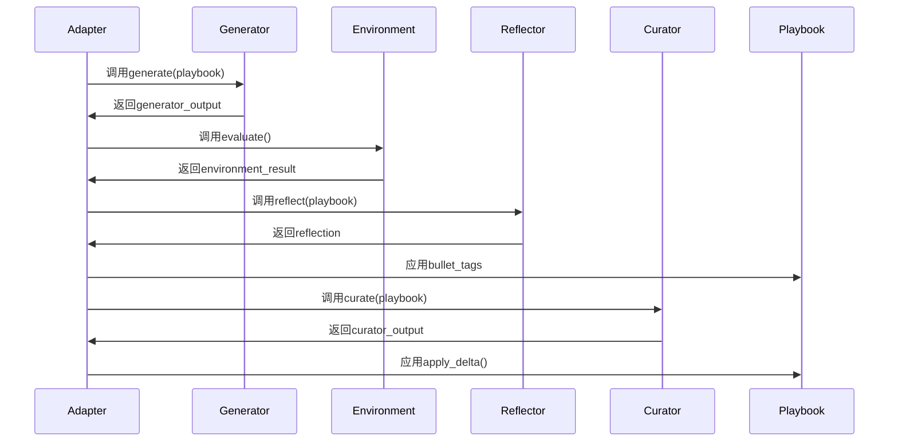

<details>
<summary>相关源文件</summary>

- [./ace/playbook.py]()：Playbook核心实现，定义数据结构和操作方法
- [./ace/roles.py]()：Playbook在不同角色中的使用场景
- [./ace/delta.py]()：定义Playbook的变更操作
- [./ace/adaptation.py]()：Playbook的自适应处理逻辑
- [./ace/prompts.py]()：包含使用Playbook的提示模板
- [./ace/__init__.py]()：模块导出Playbook类

<!-- Add additional relevant files if fewer than 5 were provided -->
</details>

# Playbook数据结构

## 1. 引言

Playbook是ACE（Adaptive Context Engine）系统的核心数据结构，用于存储和管理策略知识库。它采用类似军事作战手册的概念，将解决问题的策略组织为可重用的"子弹"(Bullet)。Playbook在ACE系统中扮演以下关键角色：

1. **知识存储**：作为结构化策略库，存储经过验证的问题解决方法
2. **上下文提供**：在生成答案时为LLM提供相关策略上下文
3. **自适应学习**：通过用户反馈和系统反思持续优化策略内容
4. **协作基础**：连接Generator、Reflector和Curator三个核心角色

Playbook的设计支持离线批处理和在线实时更新两种模式，使ACE系统能够持续进化。其数据结构经过优化，支持高效查询、序列化和增量更新。

<details>
<summary>相关源文件</summary>

- [./ace/playbook.py:43-49]()：Playbook类初始化
- [./ace/adaptation.py:56-72]()：AdapterBase初始化Playbook
</details>

## 2. 核心数据结构

### 2.1 Bullet：基本组成单元

Bullet是Playbook的基本组成单元，代表一个具体的策略或知识条目。每个Bullet包含以下字段：

| 字段名       | 类型   | 描述                     | 示例值                 |
|--------------|--------|--------------------------|------------------------|
| `id`         | str    | 唯一标识符               | "strategy-00001"      |
| `section`    | str    | 分类类别                 | "数学解题策略"        |
| `content`    | str    | 策略内容                 | "对于几何问题，先画图辅助理解" |
| `helpful`    | int    | 有帮助次数统计           | 5                     |
| `harmful`    | int    | 有害次数统计             | 1                     |
| `neutral`    | int    | 中性次数统计             | 2                     |
| `created_at` | str    | 创建时间(ISO格式)        | "2023-10-15T08:30:00Z"|
| `updated_at` | str    | 更新时间(ISO格式)        | "2023-10-16T09:15:00Z"|

Bullet提供两个关键方法：
1. `apply_metadata()`：批量更新统计字段
2. `tag()`：增加特定标签的计数

```python
# Bullet类定义示例
class Bullet:
    def tag(self, tag: str, increment: int = 1) -> None:
        if tag not in ("helpful", "harmful", "neutral"):
            raise ValueError(f"Unsupported tag: {tag}")
        current = getattr(self, tag)
        setattr(self, tag, current + increment)
        self.updated_at = datetime.now(timezone.utc).isoformat()
```

<details>
<summary>相关源文件</summary>

- [./ace/playbook.py:14-40]()：Bullet类完整实现
</details>

### 2.2 Playbook：策略知识库

Playbook是管理Bullet集合的核心类，采用以下数据结构：

| 字段名         | 类型                     | 描述                          |
|----------------|--------------------------|-------------------------------|
| `_bullets`     | Dict[str, Bullet]        | ID到Bullet对象的映射          |
| `_sections`    | Dict[str, List[str]]     | 分类到Bullet ID列表的映射     |
| `_next_id`     | int                      | 用于生成新ID的计数器          |

Playbook提供完整的CRUD操作：



<details>
<summary>相关源文件</summary>

- [./ace/playbook.py:54-103]()：CRUD方法实现
</details>

## 3. 序列化与持久化

Playbook支持完整的序列化和反序列化功能，便于存储和传输：

### 3.1 序列化方法

| 方法          | 输入              | 输出          | 描述                     |
|---------------|-------------------|---------------|--------------------------|
| `to_dict()`   | -                 | Dict[str, Any]| 转换为Python字典         |
| `dumps()`     | -                 | str           | 转换为JSON字符串         |
| `from_dict()` | Dict[str, Any]    | Playbook      | 从字典重建Playbook       |
| `loads()`     | str (JSON格式)    | Playbook      | 从JSON字符串重建Playbook |

### 3.2 数据格式示例

```json
{
  "bullets": {
    "strategy-00001": {
      "id": "strategy-00001",
      "section": "数学解题策略",
      "content": "对于几何问题，先画图辅助理解",
      "helpful": 5,
      "harmful": 1,
      "neutral": 2,
      "created_at": "2023-10-15T08:30:00Z",
      "updated_at": "2023-10-16T09:15:00Z"
    }
  },
  "sections": {
    "数学解题策略": ["strategy-00001"]
  },
  "next_id": 2
}
```

<details>
<summary>相关源文件</summary>

- [./ace/playbook.py:114-146]()：序列化方法实现
</details>

## 4. 变更管理

Playbook通过Delta机制支持增量更新，这是ACE系统自适应学习的核心。

### 4.1 DeltaOperation：原子变更操作

```mermaid
classDiagram
    class DeltaOperation {
        +type: OperationType
        +section: str
        +content: Optional[str]
        +bullet_id: Optional[str]
        +metadata: Dict[str, int]
        +from_json(payload: Dict) DeltaOperation
        +to_json() Dict
    }
    
    OperationType <|-- "ADD"
    OperationType <|-- "UPDATE"
    OperationType <|-- "TAG"
    OperationType <|-- "REMOVE"
```

DeltaOperation支持四种操作类型：
1. **ADD**：添加新Bullet
2. **UPDATE**：更新现有Bullet内容或元数据
3. **TAG**：标记Bullet（增加helpful/harmful/neutral计数）
4. **REMOVE**：删除Bullet

### 4.2 DeltaBatch：批量变更



DeltaBatch包含变更理由(reasoning)和操作列表(operations)，由Curator角色生成。

### 4.3 变更应用流程



<details>
<summary>相关源文件</summary>

- [./ace/delta.py:9-67]()：DeltaOperation和DeltaBatch实现
- [./ace/playbook.py:151-180]()：apply_delta和_apply_operation实现
</details>

## 5. 在ACE系统中的使用

### 5.1 在Generator角色中的使用

Generator使用Playbook生成问题解决方案：

```mermaid
graph TD
    A[Generator.generate] --> B[获取playbook.as_prompt()]
    B --> C[构建提示模板]
    C --> D[调用LLM生成答案]
    D --> E[解析bullet_ids]
    E --> F[返回GeneratorOutput]
```

关键数据流：
- `playbook.as_prompt()` 将Playbook转换为人类可读的提示文本
- 输出包含引用的`bullet_ids`，用于后续创建Playbook摘录

<details>
<summary>相关源文件</summary>

- [./ace/roles.py:44-101]()：Generator.generate实现
- [./ace/playbook.py:185-196]()：as_prompt实现
</details>

### 5.2 在Reflector角色中的使用

Reflector使用Playbook进行策略反思：
1. 分析Generator输出和环境反馈
2. 标记相关Bullet（增加helpful/harmful计数）
3. 生成反思结果

```python
# Reflector标记Bullet示例
def _apply_bullet_tags(self, reflection: ReflectorOutput) -> None:
    for tag in reflection.bullet_tags:
        try:
            self.playbook.tag_bullet(tag.id, tag.tag)
        except ValueError:
            continue
```

<details>
<summary>相关源文件</summary>

- [./ace/adaptation.py:84-89]()：_apply_bullet_tags实现
</details>

### 5.3 在Curator角色中的使用

Curator负责更新Playbook：
1. 分析Reflector输出
2. 生成DeltaBatch变更操作
3. 通过`playbook.apply_delta()`应用变更

```python
# Curator应用变更示例
self.playbook.apply_delta(curator_output.delta)
```

<details>
<summary>相关源文件</summary>

- [./ace/adaptation.py:137]()：apply_delta调用
</details>

### 5.4 在自适应处理中的完整生命周期



<details>
<summary>相关源文件</summary>

- [./ace/adaptation.py:104-145]()：_process_sample完整流程
</details>

## 6. 统计与监控

Playbook提供统计功能，用于监控系统状态：

```python
def stats(self) -> Dict[str, object]:
    return {
        "sections": len(self._sections),
        "bullets": len(self._bullets),
        "tags": {
            "helpful": sum(b.helpful for b in self._bullets.values()),
            "harmful": sum(b.harmful for b in self._bullets.values()),
            "neutral": sum(b.neutral for b in self._bullets.values()),
        },
    }
```

输出示例：
```json
{
  "sections": 5,
  "bullets": 42,
  "tags": {
    "helpful": 120,
    "harmful": 15,
    "neutral": 32
  }
}
```

<details>
<summary>相关源文件</summary>

- [./ace/playbook.py:198-207]()：stats方法实现
</details>

## 7. 总结

Playbook是ACE系统的核心知识库，具有以下关键特性：

1. **结构化存储**：采用Bullet为基本单元，按分类组织策略知识
2. **高效操作**：支持完整的CRUD操作和批量变更管理
3. **自适应学习**：通过Delta机制实现持续迭代优化
4. **系统集成**：作为Generator、Reflector和Curator的共享上下文
5. **可观测性**：提供详细的统计指标监控系统状态

Playbook的设计使ACE系统能够持续积累和优化问题解决策略，形成不断进化的知识库。其简洁的接口和高效实现为复杂自适应系统提供了可靠的基础设施。

<details>
<summary>相关源文件</summary>

- [./ace/playbook.py:43-215]()：Playbook完整实现
- [./ace/adaptation.py:33-193]()：Playbook在自适应处理中的应用
</details>