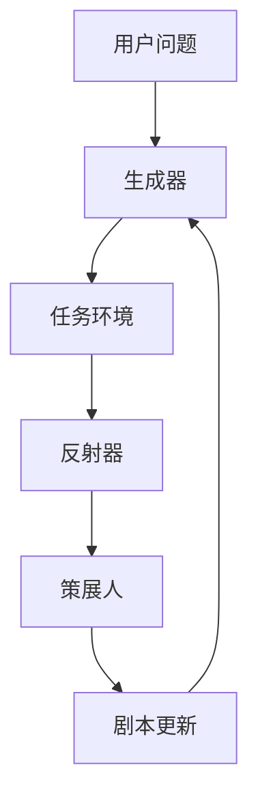
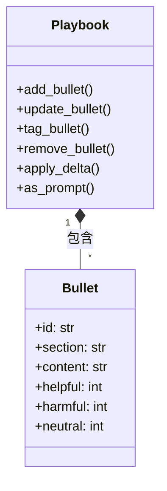
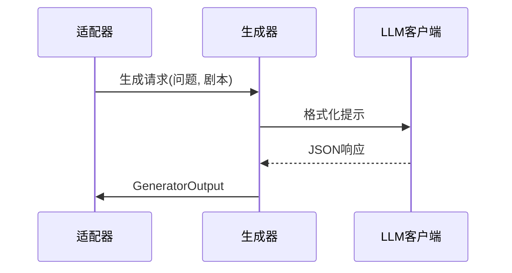
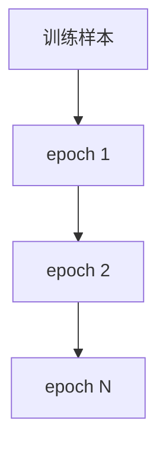
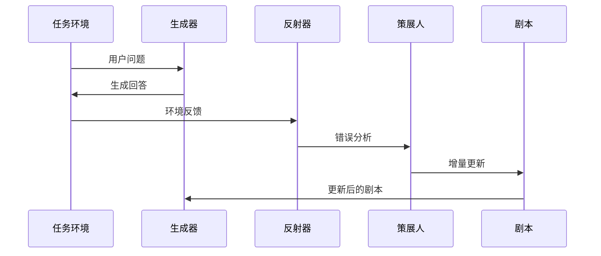

<details>
<summary>相关源文件</summary>

- [README.md]() 项目总览文档，包含核心架构、文件结构和快速入门指南
- [ace/__init__.py]() 包初始化文件，定义核心模块结构和导入关系
- [ace/adaptation.py]() 适配器实现，包含离线和在线训练循环的核心逻辑
- [ace/playbook.py]() 剧本管理系统，实现结构化上下文的存储和更新机制
- [ace/roles.py]() 代理角色实现，包含生成器、反射器和策展人的具体功能
- [docs/method_outline.md]() 方法文档，提供ACE方法的工程实现说明
</details>

# 项目简介

## 1. 概述

ACE-open项目是Agentic Context Engineering (ACE)方法的开源实现框架，旨在通过结构化上下文实现语言模型的自我改进。该框架基于*Agentic Context Engineering: Evolving Contexts for Self-Improving Language Models*论文设计，核心思想是通过三个代理角色（生成器、反射器、策展人）的协作，动态优化上下文剧本(Playbook)，提升语言模型的任务表现。

项目采用模块化设计，核心功能包括：
- **结构化剧本管理**：上下文以bullet条目形式组织，包含内容和使用统计
- **多角色协作**：生成器、反射器、策展人各司其职形成改进闭环
- **双模式训练**：支持离线和在线两种适应循环，适用于不同场景



## 2. 核心架构

### 2.1 剧本系统(Playbook)

剧本是ACE框架的核心数据结构，采用层级组织：

| 组件 | 类型 | 描述 |
|------|------|------|
| Bullet | 类 | 剧本条目，包含ID、内容、标签统计 |
| section | 属性 | 条目所属分类 |
| content | 属性 | 条目文本内容 |
| helpful/harmful/neutral | 属性 | 使用效果统计计数 |

剧本管理功能：
- 添加/更新/删除条目
- 标记条目使用效果（helpful/harmful/neutral）
- 序列化为JSON或提示文本格式



### 2.2 代理角色系统

#### 2.2.1 生成器(Generator)
- **职责**：使用当前剧本生成问题解答
- **输入**：用户问题、上下文、剧本、反射记录
- **输出**：推理过程、最终答案、使用的bullet IDs



#### 2.2.2 反射器(Reflector)
- **职责**：分析生成器输出的错误和根本原因
- **输入**：问题、生成器输出、环境反馈
- **输出**：错误分析、根本原因、关键洞察、条目标签更新

#### 2.2.3 策展人(Curator)
- **职责**：将反射分析转化为剧本更新
- **输入**：反射器输出、当前剧本、问题上下文
- **输出**：DeltaBatch增量更新操作集

### 2.3 适应循环

#### 2.3.1 离线适配器(OfflineAdapter)
- 批量处理训练样本
- 多epoch迭代优化
- 适用场景：模型预训练和微调



#### 2.3.2 在线适配器(OnlineAdapter)
- 流式处理实时样本
- 单次处理即时更新
- 适用场景：生产环境持续学习

## 3. 工作流程

ACE框架的完整工作流程包含四个阶段：



1. **生成阶段**：生成器使用当前剧本解答问题
2. **评估阶段**：任务环境提供反馈和评估结果
3. **反思阶段**：反射器分析错误原因和根本问题
4. **优化阶段**：策展人根据分析更新剧本内容

## 4. 关键数据结构

### 4.1 样本(Sample)
```python
@dataclass
class Sample:
    question: str
    context: str = ""
    ground_truth: Optional[str] = None
    metadata: Dict[str, object] = field(default_factory=dict)
```

### 4.2 环境结果(EnvironmentResult)
```python
@dataclass
class EnvironmentResult:
    feedback: str
    ground_truth: Optional[str]
    metrics: Dict[str, float] = field(default_factory=dict)
```

### 4.3 增量操作(DeltaOperation)
支持四种操作类型：
- ADD：添加新条目
- UPDATE：更新条目内容
- TAG：更新条目标签统计
- REMOVE：删除条目

## 5. 应用场景

ACE框架适用于多种语言模型改进场景：

| 场景 | 适配器类型 | 优势 |
|------|------------|------|
| 领域适应 | 离线 | 批量优化领域特定知识 |
| 实时问答 | 在线 | 持续改进响应质量 |
| 错误纠正 | 两者结合 | 迭代减少常见错误 |
| 知识更新 | 在线 | 动态整合新信息 |

## 6. 总结

ACE-open项目实现了一个完整的语言模型自我改进框架，通过结构化剧本和三个代理角色的协作，实现了上下文驱动的持续优化。核心价值在于：
1. **模块化设计**：各组件职责明确，易于扩展和维护
2. **双模式训练**：支持离线和在线场景，适用性广泛
3. **自动化闭环**：从问题解答到剧本更新形成完整优化循环
4. **可解释性**：所有更新基于可追溯的分析和决策

该框架为语言模型的自我改进提供了系统化解决方案，可广泛应用于问答系统、对话代理和领域专用模型的持续优化场景。