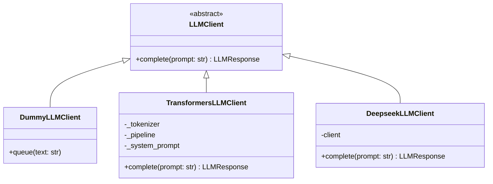
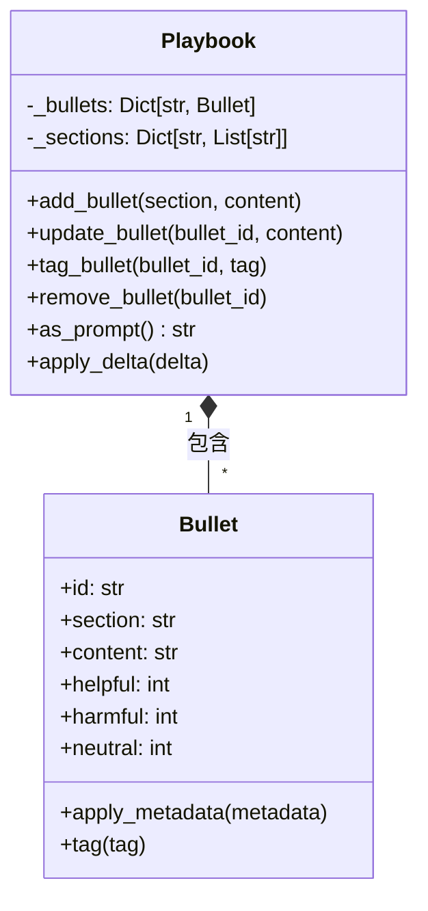
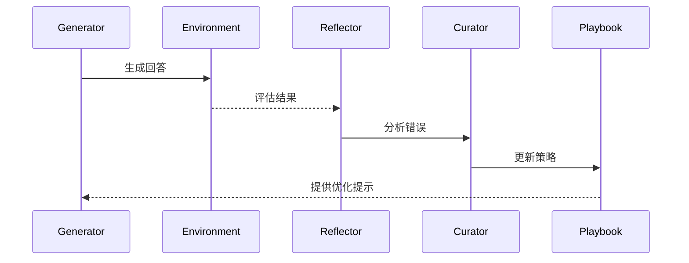

相关源文件

- [ace/prompts.py](ace/prompts.py) 包含提示模板定义：生成器提示、反射器提示和策展人提示
- [ace/llm.py](ace/llm.py) 实现LLM客户端接口，支持本地模型和云API
- [ace/playbook.py](ace/playbook.py) 定义策略库管理类，支持策略的增删改查操作
- [ace/adaptation.py](ace/adaptation.py) 实现适配器核心逻辑，处理提示定制和策略更新流程
- [ace/delta.py](ace/delta.py) 定义策略更新操作的数据结构

# Prompt定制指南

## 1. 介绍

Prompt定制是ACE框架的核心功能，它通过动态生成和优化提示模板来提升模型性能。该系统由三个核心组件构成：生成器（Generator）负责根据提示生成回答，反射器（Reflector）分析生成结果并识别错误，策展人（Curator）根据分析更新策略库（Playbook）。这些组件协同工作，实现提示模板的持续优化。

整个流程从问题输入开始，经过生成、评估、反思和更新四个阶段，最终输出优化后的策略库。这种闭环设计使系统能够从错误中学习，逐步提升提示质量。

## 2. 核心组件

### 2.1 提示模板

提示模板定义了模型交互的结构和内容，存储在`prompts.py`中：

- **生成器提示（GENERATOR_PROMPT）**：指导模型生成回答，包含策略库、反思和问题上下文
- **反射器提示（REFLECTOR_PROMPT）**：分析生成器错误，输出JSON格式的诊断报告
- **策展人提示（CURATOR_PROMPT）**：根据反思更新策略库，输出JSON格式的操作指令

相关源文件

- [ace/prompts.py:3-89]() 定义三种核心提示模板
- [ace/prompts.py:3-25]() GENERATOR_PROMPT具体实现
- [ace/prompts.py:28-55]() REFLECTOR_PROMPT具体实现
- [ace/prompts.py:58-89]() CURATOR_PROMPT具体实现

### 2.2 LLM客户端

LLM客户端处理提示与模型的交互，实现位于`llm.py`：

- **LLMClient**：抽象接口，定义complete方法
- **DummyLLMClient**：测试用客户端，支持预定义响应
- **TransformersLLMClient**：本地模型客户端，支持Hugging Face模型
- **DeepseekLLMClient**：云API客户端，兼容Deepseek API

相关源文件

- [ace/llm.py:16-211]() LLM客户端完整实现
- [ace/llm.py:23-31]() LLMClient抽象类定义
- [ace/llm.py:34-48]() DummyLLMClient实现
- [ace/llm.py:51-172]() TransformersLLMClient实现
- [ace/llm.py:175-211]() DeepseekLLMClient实现

### 2.3 策略库管理

策略库（Playbook）存储优化后的提示策略，由`playbook.py`实现：

- **Bullet**：表示单个策略条目，包含ID、内容分区和标签统计
- **Playbook**：管理策略库，支持添加、更新、标记和删除策略
- **as_prompt()**：将策略库转换为提示模板格式

相关源文件

- [ace/playbook.py:14-215]() Playbook和Bullet完整实现
- [ace/playbook.py:14-40]() Bullet类定义
- [ace/playbook.py:43-215]() Playbook类定义
- [ace/playbook.py:185-196]() as_prompt方法实现

### 2.4 适配器流程

适配器协调提示定制流程，实现位于`adaptation.py`：

- **AdapterBase**：基础适配器，定义核心处理流程
- **_process_sample()**：处理单个样本的完整流程（生成→评估→反思→更新）
- **OfflineAdapter**：离线批处理适配器
- **OnlineAdapter**：在线流式处理适配器

相关源文件

- [ace/adaptation.py:15-193]() 适配器完整实现
- [ace/adaptation.py:53-145]() AdapterBase类定义
- [ace/adaptation.py:104-145]() _process_sample核心方法
- [ace/adaptation.py:148-170]() OfflineAdapter实现
- [ace/adaptation.py:173-193]() OnlineAdapter实现

### 2.5 策略更新操作

策略更新操作由`delta.py`定义，支持四种操作类型：

| 操作类型 | 描述 | 参数 |
|---------|------|------|
| ADD | 添加新策略 | section, content |
| UPDATE | 更新现有策略 | bullet_id, content |
| TAG | 标记策略效果 | bullet_id, tag (helpful/harmful/neutral) |
| REMOVE | 删除策略 | bullet_id |

相关源文件

- [ace/delta.py:9-67]() 策略更新操作定义
- [ace/delta.py:13-43]() DeltaOperation类
- [ace/delta.py:47-67]() DeltaBatch类

## 3. 工作流程

完整的Prompt定制流程包含四个阶段：

1. **生成阶段**：使用GENERATOR_PROMPT和当前策略库生成回答
2. **评估阶段**：环境评估生成结果，提供反馈
3. **反思阶段**：使用REFLECTOR_PROMPT分析错误原因
4. **更新阶段**：使用CURATOR_PROMPT更新策略库

每次迭代都会优化策略库，提升后续提示的质量。

## 4. 配置选项

关键配置参数：

| 参数 | 位置 | 描述 | 默认值 |
|------|------|------|--------|
| max_refinement_rounds | adaptation.py | 最大优化轮数 | 1 |
| reflection_window | adaptation.py | 保留的反思数量 | 3 |
| max_new_tokens | llm.py | 生成的最大token数 | 512 |
| temperature | llm.py | 生成温度 | 0.0 |

## 5. 总结

Prompt定制是ACE框架的核心创新，通过生成→评估→反思→更新的闭环流程，实现提示模板的持续优化。系统由提示模板、LLM客户端、策略库管理、适配器流程和策略更新操作五个核心组件构成，共同支持动态提示优化功能。这种设计使系统能够从错误中学习，逐步提升模型性能。