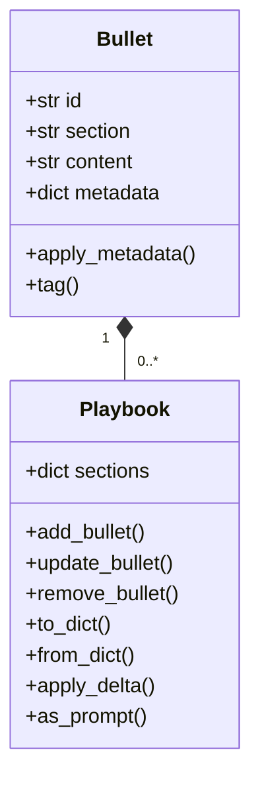
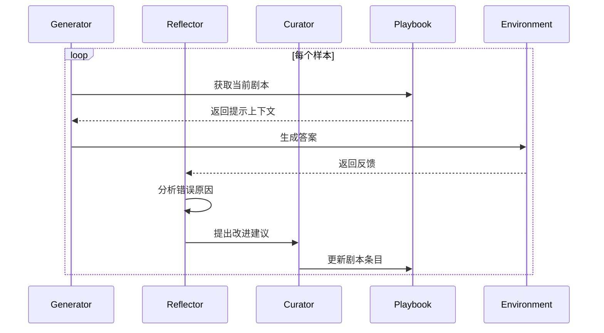
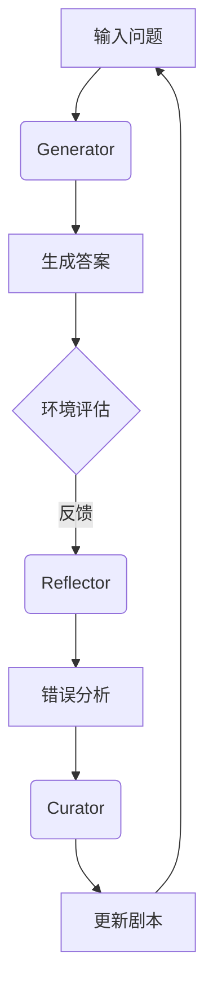
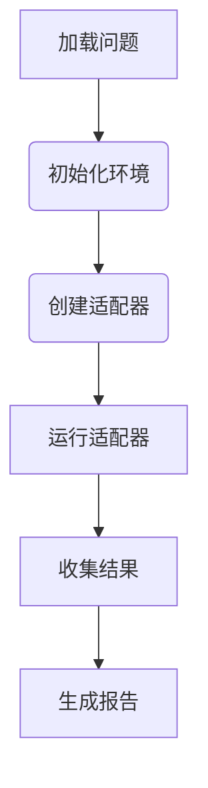

<details>
<summary>相关源文件</summary>

- [README.md](README.md) 项目概述和架构设计
- [ace/playbook.py](ace/playbook.py) 剧本核心数据结构实现
- [ace/adaptation.py](ace/adaptation.py) 适配机制实现
- [ace/roles.py](ace/roles.py) 三个代理角色实现
- [ace/prompts.py](ace/prompts.py) 代理行为提示模板
- [scripts/run_questions.py](scripts/run_questions.py) 实际执行流程

</details>

# 仓库结构

## 1. 引言

ACE-open 仓库实现了 Agentic Context Engineering (ACE) 方法，这是一种通过结构化上下文（playbook）和多个代理角色协作来提升语言模型性能的框架。仓库采用模块化设计，核心功能集中在 `ace/` 目录下，支持离线和在线两种适配模式，通过三个代理角色（生成器、反射器、策展人）协同工作实现自我改进。

整个项目结构清晰分为：
- 核心模块 (`ace/`)：实现 ACE 方法的核心逻辑
- 执行脚本 (`scripts/`)：提供实际运行示例
- 测试套件 (`tests/`)：确保功能正确性
- 文档 (`docs/`)：方法说明和工程笔记

## 2. 核心模块架构

### 2.1 Playbook 数据结构
Playbook 是 ACE 方法的核心数据结构，用于存储和管理上下文信息。它由多个 Bullet（条目）组成，每个条目包含内容和元数据。



关键功能：
- **条目管理**：支持添加、更新、删除和标记条目
- **序列化**：通过 `to_dict()` 和 `from_dict()` 实现持久化存储
- **增量更新**：`apply_delta()` 方法应用增量修改
- **提示生成**：`as_prompt()` 将剧本转换为模型可理解的提示格式

<details>
<summary>相关源文件</summary>

- [ace/playbook.py:14-40]() Bullet 类实现
- [ace/playbook.py:43-215]() Playbook 类实现

</details>

### 2.2 适配机制
适配模块实现了离线和在线两种运行模式，协调三个代理角色的工作流程。



**核心类**：
- `AdapterBase`：适配器基类，处理样本的核心流程
- `OfflineAdapter`：离线批量处理样本
- `OnlineAdapter`：实时处理样本

**工作流程**：
1. 生成器使用当前剧本生成答案
2. 环境评估答案并返回反馈
3. 反射器分析错误原因
4. 策展人根据分析更新剧本

<details>
<summary>相关源文件</summary>

- [ace/adaptation.py:53-145]() AdapterBase 实现
- [ace/adaptation.py:148-170]() OfflineAdapter 实现
- [ace/adaptation.py:173-193]() OnlineAdapter 实现

</details>

### 2.3 代理角色
三个代理角色各司其职，协同完成自我改进过程：

| 角色 | 职责 | 关键方法 |
|------|------|----------|
| 生成器 (Generator) | 根据当前剧本生成答案 | `generate()` |
| 反射器 (Reflector) | 分析错误并生成反思 | `reflect()` |
| 策展人 (Curator) | 管理剧本条目更新 | `curate()` |



<details>
<summary>相关源文件</summary>

- [ace/roles.py:44-101]() Generator 实现
- [ace/roles.py:121-201]() Reflector 实现
- [ace/roles.py:210-257]() Curator 实现

</details>

### 2.4 提示工程
提示模板定义了代理角色的行为规则和输出格式要求：

```python
# 生成器提示模板
GENERATOR_PROMPT = """
你是一位专家问题解决者。使用以下知识：
{playbook}

当前问题：{question}
请逐步推理并给出最终答案。
"""

# 反射器提示模板
REFLECTOR_PROMPT = """
分析以下错误：
问题：{question}
生成器输出：{generator_output}
环境反馈：{feedback}

请识别错误原因和改进方法。
"""
```

<details>
<summary>相关源文件</summary>

- [ace/prompts.py:3-25]() 生成器提示模板
- [ace/prompts.py:28-55]() 反射器提示模板
- [ace/prompts.py:58-89]() 策展人提示模板

</details>

## 3. 执行流程

### 3.1 脚本执行
`run_questions.py` 提供了端到端的执行流程：



关键组件：
- `FireInvestigationEnvironment`：特定领域的环境实现
- `main()` 函数：协调整个执行流程

<details>
<summary>相关源文件</summary>

- [scripts/run_questions.py:42-66]() 环境实现
- [scripts/run_questions.py:221-262]() 主执行流程

</details>

### 3.2 测试套件
测试用例集中在 `tests/` 目录，确保核心功能正确性：

- `test_adaptation.py`：验证适配机制
- 使用模拟环境测试完整工作流程
- 验证剧本更新逻辑

## 4. 总结

ACE-open 仓库采用清晰的分层架构：
1. **数据层**：Playbook 管理结构化上下文
2. **逻辑层**：三个代理角色协同工作
3. **适配层**：支持离线和在线运行模式
4. **执行层**：脚本提供实际运行示例

这种架构使项目具有高度可扩展性，可以轻松集成不同领域的任务环境和语言模型。核心价值在于通过结构化上下文和代理协作实现语言模型的持续自我改进。

<details>
<summary>相关源文件</summary>

- [README.md:1-80]() 项目概述
- [ace/playbook.py:198-207]() 剧本统计功能
- [scripts/run_questions.py:152-218]() 报告生成逻辑

</details>