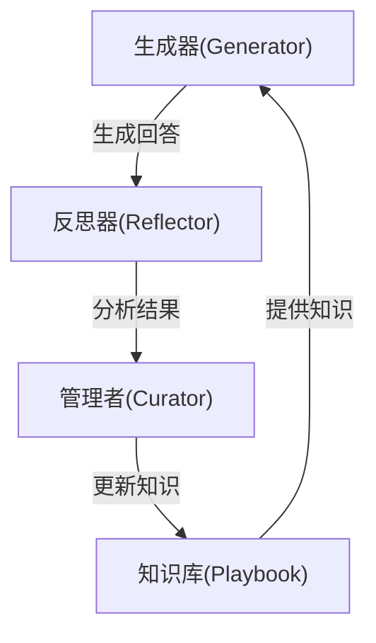
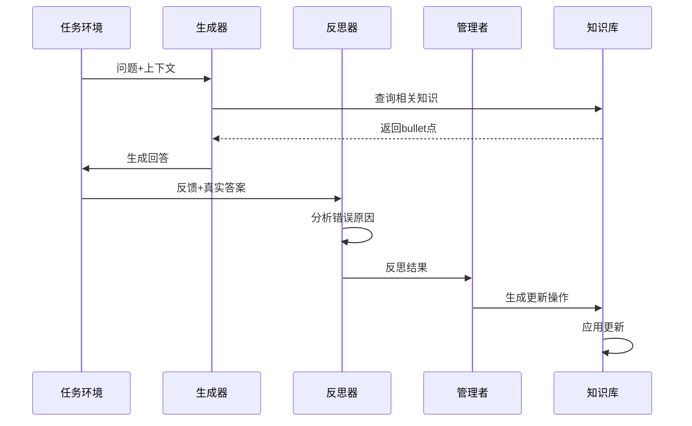
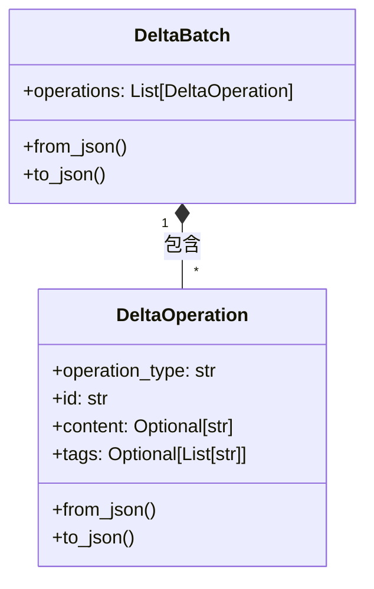
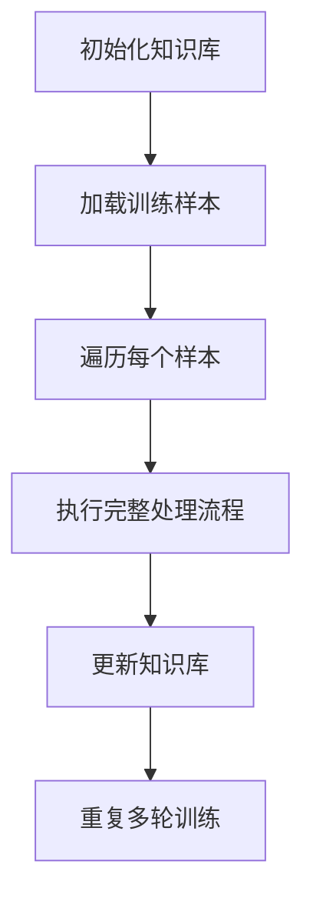
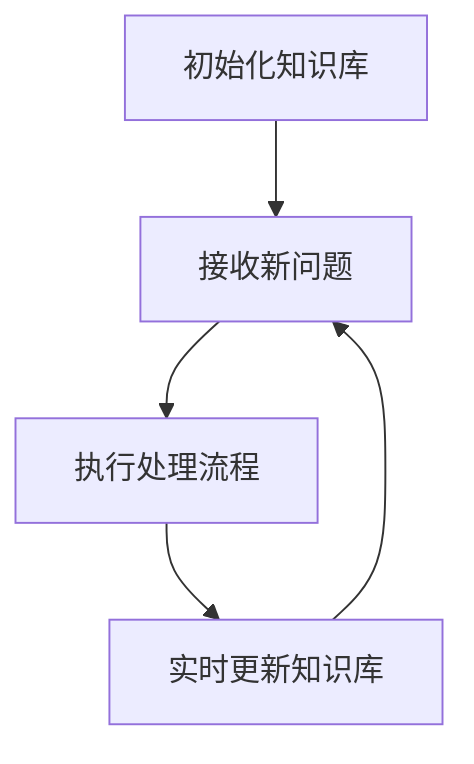

<details>
<summary>相关源文件</summary>

- [ace/roles.py]() 定义智能体交互核心角色：生成器、反思器和管理者
- [ace/playbook.py]() 实现知识库管理结构：Playbook和Bullet类
- [ace/adaptation.py]() 提供离线/在线运行模式：OfflineAdapter和OnlineAdapter
- [ace/delta.py]() 实现知识库更新机制：DeltaOperation和DeltaBatch
- [ace/prompts.py]() 包含角色交互提示模板：生成器、反思器和管理者提示
</details>

# 智能体角色交互流程

## 引言

智能体角色交互流程是ACE系统的核心机制，通过生成器(Generator)、反思器(Reflector)和管理者(Curator)三个角色的协同工作，实现知识库(Playbook)的持续优化。该流程支持离线批量训练和在线流式处理两种模式，能够根据问题输入生成回答，分析结果质量，并更新知识库内容。整个交互流程形成闭环学习系统，使智能体能够通过经验积累不断提升性能。

## 核心角色架构

### 角色组成与职责


- **生成器(Generator)**：根据问题、上下文和知识库内容生成回答
- **反思器(Reflector)**：分析生成结果，识别错误和根本原因
- **管理者(Curator)**：将反思结果转化为知识库更新操作
- **知识库(Playbook)**：存储结构化知识单元(Bullet)

<details>
<summary>相关源文件</summary>

- [ace/roles.py:44-101]() Generator类定义及generate方法
- [ace/roles.py:121-201]() Reflector类定义及reflect方法
- [ace/roles.py:210-257]() Curator类定义及curate方法
- [ace/playbook.py:43-215]() Playbook类实现
</details>

### 角色输入输出

| 角色 | 输入 | 输出 | 关键方法 |
|------|------|------|---------|
| 生成器 | 问题、上下文、知识库、反思 | 推理过程、最终答案、相关bullet点 | generate() |
| 反思器 | 问题、生成器输出、知识库、真实答案 | 错误分析、根本原因、关键洞察 | reflect() |
| 管理者 | 反思输出、知识库、问题上下文 | 知识库更新批次 | curate() |

<details>
<summary>相关源文件</summary>

- [ace/roles.py:37-41]() GeneratorOutput数据结构
- [ace/roles.py:111-118]() ReflectorOutput数据结构
- [ace/roles.py:205-207]() CuratorOutput数据结构
</details>

## 交互流程详解

### 标准处理流程


<details>
<summary>相关源文件</summary>

- [ace/adaptation.py:104-145]() _process_sample方法实现完整流程
- [ace/adaptation.py:151-170]() OfflineAdapter运行逻辑
- [ace/adaptation.py:173-193]() OnlineAdapter运行逻辑
</details>

### 知识库更新机制

知识库通过DeltaBatch进行更新，包含四种操作类型：



操作类型包括：
1. `add_bullet`：添加新知识点
2. `update_bullet`：更新知识点内容
3. `remove_bullet`：删除知识点
4. `tag_bullet`：为知识点添加标签

<details>
<summary>相关源文件</summary>

- [ace/delta.py:13-43]() DeltaOperation类实现
- [ace/delta.py:47-67]() DeltaBatch类实现
- [ace/playbook.py:151-180]() _apply_operation方法
</details>

## 提示工程

系统使用精心设计的提示模板指导LLM行为：

```python
# 生成器提示模板
GENERATOR_PROMPT = """
你是一位专家，请使用以下知识库解答问题：
{playbook}

反思总结：
{reflection}

问题：
{question}

上下文：
{context}
"""
```

关键提示模板包括：
- `GENERATOR_PROMPT`：指导生成器回答问题
- `REFLECTOR_PROMPT`：指导反思器分析结果
- `CURATOR_PROMPT`：指导管理者更新知识库

<details>
<summary>相关源文件</summary>

- [ace/prompts.py:3-25]() GENERATOR_PROMPT模板
- [ace/prompts.py:28-55]() REFLECTOR_PROMPT模板
- [ace/prompts.py:58-89]() CURATOR_PROMPT模板
</details>

## 运行模式

### 离线批量模式


### 在线流式模式


<details>
<summary>相关源文件</summary>

- [ace/adaptation.py:148-170]() OfflineAdapter实现
- [ace/adaptation.py:173-193]() OnlineAdapter实现
</details>

## 总结

智能体角色交互流程通过生成器、反思器和管理者的协同工作，形成闭环学习系统。生成器负责问题解答，反思器分析结果质量，管理者将经验转化为知识库更新。系统支持离线和在线两种运行模式，通过DeltaBatch机制实现知识库的增量更新。精心设计的提示模板指导LLM行为，确保各角色有效协作。整个流程使智能体能够持续从经验中学习，不断提升问题解答能力。