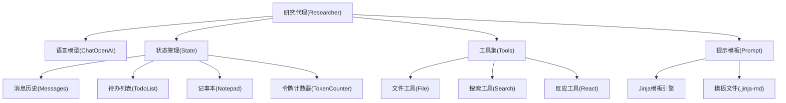
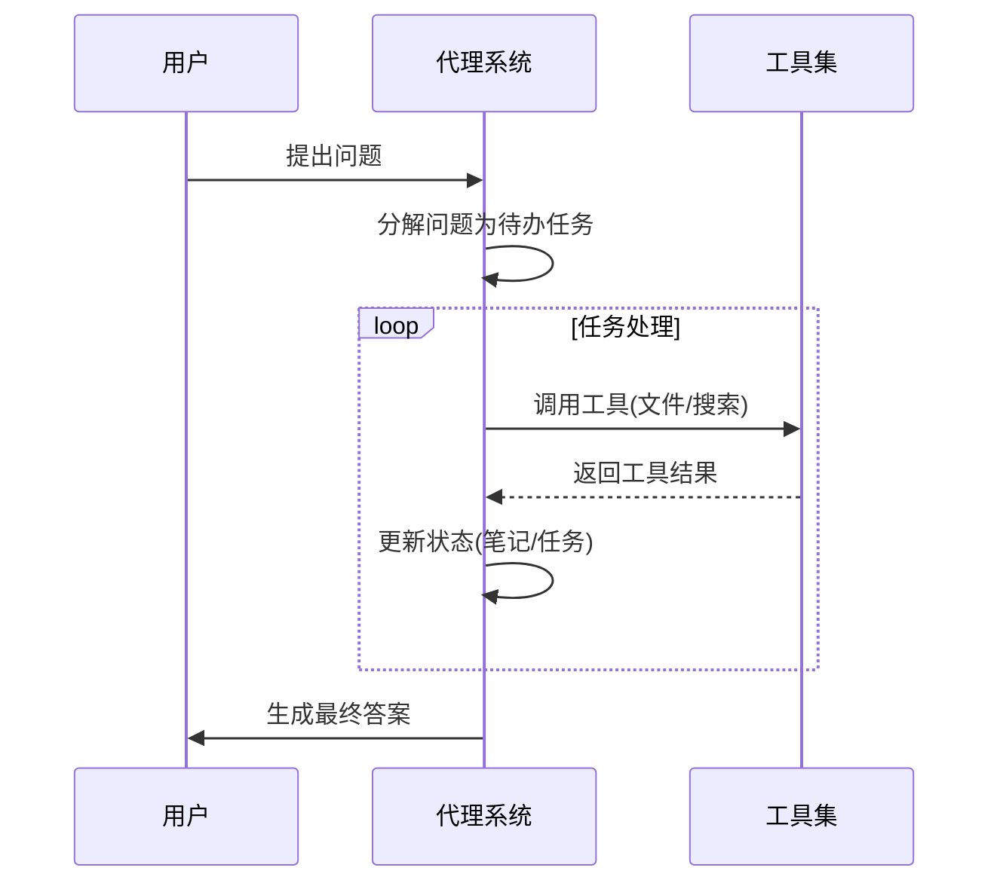
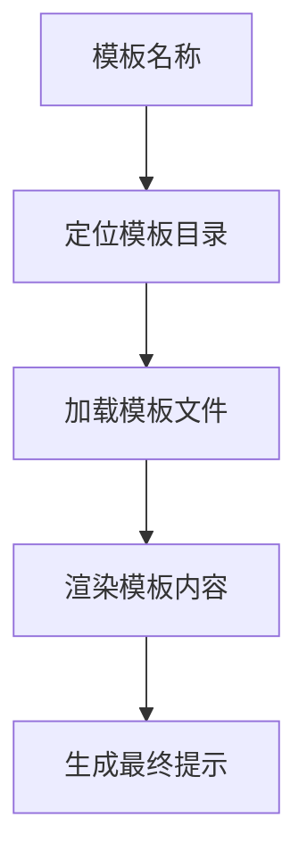
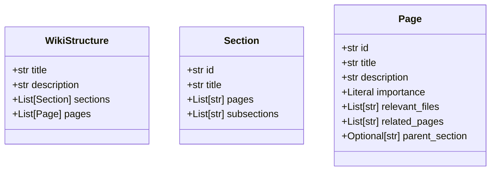

相关源文件

- [./backend/agent/researcher.py]() 代理系统的核心实现文件，包含代理创建、中间件和工具集
- [./backend/model/state.py]() 定义和管理代理系统状态，包括消息、待办事项和记事本
- [./backend/tools/react_tools.py]() 实现反应工具，用于更新代理状态和任务管理
- [./backend/prompts/prompt_template.py]() 应用Jinja2模板生成提示内容
- [./backend/llm/chat_model.py]() 创建和配置语言模型实例
- [./backend/model/deep_wiki.py]() 定义代理系统生成的wiki页面结构
- [./backend/prompts/researcher.jinja-md]() 定义代理系统的行为规范和工作流程

# 代理系统

## 1. 引言

代理系统是一个高度结构化的软件架构，旨在解决复杂的技术问题。它通过结合语言模型、状态管理和工具集，实现迭代式问题解决能力。系统核心是一个研究代理(researcher)，能够分解用户问题为可执行任务，通过工具调用获取信息，并维护状态跟踪进度。

系统设计遵循模块化原则，包含状态管理、工具执行、提示生成和语言模型集成等核心组件。这些组件协同工作，确保代理能够高效、准确地解决技术问题，同时生成结构化的技术文档。

## 2. 系统架构

### 2.1 核心组件

代理系统由以下核心组件构成：
- **研究代理**：协调整个问题解决流程
- **语言模型**：提供自然语言处理能力
- **状态管理**：跟踪对话历史、任务进度和临时笔记
- **工具集**：提供文件操作、搜索和状态更新能力
- **提示模板**：生成结构化的指令和上下文

### 2.2 状态管理

状态对象包含以下关键属性：

| 属性 | 类型 | 描述 |
|------|------|------|
| `messages` | `list[BaseMessage]` | 对话消息历史 |
| `todo_list` | `TodoList` | 待办任务列表 |
| `notepad` | `Notepad` | 临时笔记存储 |
| `token_counter` | `TokenCounter` | API调用令牌统计 |
| `project` | `Project` | 当前工作项目 |

状态更新通过专门的合并函数实现：
- `merge_messages()`：合并新旧消息
- `merge_todo_list()`：更新任务状态
- `merge_notepad()`：添加新笔记

## 3. 工作流程

### 3.1 问题解决流程

工作流程分为四个阶段：
1. **问题接收**：用户提交技术问题
2. **任务分解**：代理将问题拆解为待办任务
3. **迭代处理**：依次执行任务，调用工具获取信息
4. **结果生成**：整合所有信息生成最终答案

### 3.2 工具调用机制

代理系统提供以下工具集：

| 工具名称 | 功能描述 | 使用场景 |
|----------|----------|----------|
| `file_outline` | 获取Python文件结构 | 分析代码架构 |
| `read_lines` | 读取文件内容 | 查看具体实现 |
| `search_in_file` | 文件内关键词搜索 | 定位特定功能 |
| `search_in_folders` | 目录内关键词搜索 | 查找相关文件 |
| `file_tree` | 获取目录结构 | 了解项目布局 |
| `react` | 更新代理状态 | 记录发现/管理任务 |

## 4. 提示工程

系统使用Jinja2模板引擎生成提示，模板存储在`./backend/prompts/`目录。关键模板包括：
- `researcher.jinja-md`：定义代理行为规范
- `wiki_page.jinja-md`：wiki页面生成模板
- `wiki_structure.jinja-md`：wiki结构生成模板

提示模板应用流程：

## 5. 语言模型集成

系统通过`create_chat_model()`函数创建语言模型实例，配置参数包括：

| 参数 | 描述 | 默认值 |
|------|------|--------|
| `model` | 模型名称 | 环境变量定义 |
| `base_url` | API基础URL | 环境变量定义 |
| `api_key` | API密钥 | 环境变量定义 |
| `temperature` | 生成随机性 | 0 |
| `top_p` | 采样策略 | 0 |
| `max_retries` | 最大重试次数 | 3 |

## 6. Wiki生成

代理系统生成的技术wiki遵循结构化格式：

每个wiki页面包含：
- 相关源文件引用
- 技术介绍
- 详细技术说明
- 可视化图表
- 结构化表格
- 源代码片段(可选)
- 总结

## 7. 总结

代理系统是一个高度自动化的技术问题解决框架，通过结合语言模型、状态管理和工具集，实现了复杂技术问题的分解、迭代解决和文档生成能力。系统采用模块化设计，各组件职责明确，协同工作流程清晰。

系统特别适合技术文档生成场景，能够基于源代码分析生成准确、结构化的wiki内容。通过严格的状态管理和工具调用机制，确保输出内容的准确性和可追溯性，同时通过可视化图表增强技术概念的表达。