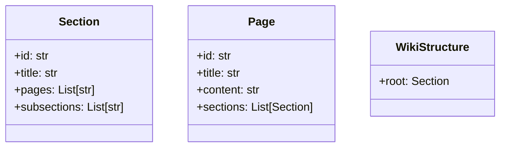
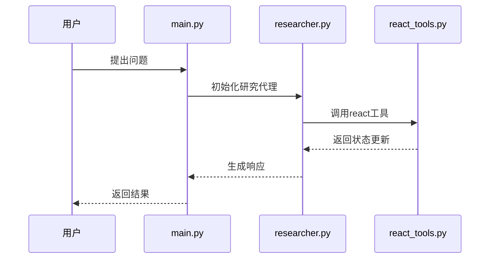
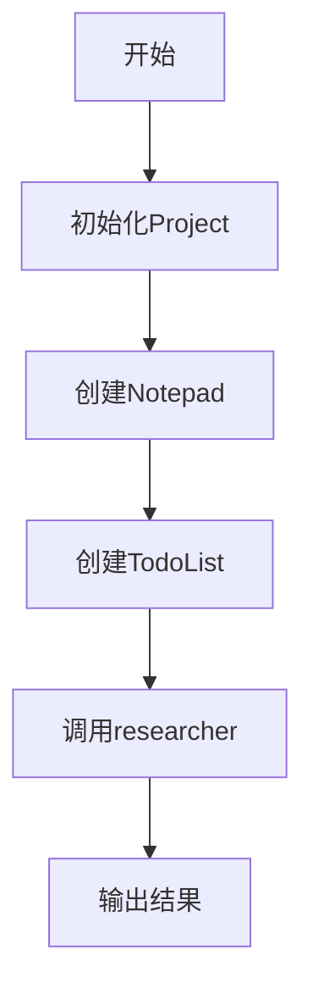

<details>
<summary>相关源文件</summary>

- [main.py:1-30]() 项目入口文件，定义系统启动流程和核心组件初始化
- [backend/model/deep_wiki.py:5-9]() 定义Section类，表示wiki页面的基本组织单元
- [backend/tools/react_tools.py:6-34]() 实现react工具，提供系统交互的核心框架
- [backend/agent/researcher.py:72-91]() 包含create_researcher函数，实现研究代理的创建逻辑
- [backend/llm/chat_model.py:10-18]() 定义create_chat_model函数，负责LLM模型的集成
</details>

# 架构总览

## 引言

本系统采用前后端分离架构，核心功能集中在backend模块。系统通过研究代理(researcher)处理用户请求，结合LLM模型和工具集实现智能响应。架构设计围绕wiki内容生成展开，包含数据模型、工具集和代理工作流三大核心组件。

系统工作流程为：用户输入→项目初始化→研究代理处理→生成响应。整个架构支持模块化扩展，各组件通过明确定义的接口交互。

## 核心组件

### 数据模型层


- **Section类**：表示wiki页面的基本组织单元，包含唯一标识符、标题、关联页面和子章节
- **Page类**：表示完整的wiki页面，包含标题、内容和章节结构
- **WikiStructure类**：管理wiki页面的整体结构，以根章节为起点组织内容

<details>
<summary>相关源文件</summary>

- [backend/model/deep_wiki.py:5-9]()
- [backend/model/deep_wiki.py:12-19]()
- [backend/model/deep_wiki.py:22-26]()
</details>

### 工具层

#### react工具
```python
def react(
    thoughts: str,
    add_note: str,
    mark_todo_as_done: List[int],
    ready_to_answer: bool,
    father_id: int,
    add_todo: List[str]
) -> dict:
    # 实现状态更新逻辑
```

react工具提供系统状态管理能力，包含：
- 思考过程记录(thoughts)
- 笔记添加(add_note)
- 任务状态更新(mark_todo_as_done)
- 新任务创建(add_todo)

<details>
<summary>相关源文件</summary>

- [backend/tools/react_tools.py:6-34]()
</details>

### 代理层

#### 研究代理工作流


研究代理是系统的智能处理核心：
1. 接收用户输入并初始化上下文
2. 协调工具调用(如react工具)
3. 管理任务执行流程
4. 生成最终响应

关键函数：
- `create_researcher()`: 创建研究代理实例
- `handle_tool_errors()`: 处理工具调用异常

<details>
<summary>相关源文件</summary>

- [backend/agent/researcher.py:72-91]()
- [backend/agent/researcher.py:59-69]()
</details>

## 系统集成

### LLM模型集成
```python
def create_chat_model():
    # 创建聊天模型实例
    return ChatOpenAI(model="gpt-4-turbo")
```

系统通过chat_model模块集成LLM能力：
- 使用ChatOpenAI作为基础模型
- 支持模型配置参数调整
- 提供统一的模型调用接口

<details>
<summary>相关源文件</summary>

- [backend/llm/chat_model.py:10-18]()
</details>

### 启动流程


main.py作为系统入口：
1. 初始化Project对象
2. 创建Notepad和TodoList
3. 调用researcher处理用户输入
4. 输出最终结果

<details>
<summary>相关源文件</summary>

- [main.py:1-30]()
</details>

## 总结

本系统采用分层架构设计，数据模型层定义wiki内容结构，工具层提供状态管理能力，代理层实现智能处理流程。各组件通过明确定义的接口协同工作，支持从用户输入到wiki内容生成的完整流程。架构设计注重模块化和扩展性，便于未来功能增强。