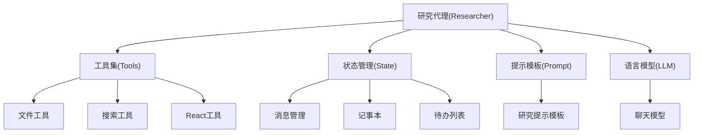
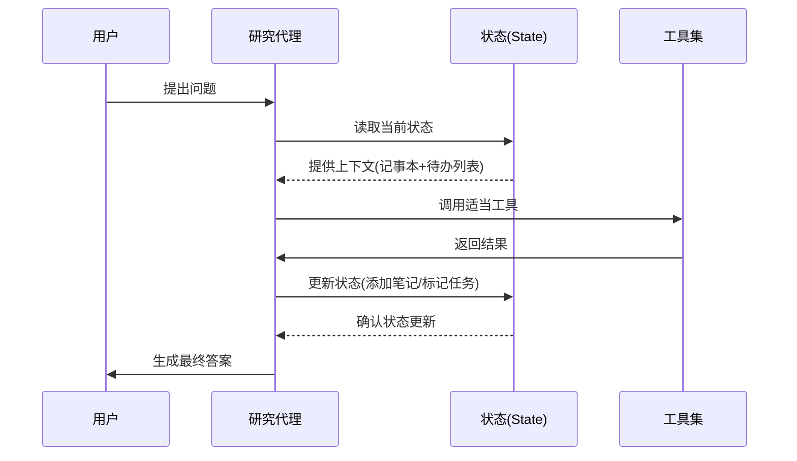

相关源文件

- [backend/agent/researcher.py]() 定义了自动研究流程的核心代理，包括工具集和中间件
- [backend/prompts/researcher.jinja-md]() 包含研究代理的提示模板，指导代理行为
- [backend/model/state.py]() 管理研究流程的状态，包括消息合并和状态维护
- [backend/tools/react_tools.py]() 实现react工具，用于更新记事本和待办列表
- [backend/llm/chat_model.py]() 创建聊天模型，为研究代理提供语言能力

# 自动研究流程

## 1. 引言

自动研究流程是一个基于AI代理的系统，旨在通过迭代式问题分解和工具调用解决复杂技术问题。该流程模拟了人类研究员的思维方式，将大问题分解为可执行的小任务，并通过工具调用收集信息、分析代码和生成解决方案。系统核心是一个研究代理(researcher)，它使用记事本记录发现，待办列表管理任务，并通过多种工具与代码库交互。

整个流程在状态机(State)的管理下运行，确保研究过程的连续性和上下文一致性。研究代理遵循严格的步骤规范，通过工具调用逐步推进问题解决，最终生成准确的技术文档或解决方案。

## 2. 系统架构

### 2.1 核心组件

### 2.2 数据流

## 3. 核心工作机制

### 3.1 迭代式问题解决流程

研究代理遵循严格的迭代步骤：

1. **任务分解**：将复杂问题拆解为可执行的待办项
2. **工具调用**：使用适当工具收集信息
3. **状态更新**：通过react工具更新记事本和待办列表
4. **进度评估**：判断是否可生成最终答案

### 3.2 状态管理

状态机(State)维护研究过程的完整上下文，包含以下关键元素：

| 组件 | 类型 | 描述 |
|------|------|------|
| 消息(messages) | BaseMessage列表 | 存储对话历史和研究上下文 |
| 待办列表(todo_list) | TodoList | 管理研究任务和进度 |
| 记事本(notepad) | Notepad | 记录研究发现和关键信息 |
| 令牌计数器(token_counter) | TokenCounter | 跟踪资源使用情况 |

状态合并函数确保研究过程的连续性：
- `merge_messages()`：智能合并对话历史
- `merge_todo_list()`：同步任务状态
- `merge_notepad()`：整合研究发现

### 3.3 工具系统

研究代理使用多种工具与代码库交互：

| 工具名称 | 功能描述 | 使用场景 |
|----------|----------|----------|
| file_outline | 获取Python文件结构 | 快速理解代码架构 |
| read_lines | 读取文件内容 | 分析具体实现 |
| search_in_file | 文件内关键词搜索 | 定位特定功能 |
| search_in_folders | 目录递归搜索 | 发现相关文件 |
| file_tree | 获取目录结构 | 理解项目布局 |
| react | 更新研究状态 | 管理任务和记录发现 |

## 4. 提示工程

研究代理使用专门的提示模板(researcher.jinja-md)指导行为，关键要求包括：
- 严格遵循迭代式问题解决流程
- 使用中文响应
- 避免任务重复
- 引用文件路径和行号
- 至少读取80行代码
- 最终答案需包含关键发现但不提记事本/待办列表

## 5. 总结

自动研究流程是一个高度结构化的AI辅助问题解决系统，通过研究代理、状态管理和工具系统的协同工作，实现了复杂技术问题的迭代式解决。系统核心优势在于其严谨的工作流程和上下文维护机制，确保研究过程的连贯性和结果的可追溯性。

该流程特别适用于技术文档生成、代码分析和系统理解等场景，通过AI代理模拟人类研究员的思维方式，但以更高的效率和一致性执行任务。未来可通过扩展工具集和优化提示模板进一步增强系统能力。