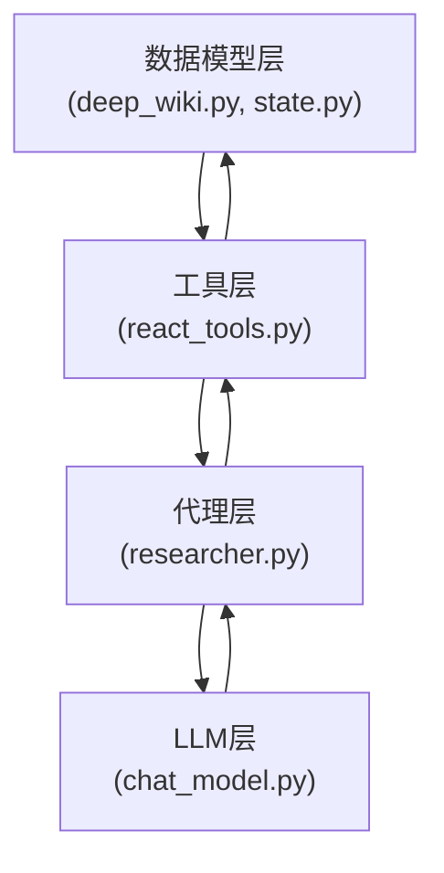
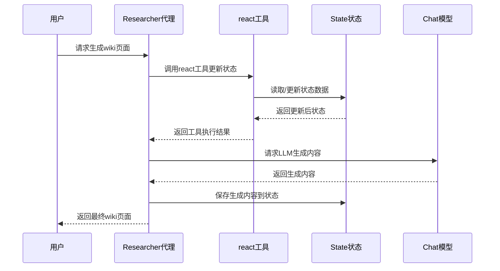
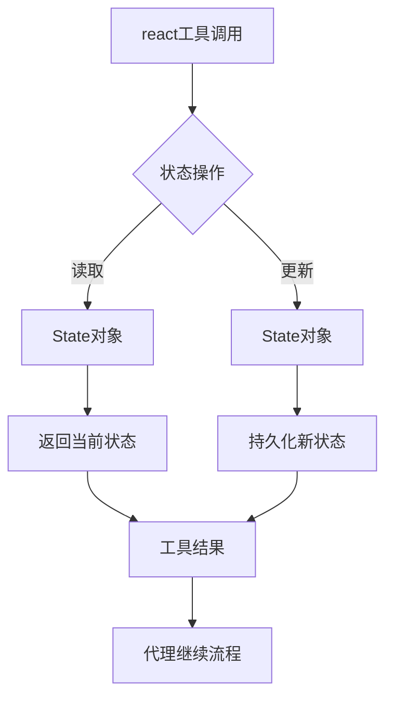

<details>
<summary>相关源文件</summary>

- [backend/model/deep_wiki.py:5-9]() 定义Section类，用于组织wiki文档结构
- [backend/model/deep_wiki.py:12-19]() 定义Page类，表示wiki页面
- [backend/model/deep_wiki.py:22-26]() 定义WikiStructure类，管理wiki整体结构
- [backend/model/state.py:84-104]() 定义State类，管理应用状态
- [backend/tools/react_tools.py:6-34]() 实现react函数，处理状态更新
- [backend/agent/researcher.py:72-91]() 实现create_researcher函数，创建研究代理
- [backend/llm/chat_model.py:10-18]() 实现create_chat_model函数，创建聊天模型
- [backend/prompts/wiki_structure.jinja-md]() 定义wiki结构生成模板
- [backend/prompts/wiki_page.jinja-md]() 定义wiki页面生成模板

</details>

# 组件关系

## 1. 引言

本组件关系文档详细描述了ace-deepwiki项目中各核心组件之间的交互关系和工作流程。系统采用分层架构设计，主要分为数据模型层、工具层、代理层和LLM层，各层之间通过明确定义的接口进行通信。组件关系构成了系统的核心骨架，确保了wiki生成流程的高效执行。

[系统架构](#系统架构)部分提供了整体架构图，[核心工作流程](#核心工作流程)部分详细描述了组件间的调用序列。

## 2. 系统架构

### 2.1 整体架构图



> 系统采用分层架构，数据模型层存储核心数据结构，工具层提供状态更新功能，代理层协调工作流程，LLM层处理自然语言交互。各层之间保持单向依赖关系，确保系统松耦合。

### 2.2 组件职责表

| 组件 | 文件位置 | 主要职责 |
|------|----------|----------|
| Section | deep_wiki.py:5-9 | 定义wiki文档部分结构 |
| Page | deep_wiki.py:12-19 | 表示wiki页面内容 |
| WikiStructure | deep_wiki.py:22-26 | 管理wiki整体结构 |
| State | state.py:84-104 | 管理应用状态和Markdown生成 |
| react工具 | react_tools.py:6-34 | 更新笔记和待办列表 |
| Researcher代理 | researcher.py:72-91 | 协调研究任务执行 |
| Chat模型 | chat_model.py:10-18 | 处理自然语言交互 |

## 3. 核心工作流程

### 3.1 wiki生成序列



> wiki生成流程始于用户请求，由Researcher代理协调各组件工作。react工具负责状态管理，Chat模型处理内容生成，State对象持久化中间结果。

### 3.2 状态管理流程



> react工具是状态管理的核心枢纽，所有状态操作都通过该工具进行。工具读取State对象的当前状态，执行更新操作后持久化新状态，确保状态变更的原子性和一致性。

## 4. 关键接口定义

### 4.1 react工具接口

```python
def react(
    thoughts: str,
    add_note: str,
    mark_todo_as_done: List[int],
    ready_to_answer: bool,
    father_id: int,
    add_todo: List[str]
) -> dict:
    """更新笔记和待办列表的核心工具
    
    参数:
        thoughts: 当前思考摘要
        add_note: 要添加的笔记内容
        mark_todo_as_done: 要标记为完成的待办ID列表
        ready_to_answer: 是否准备生成最终答案
        father_id: 父任务ID
        add_todo: 要添加的新待办项
        
    返回:
        工具执行结果状态
    """
```

> 此接口定义于backend/tools/react_tools.py:6-34，是组件间协调的核心机制，各组件通过此接口更新状态和任务进度。

### 4.2 State对象结构

```python
class State(BaseModel):
    """应用状态管理"""
    
    notepad: List[str] = Field(default_factory=list)
    todo_list: List[TodoItem] = Field(default_factory=list)
    messages: List[Message] = Field(default_factory=list)
    
    def to_markdown(self) -> str:
        """将状态转换为Markdown格式"""
        # 实现细节...
```

> State类定义于backend/model/state.py:84-104，封装了应用的核心状态数据，并提供转换为Markdown格式的方法，用于最终wiki输出。

## 5. 总结

ace-deepwiki项目的组件关系设计体现了清晰的分层架构和职责分离原则。数据模型层负责核心数据结构定义，工具层提供状态管理能力，代理层协调工作流程，LLM层处理内容生成。这种设计确保了系统的可扩展性和可维护性，各组件通过明确定义的接口进行通信，共同协作完成wiki页面的生成任务。

关键优势包括：
1. 状态管理的原子性（通过react工具保证）
2. 工作流程的可视化（通过序列图展示）
3. 组件的松耦合（分层架构设计）
4. 扩展的灵活性（新组件可轻松集成）

<details>
<summary>相关源文件</summary>

- [backend/model/deep_wiki.py:5-9]() Section类定义
- [backend/model/deep_wiki.py:12-19]() Page类定义
- [backend/model/deep_wiki.py:22-26]() WikiStructure类定义
- [backend/model/state.py:84-104]() State类及to_markdown方法
- [backend/tools/react_tools.py:6-34]() react工具实现
- [backend/agent/researcher.py:72-91]() create_researcher实现
- [backend/llm/chat_model.py:10-18]() create_chat_model实现
- [backend/prompts/wiki_structure.jinja-md]() wiki结构模板
- [backend/prompts/wiki_page.jinja-md]() wiki页面模板

</details>