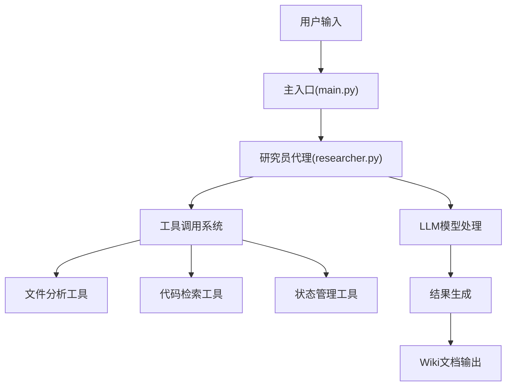
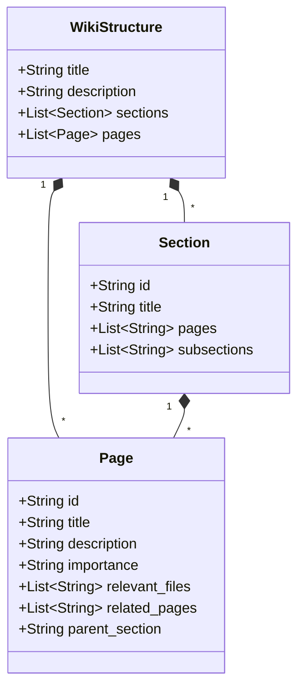
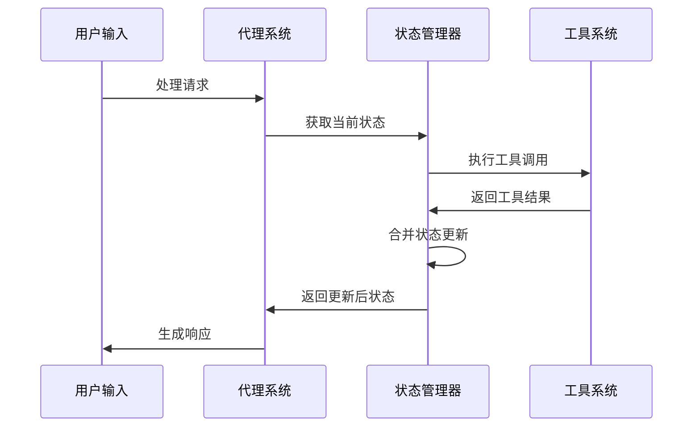
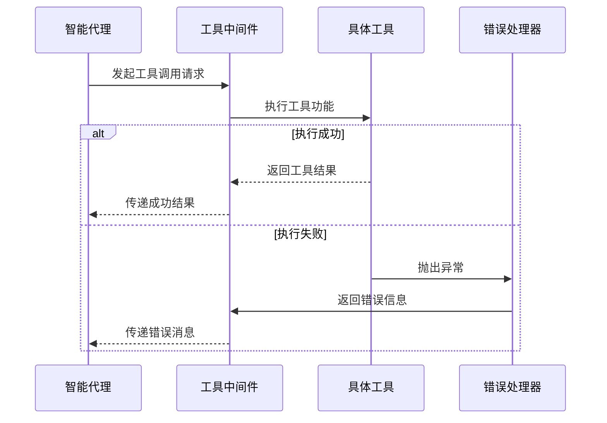
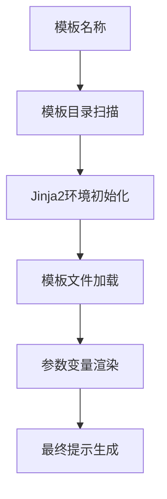
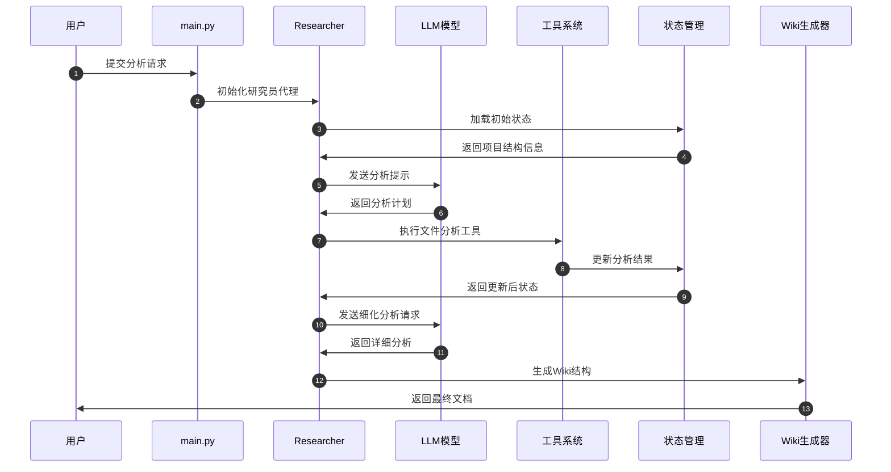
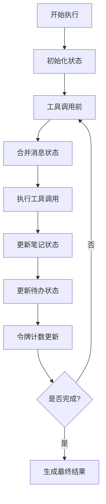

相关源文件

- [main.py:1-50]() 项目主入口文件，包含智能研究代理的初始化和执行流程
- [backend/agent/researcher.py:1-94]() 智能研究员模块核心实现，包含代理创建、工具集成和中间件配置
- [backend/model/deep_wiki.py:1-26]() Wiki结构数据模型定义，包含Section、Page和WikiStructure类
- [backend/tools/react_tools.py:1-36]() React工具实现，支持状态管理和任务跟踪
- [backend/prompts/prompt_template.py:1-17]() 提示模板应用机制，使用Jinja2模板引擎
- [backend/model/state.py:1-50]() 状态管理功能，包含消息合并和状态同步机制

# 定制扩展

## 引言

定制扩展是ace-deepwiki项目的核心架构组件，它基于LangChain和LangGraph框架构建了一个智能化的代码分析和文档生成系统。该系统通过智能代理、工具集成和状态管理机制，实现了对软件项目的深度理解和结构化文档生成能力。定制扩展的设计目标是提供一个可扩展的框架，支持对任意代码库进行智能分析和wiki文档生成。

该系统采用模块化架构，将不同的功能组件分离为独立的模块，包括智能代理、数据模型、工具系统和提示模板等，使得系统具有良好的可维护性和扩展性。

## 系统架构

### 智能代理层

定制扩展的核心是智能代理层，它负责协调整个系统的运行流程。智能代理基于LangGraph框架构建，采用状态机模式管理执行流程。

智能代理通过`create_researcher()`函数创建，该函数集成了聊天模型、工具系统和提示模板，形成一个完整的智能分析管道。

相关源文件

- [backend/agent/researcher.py:80-94]() 研究员代理创建函数实现
- [main.py:10-30]() 代理初始化和执行流程

### 数据模型设计

定制扩展采用严格的数据模型来管理wiki结构和系统状态。核心数据模型包括Wiki结构模型和状态管理模型。

#### Wiki结构模型

Wiki结构模型定义了文档的组织方式，采用层次化结构管理内容：

每个Page对象包含重要性评估、相关文件列表和关联页面信息，支持智能的内容组织和优先级管理。

相关源文件

- [backend/model/deep_wiki.py:1-26]() Wiki结构数据模型完整定义
- [backend/model/deep_wiki.py:5-12]() Section类定义
- [backend/model/deep_wiki.py:14-22]() Page类定义
- [backend/model/deep_wiki.py:24-26]() WikiStructure类定义

#### 状态管理模型

状态管理系统负责维护代理执行过程中的各种状态信息，包括待办事项、笔记记录和令牌计数等。

| 状态组件 | 类型 | 描述 |
|---------|------|------|
| notepad | Notepad | 笔记记录系统，存储分析过程中的关键发现 |
| todo_list | TodoList | 待办事项管理，跟踪任务执行进度 |
| token_counter | TokenCounter | 令牌使用统计，监控资源消耗 |
| project | Project | 项目文件树管理，提供代码库结构信息 |

状态管理系统通过合并函数确保状态的一致性：

相关源文件

- [backend/model/state.py:10-25]() 待办列表合并函数实现
- [backend/model/state.py:27-40]() 笔记合并函数实现
- [main.py:32-45]() 状态管理在主要流程中的应用

### 工具系统集成

定制扩展集成了多种工具来支持代码分析和文档生成任务。工具系统采用统一的接口设计，支持错误处理和状态跟踪。

#### 核心工具列表

| 工具名称 | 功能描述 | 使用场景 |
|---------|---------|---------|
| file_outline | 文件结构分析 | 获取Python文件的类和方法结构 |
| read_lines | 文件内容读取 | 读取特定行范围的代码内容 |
| search_in_file | 文件内搜索 | 在单个文件中搜索关键词 |
| search_in_folders | 文件夹搜索 | 在多个文件夹中搜索文件 |
| file_tree | 目录树获取 | 获取项目文件结构树 |
| react | 状态管理工具 | 更新笔记和待办事项状态 |

#### 工具调用流程

工具调用采用统一的错误处理机制，确保系统的稳定性：

相关源文件

- [backend/agent/researcher.py:45-55]() 工具错误处理机制
- [backend/tools/react_tools.py:1-36]() React工具具体实现
- [backend/agent/researcher.py:60-70]() 工具列表定义

### 提示模板系统

定制扩展采用模板化的提示工程方法，使用Jinja2模板引擎动态生成系统提示。提示模板系统支持参数化配置和模块化设计。

#### 模板加载机制

提示模板系统通过`apply_prompt_template`函数实现模板的动态加载和渲染，支持根据不同任务类型使用不同的提示策略。

相关源文件

- [backend/prompts/prompt_template.py:8-15]() 模板应用函数实现
- [backend/prompts/prompt_template.py:16-17]() 测试代码示例

## 执行流程分析

### 完整工作流程

定制扩展的完整工作流程涉及多个组件的协同工作，从用户输入到最终文档生成的完整链条：

### 状态管理流程

状态管理是定制扩展的核心机制，确保系统在执行过程中保持一致性：

状态管理系统通过`merge_messages`函数确保消息队列的一致性，通过`merge_todo_list`和`merge_notepad`函数管理任务和笔记状态。

相关源文件

- [backend/model/state.py:10-25]() 待办列表合并实现
- [backend/model/state.py:27-40]() 笔记合并实现
- [backend/agent/researcher.py:20-35]() 消息合并中间件

## 扩展性设计

### 模块化架构

定制扩展采用高度模块化的设计，每个组件都可以独立扩展和替换：

- **代理层**：支持不同类型的智能代理配置
- **工具层**：支持自定义工具开发和集成
- **模型层**：支持不同的数据模型和输出格式
- **模板层**：支持灵活的提示工程策略

### 配置灵活性

系统支持多种配置选项，包括：
- 递归深度限制配置
- 令牌使用监控
- 工具调用策略
- 输出格式定制

## 总结

定制扩展是ace-deepwiki项目的核心技术架构，它通过智能代理、工具集成和状态管理的有机结合，实现了对代码库的智能化分析和文档生成。系统采用模块化设计，具有良好的扩展性和维护性，能够适应不同规模和复杂度的软件项目分析需求。

该架构的核心优势在于其灵活的工具系统、严谨的数据模型和智能的状态管理机制，这些组件协同工作，确保了分析过程的准确性和文档生成的质量。通过持续的状态跟踪和错误处理机制，系统能够在复杂的代码分析任务中保持稳定运行。

相关源文件

- [main.py:1-101]() 完整的主程序实现
- [backend/agent/researcher.py:1-94]() 完整的智能代理实现
- [backend/model/deep_wiki.py:1-26]() 完整的Wiki数据模型
- [backend/tools/react_tools.py:1-36]() 完整的React工具实现
- [backend/prompts/prompt_template.py:1-17]() 完整的提示模板系统

