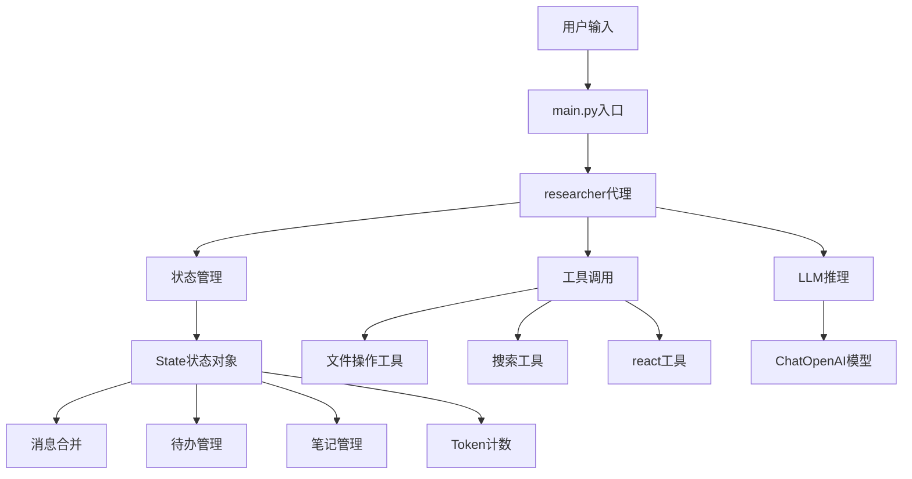
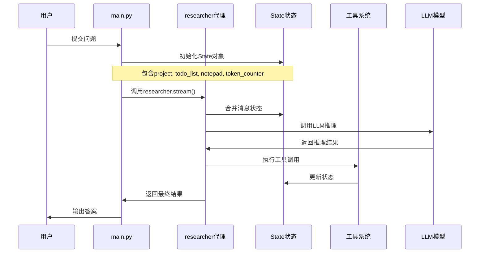
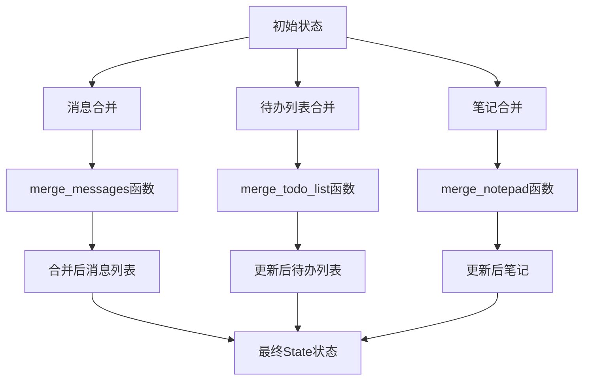
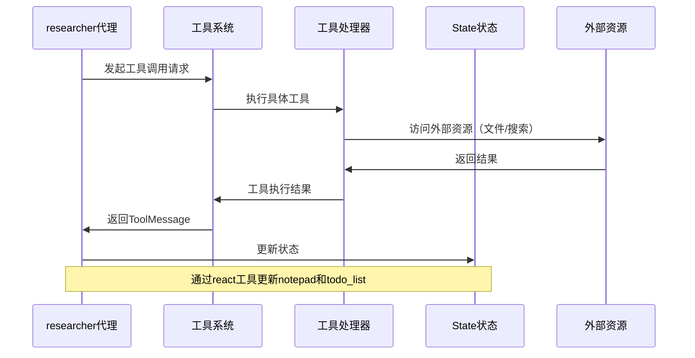
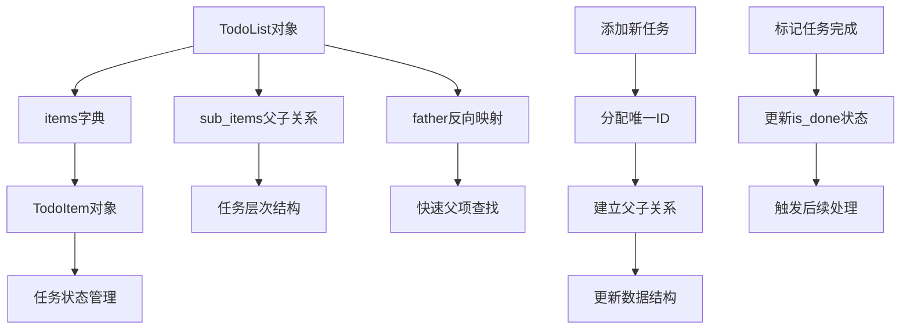
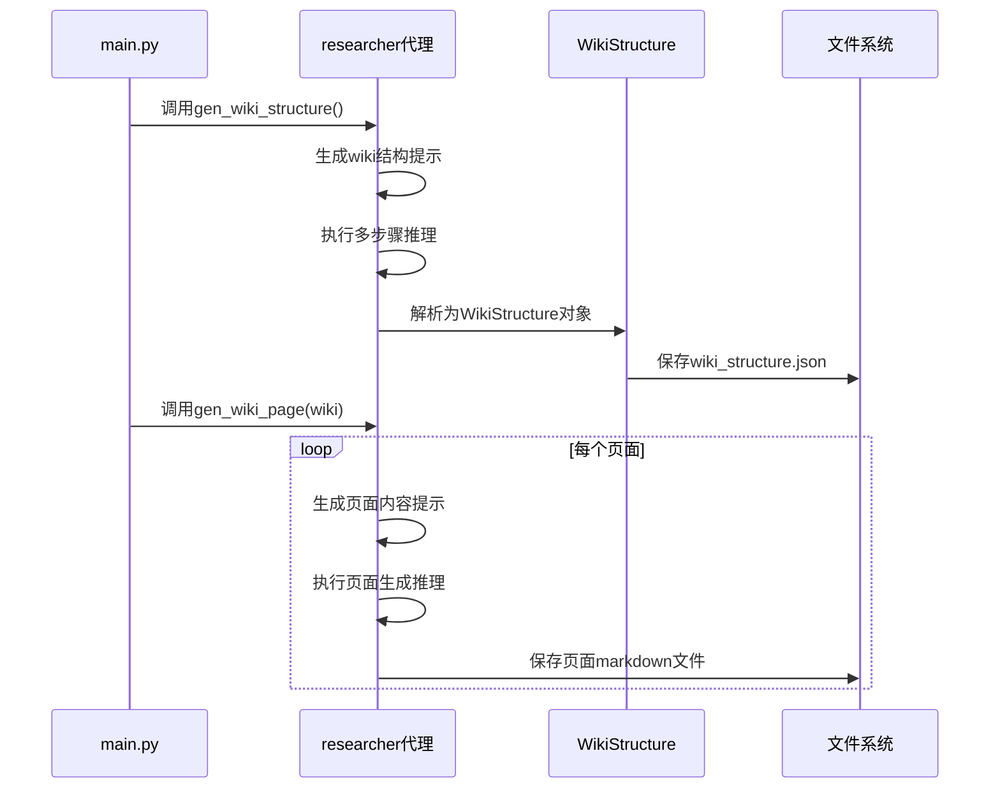
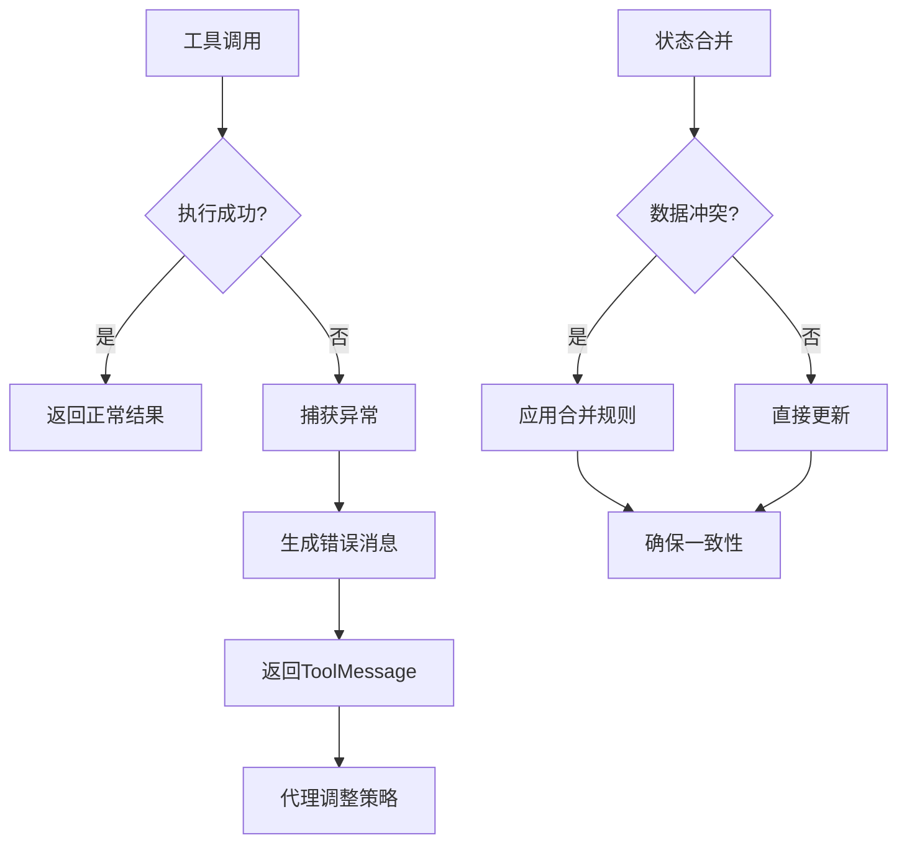

<details>
<summary>相关源文件</summary>

- [main.py:1-100]() 主程序入口，定义了ask()函数和wiki生成流程
- [backend/model/deep_wiki.py:1-26]() 定义了Wiki数据模型，包括Section、Page和WikiStructure类
- [backend/model/state.py:1-104]() 定义了系统状态管理，包含State类和合并函数
- [backend/model/todo_list.py:1-76]() 定义了待办事项管理系统，支持父子关系管理
- [backend/model/notepad.py:1-25]() 定义了简单的笔记管理系统
- [backend/agent/researcher.py:1-94]() 实现了研究代理的核心逻辑和工具集成
- [backend/llm/chat_model.py:1-23]() 实现了LLM集成和配置管理
- [backend/tools/react_tools.py:1-36]() 实现了react工具，用于状态更新和任务管理

</details>

# 数据流设计

## 引言

ace-deepwiki项目的数据流设计围绕一个智能研究代理系统构建，该系统能够处理用户问题、管理项目文件、维护笔记和待办事项，并生成技术wiki文档。整个数据流采用基于状态的管理模式，通过LangGraph框架实现复杂的多步骤推理过程。

系统核心是一个研究代理（researcher），它接收包含项目结构、笔记、待办列表和用户问题的输入消息，通过工具调用和LLM推理生成wiki内容。数据流设计强调状态的一致性和工具的可组合性，支持复杂的wiki生成任务。

## 系统架构概述

### 核心组件架构

系统采用分层架构，各组件通过明确定义的接口进行交互：



系统通过State对象维护整个会话的状态，包括消息历史、项目信息、待办事项、笔记和token使用情况。这种设计确保了数据流的一致性和可追溯性。

<details>
<summary>相关源文件</summary>

- [main.py:1-20]() 定义了主程序入口和核心数据流
- [backend/model/state.py:60-104]() 定义了State类和状态管理机制

</details>

### 数据模型设计

系统使用Pydantic模型定义核心数据结构：

| 模型类 | 主要字段 | 功能描述 |
|--------|----------|----------|
| WikiStructure | title, description, sections, pages | Wiki整体结构定义 |
| Section | id, title, pages, subsections | Wiki章节定义 |
| Page | id, title, description, importance, relevant_files | Wiki页面定义 |
| State | messages, project, todo_list, notepad, token_counter | 系统状态容器 |
| TodoList | items, sub_items, father, id_counter | 待办事项管理 |
| Notepad | notes | 笔记管理 |

这些模型通过类型注解确保数据的一致性和验证，支持复杂的数据流操作。

<details>
<summary>相关源文件</summary>

- [backend/model/deep_wiki.py:1-26]() 定义了Wiki相关数据模型
- [backend/model/state.py:60-104]() 定义了State状态模型
- [backend/model/todo_list.py:1-76]() 定义了待办事项模型
- [backend/model/notepad.py:1-25]() 定义了笔记模型

</details>

## 核心数据流

### 主数据流处理

系统的主数据流通过`main.py`中的`ask()`函数驱动：



这个数据流支持多步骤的推理过程，代理可以根据需要多次调用工具和LLM来完成复杂任务。

<details>
<summary>相关源文件</summary>

- [main.py:10-40]() 定义了ask()函数和主数据流
- [backend/agent/researcher.py:20-50]() 实现了代理的消息处理逻辑

</details>

### 状态合并机制

系统实现了精细的状态合并机制，确保在多步骤推理中状态的一致性：



合并函数处理不同来源的状态更新，避免数据冲突和重复：

- **消息合并**：保留所有HumanMessage，只保留最新的AIMessage和ToolMessage
- **待办列表合并**：基于ID合并，更新现有项，添加新项
- **笔记合并**：基于内容去重，添加新笔记

<details>
<summary>相关源文件</summary>

- [backend/model/state.py:5-58]() 实现了状态合并函数
- [backend/model/state.py:60-104]() 定义了State类的合并注解

</details>

### 工具调用数据流

代理通过工具系统与外部资源交互，工具调用遵循标准的数据流模式：



工具系统包含文件操作、搜索和状态管理工具，支持代理完成复杂的研究任务。

<details>
<summary>相关源文件</summary>

- [backend/agent/researcher.py:60-94]() 定义了工具集成和错误处理
- [backend/tools/react_tools.py:1-36]() 实现了react工具的状态更新机制

</details>

## 具体实现细节

### 消息处理流水线

代理的消息处理采用流水线架构，包含预处理、模型调用和后处理三个阶段：

```python
# 预处理阶段 - log_before_model
def log_before_model(state: State, runtime: Runtime):
    # 合并notepad和todo_list到消息中
    msg = [
        HumanMessage(content=state["notepad"].to_markdown(), id="notepad"),
        HumanMessage(content=state["todo_list"].to_markdown(), id="todo_list"),
    ]
    state["messages"] = merge_messages(state["messages"], msg)

# 后处理阶段 - log_after_model  
def log_after_model(state: State, runtime: Runtime):
    # 更新token计数
    last_message = state["messages"][-1]
    state["token_counter"].completion_tokens += last_message.response_metadata["token_usage"]["completion_tokens"]
    state["token_counter"].prompt_tokens += last_message.response_metadata["token_usage"]["prompt_tokens"]
    state["token_counter"].total_tokens += last_message.response_metadata["token_usage"]["total_tokens"]
```

这种设计确保了数据流的一致性和可观测性。

<details>
<summary>相关源文件</summary>

- [backend/agent/researcher.py:15-50]() 实现了消息处理中间件
- [backend/agent/researcher.py:52-58]() 实现了token计数功能

</details>

### 待办事项管理数据流

待办系统采用树形结构管理任务，支持复杂的任务分解：



这种设计支持代理进行任务分解和进度跟踪，是复杂推理任务的关键支撑。

<details>
<summary>相关源文件</summary>

- [backend/model/todo_list.py:15-50]() 实现了待办事项的添加和管理
- [backend/model/todo_list.py:60-76]() 实现了markdown转换功能

</details>

### Wiki生成数据流

系统支持自动生成wiki结构和个人页面，数据流如下：



这个数据流确保了wiki内容的结构化和一致性。

<details>
<summary>相关源文件</summary>

- [main.py:45-101]() 实现了wiki生成流程
- [backend/model/deep_wiki.py:1-26]() 定义了wiki数据结构

</details>

## 错误处理和容错机制

系统实现了完善的错误处理机制，确保数据流的稳定性：



错误处理机制确保单个工具的失败不会影响整个数据流的执行。

<details>
<summary>相关源文件</summary>

- [backend/agent/researcher.py:60-70]() 实现了工具错误处理
- [backend/model/state.py:5-58]() 实现了状态合并的错误处理

</details>

## 性能优化考虑

数据流设计考虑了性能优化因素：

1. **Token管理**：通过TokenCounter实时跟踪资源使用
2. **消息剪枝**：合并函数避免消息历史无限增长
3. **工具缓存**：合理的工具调用策略减少重复操作
4. **状态序列化**：高效的markdown转换支持状态持久化

<details>
<summary>相关源文件</summary>

- [backend/model/state.py:50-55]() 实现了TokenCounter类
- [backend/model/state.py:30-48]() 实现了消息剪枝逻辑

</details>

## 总结

ace-deepwiki项目的数据流设计体现了现代AI代理系统的典型特征：基于状态的管理、工具的可组合性、多步骤的推理流程。系统通过精细的状态合并机制、完善的错误处理和性能优化策略，确保了复杂wiki生成任务的可靠执行。

数据流设计的核心优势在于其模块化和可扩展性，各组件通过明确定义的接口交互，支持系统的持续演进和功能扩展。这种设计为构建更复杂的AI辅助开发工具奠定了坚实的基础。

<details>
<summary>相关源文件</summary>

- [main.py:1-101]() 整体数据流集成
- [backend/agent/researcher.py:1-94]() 代理核心逻辑
- [backend/model/state.py:1-104]() 状态管理核心
- [backend/tools/react_tools.py:1-36]() 工具交互机制

</details>