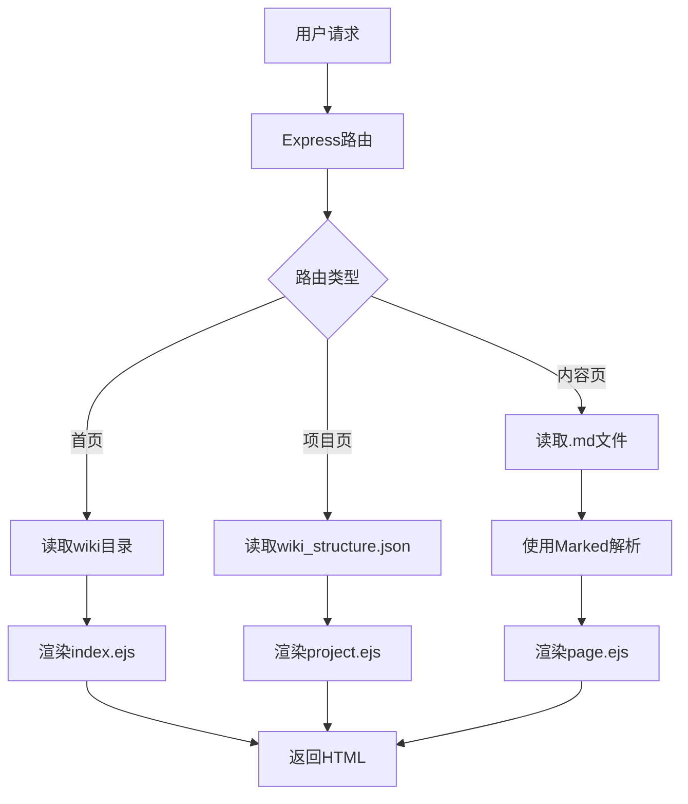

<details>
<summary>相关源文件</summary>

- [frontend/server.js:1-114]() 前端服务器入口，处理路由和渲染逻辑
- [frontend/views/index.ejs:1-28]() 首页模板，显示项目列表
- [frontend/views/project.ejs:1-47]() 项目页面模板，展示项目结构
- [frontend/views/page.ejs:1-90]() 内容页面模板，渲染Markdown和Mermaid图表
- [frontend/public/css/style.css:1-360]() 全局样式表，定义UI组件和布局
- [frontend/package.json:1-17]() 项目依赖配置文件

<!-- 已包含6个相关源文件 -->
</details>

# 前端架构

## 1. 引言

前端架构采用Express.js框架构建，主要功能是渲染技术文档系统。系统包含三个核心页面：项目列表页、项目结构页和文档内容页。架构基于服务端渲染(SSR)模式，使用EJS模板引擎生成HTML，并集成Marked库解析Markdown文档，特别支持Mermaid图表渲染。整个前端系统设计简洁高效，专注于技术文档的展示和导航功能。

## 2. 架构概述

### 2.1 系统组成
前端系统由以下核心组件构成：
- **Express服务器**：处理HTTP请求和路由
- **模板引擎**：使用EJS生成HTML页面
- **Markdown处理器**：使用Marked库转换.md文件
- **Mermaid集成**：渲染技术图表
- **响应式样式**：基于CSS的UI组件系统

### 2.2 数据流


## 3. 核心组件

### 3.1 路由系统
Express服务器定义了三类路由：
1. 首页路由(`/`): 展示所有项目列表
2. 项目路由(`/:project`): 展示特定项目的文档结构
3. 内容路由(`/:project/page/:pageId`): 渲染具体文档内容

路由系统负责协调数据获取和模板渲染，形成完整的前端导航体系。

### 3.2 模板引擎
系统使用EJS模板引擎，包含三个核心模板：

#### 3.2.1 首页模板(index.ejs)
```html
<ul class="project-list">
  <% projects.forEach(project => { %>
    <li>
      <a href="/<%= project %>"><%= project %></a>
    </li>
  <% }); %>
</ul>
```

#### 3.2.2 项目模板(project.ejs)
```html
<% structure.sections.forEach(section => { %>
  <section>
    <h2><%= section.title %></h2>
    <ul class="page-list">
      <% section.pages.forEach(pageId => { %>
        <li>
          <a href="/<%= project %>/page/<%= pageId %>">
            <%= pageInfo.title %>
          </a>
        </li>
      <% }); %>
    </ul>
  </section>
<% }); %>
```

#### 3.2.3 内容模板(page.ejs)
```html
<div class="content-wrapper">
  <aside class="sidebar"><!-- 导航 --></aside>
  <main class="content">
    <article class="markdown-body">
      <%- content %>
    </article>
  </main>
</div>
```

### 3.3 Markdown处理
系统使用Marked库解析Markdown，并特别处理Mermaid代码块：
```javascript
renderer.code = function(code, language) {
  if (language === 'mermaid') {
    return `<div class="mermaid">${code}</div>`;
  }
  return `<pre><code class="language-${language}">${code}</code></pre>`;
};
```

### 3.4 Mermaid集成
内容页面集成Mermaid.js进行图表渲染：
```html
<script>
  mermaid.initialize({
    theme: 'default',
    themeVariables: {
      primaryTextColor: '#000000',
      lineColor: '#333333'
    }
  });
  mermaid.init();
</script>
```

## 4. UI/样式系统

### 4.1 核心样式组件
| 组件 | 功能 | 示例类名 |
|------|------|----------|
| 项目卡片 | 展示项目入口 | `.project-list li` |
| 页面列表 | 文档导航 | `.page-list` |
| 内容容器 | Markdown渲染区 | `.markdown-body` |
| 侧边栏 | 文档导航 | `.sidebar` |

### 4.2 响应式布局
```css
.content-wrapper {
  display: grid;
  grid-template-columns: 250px 1fr;
  gap: 30px;
}

@media (max-width: 768px) {
  .content-wrapper {
    grid-template-columns: 1fr;
  }
}
```

## 5. 依赖管理

### 5.1 核心依赖
| 依赖包 | 版本 | 功能 |
|--------|------|------|
| express | ^4.18.2 | Web框架 |
| marked | ^11.1.1 | Markdown解析 |
| mermaid | ^10.4.0 | 图表渲染 |
| ejs | ^3.1.9 | 模板引擎 |

## 6. 总结

前端架构采用Express+EJS+Marked技术栈，构建了专注于技术文档展示的系统。核心特点包括：
1. 基于服务端渲染的高效内容交付
2. 深度集成的Mermaid图表支持
3. 响应式布局适配多设备
4. 模块化的模板组件设计
5. 清晰的文档导航结构

整个架构简洁高效，完美满足技术文档系统的展示需求，同时保持良好的可维护性和扩展性。