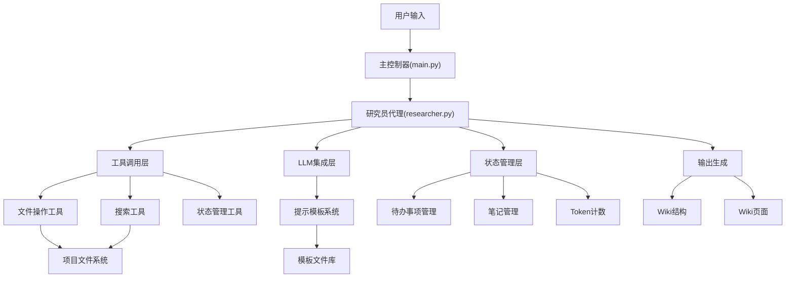
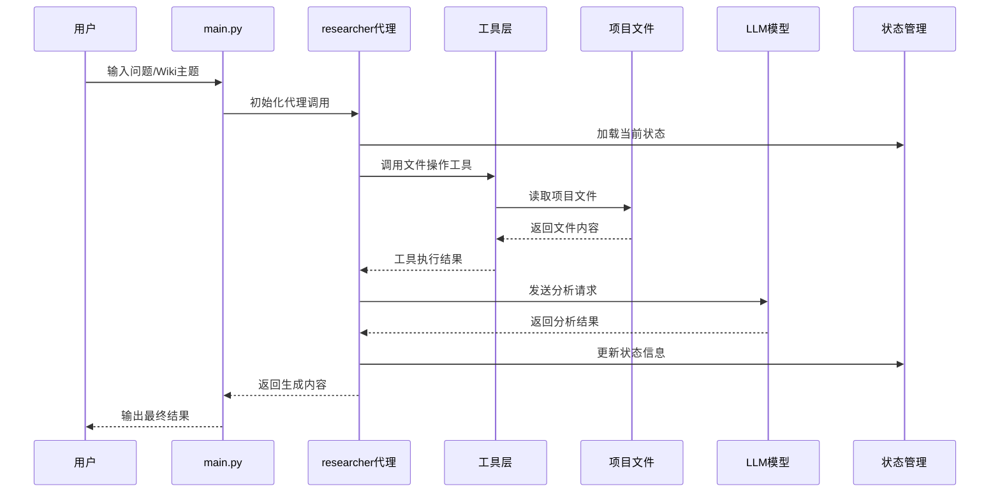
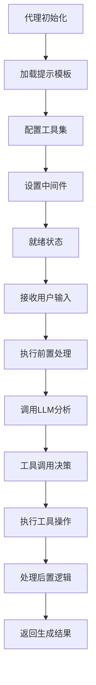
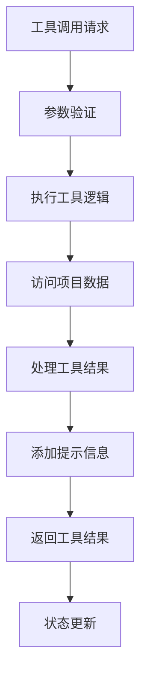
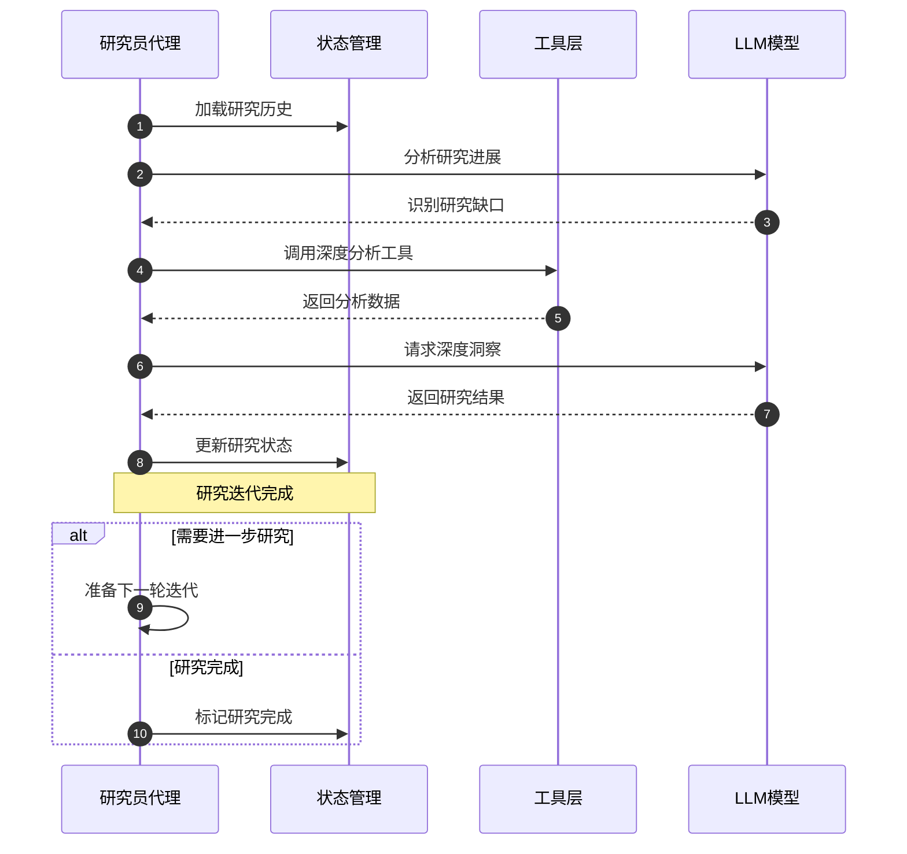
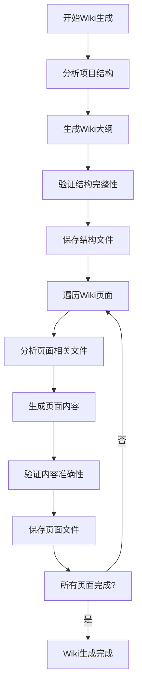
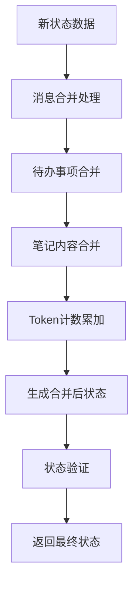

相关源文件

- [main.py:1-100]() 系统主入口，定义了知识生成的问答流程和Wiki页面生成机制
- [backend/agent/researcher.py:1-94]() 研究员代理实现，包含工具调用、状态管理和错误处理
- [backend/model/deep_wiki.py:1-26]() Wiki结构数据模型，定义了Section、Page和WikiStructure类
- [backend/prompts/deep_research.md:1-31]() 深度研究指导原则，强调迭代式研究和持续深入
- [backend/prompts/researcher.jinja-md:1-37]() 研究员工作流程模板，定义了问题分解和迭代解决机制
- [backend/prompts/wiki_structure.jinja-md:1-83]() Wiki结构生成模板，包含章节组织和可视化要求
- [backend/prompts/wiki_page.jinja-md:1-100]() Wiki页面生成规范，详细定义了内容组织和引用要求
- [backend/tools/react_tools.py:1-36]() react工具实现，负责状态管理和工作流程控制
- [backend/tools/code_rag_tools.py:1-90]() 代码RAG工具集，包含文件操作和搜索功能
- [backend/model/state.py:1-100]() 状态管理核心，定义了状态合并和消息处理机制

<!-- Add additional relevant files if fewer than 5 were provided -->

# 知识生成机制

## 引言

ace-deepwiki项目的知识生成机制是一个基于深度搜索和智能代理的自动化Wiki生成系统。该系统通过研究员代理（researcher）对代码库进行深度分析，使用迭代式的研究方法逐步构建完整的Wiki文档结构。整个机制建立在LangChain框架之上，结合了代码检索增强生成（Code RAG）技术和结构化数据建模，能够自动识别项目架构、核心功能和技术实现细节。

该系统采用模块化设计，将知识生成过程分解为Wiki结构生成和Wiki页面生成两个主要阶段，每个阶段都有严格的验证和质量控制机制。通过智能工具调用和状态管理，系统能够确保生成内容的准确性和完整性。

## 系统架构

### 核心组件架构

ace-deepwiki的知识生成系统采用分层架构设计，主要包含代理层、模型层、工具层和状态管理层。

系统通过研究员代理作为核心协调器，整合了文件操作、代码搜索、状态管理和LLM交互等多个模块，实现端到端的知识生成流程。

相关源文件

- [main.py:1-30]() 定义了系统的主入口和核心流程控制
- [backend/agent/researcher.py:1-20]() 研究员代理的导入和基础结构
- [backend/tools/code_rag_tools.py:1-10]() 工具层的导入和基础定义

### 数据流架构

知识生成过程遵循严格的数据流规范，确保信息在各个组件间的正确传递和处理。

数据流从用户输入开始，经过多层处理，最终生成结构化的Wiki内容。每个步骤都有状态跟踪和错误处理机制。

相关源文件

- [main.py:10-30]() 展示了问答流程的数据处理
- [backend/agent/researcher.py:40-60]() 包含工具调用和状态更新逻辑
- [backend/model/state.py:80-100]() 状态管理的核心实现

## 核心功能模块

### 研究员代理机制

研究员代理是知识生成的核心引擎，负责协调整个生成过程。代理基于LangChain框架构建，具备智能工具调用和状态管理能力。

**代理配置参数：**
- 模型集成：通过create_chat_model()集成LLM能力
- 工具集：包含6个核心工具（文件操作、搜索、状态管理）
- 提示模板：使用researcher.jinja-md指导代理行为
- 中间件：包含前置处理、错误处理和后置处理

代理采用迭代式工作流程，每次调用都会基于之前的状态进行深入分析，避免重复工作。

相关源文件

- [backend/agent/researcher.py:60-94]() 代理创建和配置逻辑
- [backend/agent/researcher.py:20-40]() 中间件实现细节
- [backend/prompts/researcher.jinja-md:1-37]() 代理工作指导原则

### Wiki结构建模

系统使用严格的数据模型来定义Wiki结构，确保生成内容的规范性和可验证性。

**核心数据模型：**

| 模型类 | 字段 | 类型 | 描述 |
|-------|------|------|------|
| Section | id | str | 章节标识符 |
| | title | str | 章节标题 |
| | pages | List[str] | 页面引用列表 |
| | subsections | List[str] | 子章节引用 |
| Page | id | str | 页面标识符 |
| | title | str | 页面标题 |
| | description | str | 页面描述 |
| | importance | Literal | 重要性等级 |
| | relevant_files | List[str] | 相关文件列表 |
| | related_pages | List[str] | 相关页面列表 |
| WikiStructure | title | str | Wiki总标题 |
| | description | str | Wiki描述 |
| | sections | List[Section] | 章节列表 |
| | pages | List[Page] | 页面列表 |

这些模型通过Pydantic进行数据验证，确保生成内容的完整性和正确性。

相关源文件

- [backend/model/deep_wiki.py:1-26]() 完整的数据模型定义
- [backend/prompts/wiki_structure.jinja-md:40-60]() 模型字段的详细说明

### 工具集成系统

知识生成系统集成了多种工具来支持代码分析和内容生成。

**工具分类表：**

| 工具类型 | 工具名称 | 功能描述 | 使用场景 |
|---------|---------|----------|----------|
| 文件操作 | file_tree | 获取文件树结构 | 项目结构分析 |
| | file_outline | 获取Python文件大纲 | 代码结构分析 |
| | read_lines | 读取文件内容 | 详细代码分析 |
| 搜索功能 | search_in_folders | 文件夹内搜索 | 关键词定位 |
| | search_in_file | 文件内搜索 | 精确代码查找 |
| 状态管理 | react | 更新笔记和待办事项 | 工作流程控制 |

所有工具都通过统一的ToolRuntime接口进行调用，支持错误处理和状态跟踪。

工具调用过程包含完整的错误处理机制，确保系统的稳定性。

相关源文件

- [backend/tools/code_rag_tools.py:10-50]() 文件操作工具实现
- [backend/tools/code_rag_tools.py:50-80]() 搜索工具实现
- [backend/tools/react_tools.py:1-36]() 状态管理工具实现

## 工作流程详解

### 深度研究流程

系统采用深度研究方法进行知识生成，强调迭代式分析和持续深入。

**研究迭代流程：**

每个研究迭代都基于之前的研究成果，避免重复劳动，确保研究深度。

相关源文件

- [backend/prompts/deep_research.md:1-31]() 深度研究指导原则
- [backend/agent/researcher.py:40-60]() 迭代研究的具体实现

### Wiki生成流程

Wiki生成分为两个主要阶段：结构生成和页面生成。

**完整生成流程：**

每个阶段都有严格的质量控制，包括结构验证和内容验证。

相关源文件

- [main.py:40-70]() Wiki结构生成流程
- [main.py:70-101]() Wiki页面生成流程
- [backend/prompts/wiki_structure.jinja-md:60-83]() 结构生成的具体要求

## 状态管理机制

### 状态合并逻辑

系统采用智能状态合并机制，确保在多轮对话中保持状态的一致性。

**状态合并规则：**

| 状态组件 | 合并策略 | 冲突解决 |
|---------|---------|----------|
| 消息列表 | 保留最近的AI消息和工具消息 | 基于时间戳的优先级 |
| 待办事项 | 基于ID的合并，更新状态 | ID冲突时保留最新状态 |
| 笔记内容 | 基于内容去重合并 | 内容重复时保留最早版本 |

状态合并过程确保系统在长期对话中保持上下文连贯性。

相关源文件

- [backend/model/state.py:10-40]() 待办事项合并逻辑
- [backend/model/state.py:40-70]() 笔记合并逻辑
- [backend/model/state.py:70-90]() 消息合并逻辑

### Token计数管理

系统集成Token计数功能，监控资源使用情况。

**计数指标：**
- 提示Token数：输入到模型的Token数量
- 完成Token数：模型生成的Token数量  
- 总Token数：本次调用的总Token消耗

计数数据用于优化提示设计和控制生成成本。

相关源文件

- [backend/model/state.py:90-100]() Token计数器定义
- [backend/agent/researcher.py:70-80]() Token计数更新逻辑

## 质量保证机制

### 内容验证流程

生成的内容经过多层验证确保质量。

**验证步骤：**
1. **结构验证**：验证生成的JSON结构符合数据模型
2. **内容验证**：检查内容是否基于实际源文件
3. **引用验证**：确保所有重要信息都有正确的源文件引用
4. **格式验证**：验证输出格式符合Markdown规范

### 错误处理机制

系统具备完善的错误处理能力，确保生成过程的稳定性。

**错误类型和处理策略：**

| 错误类型 | 检测方式 | 处理策略 |
|---------|---------|----------|
| 工具执行错误 | 异常捕获 | 返回错误信息，继续处理 |
| 数据验证错误 | Pydantic验证 | 重新生成或修正数据 |
| 格式错误 | 模板验证 | 根据规范重新格式化 |
| 资源限制 | Token计数 | 优化提示或分段处理 |

相关源文件

- [backend/agent/researcher.py:50-60]() 工具错误处理实现
- [main.py:50-60]() 数据验证错误处理
- [backend/prompts/wiki_page.jinja-md:90-111]() 内容质量要求

## 总结

ace-deepwiki的知识生成机制是一个高度自动化的智能文档生成系统，通过研究员代理、深度研究方法和严格的质量控制，能够对代码库进行全面分析并生成结构化的Wiki文档。系统采用模块化设计，整合了文件操作、代码搜索、状态管理和LLM交互等多个技术组件，确保生成内容的准确性、完整性和实用性。

该机制的核心优势在于其迭代式的研究方法和严格的内容验证流程，能够确保生成的知识文档既全面又准确。通过智能工具调用和状态管理，系统能够适应不同规模的项目需求，为软件开发团队提供高效的文档生成解决方案。

相关源文件

- [main.py:1-101]() 完整的系统实现
- [backend/agent/researcher.py:1-94]() 核心代理机制
- [backend/model/deep_wiki.py:1-26]() 数据模型定义
- [backend/prompts/wiki_page.jinja-md:1-111]() 内容生成规范
- [backend/tools/code_rag_tools.py:1-90]() 工具集成实现

