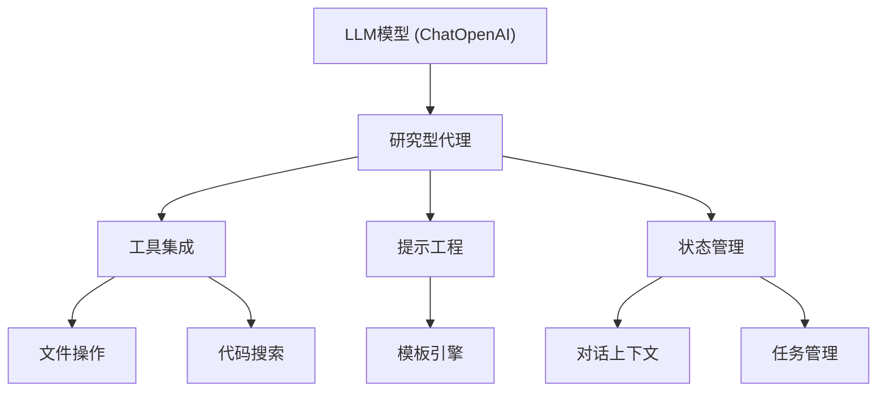
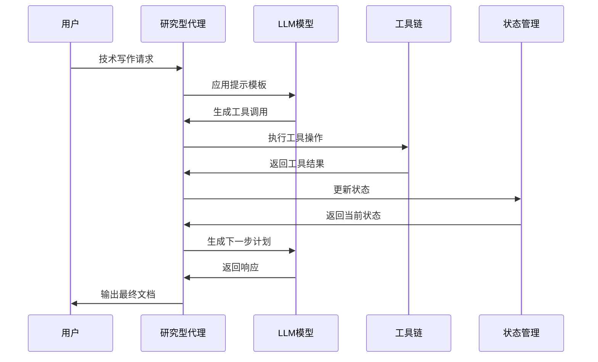

<details>
<summary>相关源文件</summary>

- [./backend/agent/researcher.py:1-94]() 创建研究型代理，集成LLM和工具链
- [./backend/llm/chat_model.py:1-23]() 实现LLM核心配置和初始化
- [./backend/prompts/researcher.jinja-md:1-37]() 定义研究型代理的提示模板
- [./backend/prompts/prompt_template.py:1-17]() 实现提示模板的应用机制
- [./backend/model/state.py:1-100]() 管理LLM交互状态和上下文

<!-- Add additional relevant files if fewer than 5 were provided -->
</details>

# LLM集成

## 1. 引言

LLM集成是本项目的核心架构，负责将大型语言模型能力无缝整合到技术写作工作流中。该系统通过模块化设计实现以下功能：
- 使用ChatOpenAI作为基础模型，通过环境变量灵活配置模型参数
- 创建研究型代理，集成文件操作、代码搜索等工具链
- 应用提示工程引导模型行为，确保技术写作的准确性和一致性
- 管理对话状态和上下文，支持多轮交互式技术文档生成

该架构使系统能够根据代码库自动生成准确、全面的技术文档，特别适合软件项目的wiki页面创建任务。

<details>
<summary>相关源文件</summary>

- [./backend/llm/chat_model.py:10-17]() LLM核心配置实现
- [./backend/agent/researcher.py:7-58]() 研究型代理创建逻辑
- [./backend/prompts/researcher.jinja-md:1-37]() 提示模板定义
- [./backend/model/state.py:70-84]() 状态管理结构
</details>

## 2. 架构设计

### 2.1 核心组件



- **LLM模型**：基于ChatOpenAI实现，通过环境变量配置模型参数
- **研究型代理**：协调模型、工具和状态的核心控制器
- **工具集成**：提供文件操作和代码搜索能力
- **提示工程**：使用Jinja2模板引擎应用行为引导
- **状态管理**：维护对话上下文和任务状态

<details>
<summary>相关源文件</summary>

- [./backend/llm/chat_model.py:10-17]() LLM模型实现
- [./backend/agent/researcher.py:50-58]() 研究型代理创建
- [./backend/tools/react_tools.py]() 工具集成实现
- [./backend/prompts/prompt_template.py:9-11]() 模板引擎应用
- [./backend/model/state.py:70-84]() 状态管理结构
</details>

### 2.2 数据流



- 用户请求触发代理工作流
- LLM根据提示模板生成工具调用
- 工具执行结果更新到状态管理
- 多轮交互后生成最终技术文档

<details>
<summary>相关源文件</summary>

- [./backend/agent/researcher.py:20-40]() 代理工作流中间件
- [./backend/prompts/researcher.jinja-md:8-22]() 分步问题解决流程
- [./backend/model/state.py:45-68]() 消息合并逻辑
</details>

## 3. 关键实现

### 3.1 LLM配置

| 参数 | 类型 | 默认值 | 描述 |
|------|------|--------|------|
| model | string | 环境变量MODEL | 使用的LLM模型名称 |
| base_url | string | 环境变量BASEURL | API端点地址 |
| api_key | string | 环境变量APIKEY | 认证密钥 |
| temperature | float | 0 | 生成多样性控制 |
| top_p | float | 0 | 核采样参数 |
| max_retries | int | 3 | API错误重试次数 |

<details>
<summary>相关源文件</summary>

- [./backend/llm/chat_model.py:12-17]() LLM配置参数实现
</details>

### 3.2 提示工程

提示模板关键要素：
- **分步问题解决**：定义迭代式问题分解流程
- **状态管理**：要求使用react工具管理todo和notepad
- **响应格式**：严格限制为工具调用样式
- **防幻觉机制**：强制引用源文件和避免重复任务

```python
# 提示模板应用示例
def apply_prompt_template(template: str, **kwargs) -> str:
    template_dir = os.path.join(os.path.dirname(__file__))
    loader = FileSystemLoader(template_dir)
    env = Environment(loader=loader)
    template = env.get_template(f"{template}.jinja-md")
    return template.render(**kwargs)
```

<details>
<summary>相关源文件</summary>

- [./backend/prompts/researcher.jinja-md:1-37]() 提示模板内容
- [./backend/prompts/prompt_template.py:9-11]() 模板应用实现
</details>

### 3.3 状态管理

状态数据结构：
```python
class State(TypedDict):
    messages: list[BaseMessage]  # 对话消息
    remaining_steps: int         # 剩余步骤
    project: Project             # 当前项目
    todo_list: TodoList          # 任务列表
    notepad: Notepad             # 笔记记录
    token_counter: TokenCounter  # token统计
```

关键功能：
- **消息合并**：智能压缩对话历史，保留关键上下文
- **任务管理**：支持任务添加、更新和状态跟踪
- **笔记记录**：保存关键发现和代码引用
- **token统计**：监控API使用成本

<details>
<summary>相关源文件</summary>

- [./backend/model/state.py:70-84]() 状态结构定义
- [./backend/model/state.py:7-24]() 任务合并逻辑
- [./backend/model/state.py:26-43]() 笔记合并逻辑
- [./backend/model/state.py:45-68]() 消息合并逻辑
</details>

## 4. 总结

LLM集成是本项目的核心技术架构，通过模块化设计实现了：
1. **灵活模型配置**：支持多种OpenAI模型和自定义API端点
2. **工具链集成**：提供代码搜索和文件操作能力，确保文档准确性
3. **智能提示工程**：引导模型遵循技术写作规范，避免幻觉
4. **状态管理**：维护多轮对话上下文，支持复杂文档生成任务

该架构特别适合技术wiki生成场景，能够根据代码库自动创建准确、全面的技术文档，显著提高开发团队的文档效率和质量。

<details>
<summary>相关源文件</summary>

- [./backend/llm/chat_model.py:10-17]() 模型配置
- [./backend/agent/researcher.py:52-58]() 工具集成
- [./backend/prompts/researcher.jinja-md:1-37]() 提示工程
- [./backend/model/state.py:70-84]() 状态管理
</details>