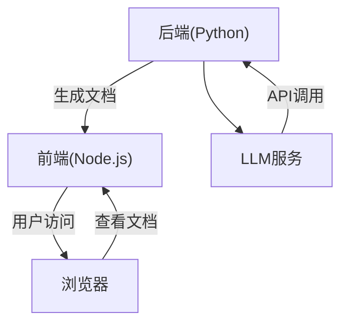
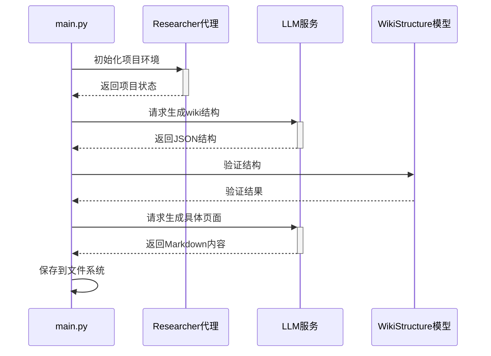
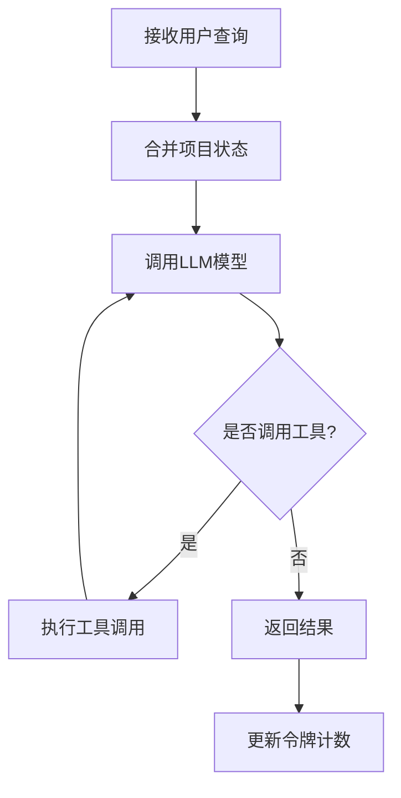

<details>
<summary>相关源文件</summary>

- [README.md:1-100]() 项目概述文档，包含系统定位、核心功能、技术栈和快速启动指南
- [main.py:1-99]() 项目主入口文件，实现文档生成的核心流程和异步任务协调
- [backend/model/deep_wiki.py:1-26]() 定义Wiki文档的核心数据结构模型
- [backend/prompts/deep_research.md:1-31]() 研究代理的提示模板，定义深度研究过程的准则和格式
- [backend/agent/researcher.py:1-94]() 研究代理实现，包含状态管理、工具调用和模型交互逻辑
</details>

# 项目介绍

## 引言
Ace-DeepWiki 是一个基于LLM技术的智能项目文档生成和展示系统，能够自动分析项目代码结构并生成结构化的技术文档。该系统采用前后端分离架构，后端使用Python实现文档生成逻辑，前端使用Node.js实现文档展示界面。核心功能包括代码结构分析、文档内容生成、Markdown渲染和图表可视化，适用于各类软件项目的技术文档自动化生成需求。

<details>
<summary>相关源文件</summary>

- [README.md:1-100]()
- [main.py:1-99]()
</details>

## 系统架构

### 整体架构
Ace-DeepWiki采用前后端分离架构，后端负责文档生成，前端负责文档展示：



- **后端**：基于Python 3.8+，使用LangChain、LangGraph和Pydantic框架
- **前端**：基于Node.js，使用Express.js服务器和EJS模板引擎
- **交互**：后端通过API调用LLM服务生成文档，前端通过HTTP服务展示文档

<details>
<summary>相关源文件</summary>

- [README.md:1-100]()
- [main.py:1-99]()
</details>

### 后端核心模块
后端包含以下关键组件：

| 模块 | 功能描述 | 关键文件 |
|------|----------|---------|
| 智能代理 | 执行文档生成任务 | researcher.py |
| 数据模型 | 定义文档结构 | deep_wiki.py |
| 提示模板 | 管理LLM提示词 | deep_research.md |
| 工具集 | 提供代码分析能力 | react_tools.py |
| 工作空间 | 管理项目环境 | project.py |

<details>
<summary>相关源文件</summary>

- [backend/agent/researcher.py:1-94]()
- [backend/model/deep_wiki.py:1-26]()
- [backend/prompts/deep_research.md:1-31]()
</details>

### 文档生成流程
文档生成分为两个阶段：



1. **结构生成阶段**：调用LLM生成wiki整体结构
2. **页面生成阶段**：为每个页面生成具体内容
3. **验证保存**：验证数据结构后保存到文件系统

<details>
<summary>相关源文件</summary>

- [main.py:1-99]()
- [backend/model/deep_wiki.py:1-26]()
</details>

## 核心模型

### Wiki结构模型
`WikiStructure`模型定义文档的整体结构：

```python
class WikiStructure(BaseModel):
    title: str = Field(..., description="总体标题")
    description: str = Field(..., description="总体描述")
    sections: List[Section] = Field(..., description="章节列表")
    pages: List[Page] = Field(..., description="页面列表")
```

### 页面模型
`Page`模型定义单个页面的元数据：

```python
class Page(BaseModel):
    id: str = Field(..., description="页面ID")
    title: str = Field(..., description="页面标题")
    description: str = Field(..., description="页面描述")
    importance: Literal["high", "medium", "low"] = Field(..., description="重要性级别")
    relevant_files: List[str] = Field(..., description="相关文件列表")
```

<details>
<summary>相关源文件</summary>

- [backend/model/deep_wiki.py:1-26]()
</details>

## 研究代理

### 工作流程
研究代理执行深度代码分析任务：



### 核心功能
- **状态管理**：通过`State`模型管理项目状态
- **工具集成**：提供文件分析、代码搜索等工具
- **错误处理**：通过中间件捕获和处理工具错误
- **令牌计数**：跟踪资源消耗情况

<details>
<summary>相关源文件</summary>

- [backend/agent/researcher.py:1-94]()
- [backend/prompts/deep_research.md:1-31]()
</details>

## 总结
Ace-DeepWiki通过自动化文档生成流程，显著提高了技术文档的创建效率。系统核心优势在于：
1. **智能分析**：利用LLM技术理解代码结构和业务逻辑
2. **结构化输出**：生成符合标准的内容和图表
3. **可扩展架构**：模块化设计支持功能扩展
4. **资源管理**：精确跟踪计算资源消耗

该系统适用于各类软件项目，特别适合需要持续更新技术文档的中大型项目，能够有效降低文档维护成本并提高知识传递效率。

<details>
<summary>相关源文件</summary>

- [README.md:1-100]()
- [main.py:1-99]()
- [backend/agent/researcher.py:1-94]()
</details>