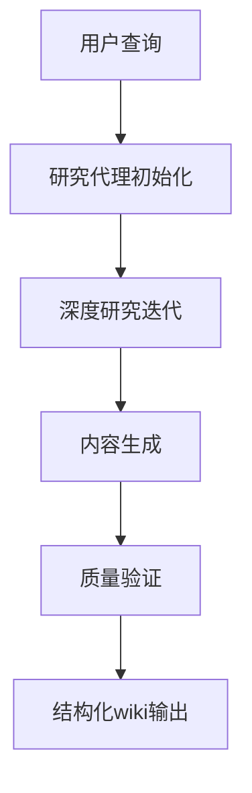
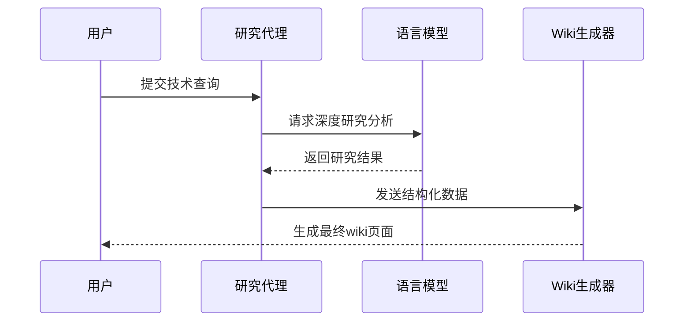
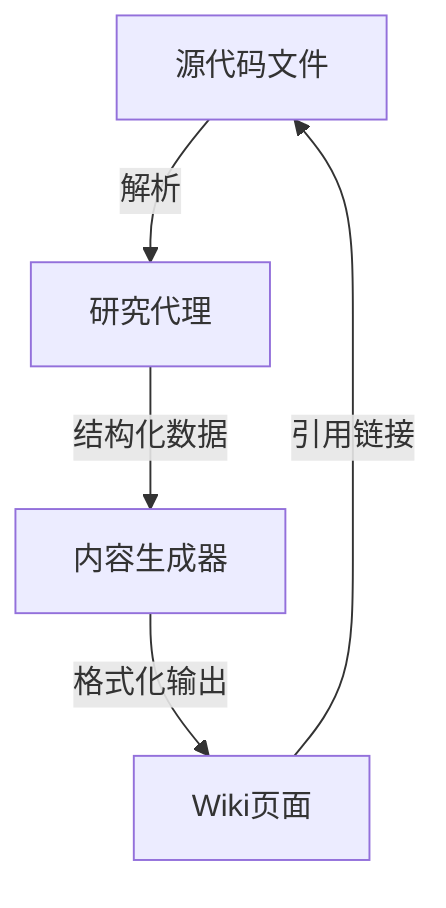

相关源文件

- [backend/prompts/deep_research.md]() 定义深度研究流程和迭代规则，指导如何基于用户查询进行深入分析
- [backend/prompts/researcher.jinja-md]() 描述研究员角色职责和研究工作流程，包含研究迭代指南
- [backend/prompts/wiki_page.jinja-md]() 提供wiki页面生成模板，包含技术文档结构和格式规范
- [backend/prompts/wiki_structure.jinja-md]() 定义wiki整体结构规划，包含页面分类和内容组织原则
- [backend/llm/chat_model.py]() 实现与大型语言模型的交互处理，包含错误处理和日志记录功能
- [backend/agent/researcher.py]() 实现研究代理的核心逻辑，负责执行深度研究任务

# 提示工程

## 引言
提示工程是本项目的核心知识管理机制，负责将代码库中的技术知识转化为结构化的wiki文档。该系统通过深度研究流程分析代码库，使用大型语言模型生成符合规范的技术文档，并确保内容完全基于源代码实现。提示工程定义了从原始代码到结构化知识库的完整转换流程，包括研究迭代、内容生成和质量控制等环节。

## 系统架构
### 研究代理工作流

### 核心组件交互

## 关键功能模块
### 1. 深度研究引擎
- 基于迭代的研究方法，每轮研究聚焦特定技术点
- 强制要求新增信息，禁止重复已有内容
- 严格遵循垂直研究路径，避免主题漂移

### 2. Wiki内容生成器
| 功能 | 描述 | 实现文件 |
|------|------|----------|
| 结构生成 | 创建符合规范的文档框架 | wiki_structure.jinja-md |
| 内容填充 | 将技术细节转化为文档内容 | wiki_page.jinja-md |
| 引用处理 | 自动添加源代码引用 | wiki_page.jinja-md |

### 3. 质量控制系统
- 内容验证：确保所有声明都有源代码支持
- 格式审查：严格执行markdown和mermaid规范
- 完整性检查：要求至少引用5个独立源文件

## 数据流管理

## 部署与扩展
提示工程系统通过模块化设计支持扩展：
1. 新增研究模板：在prompts目录添加.jinja-md文件
2. 自定义输出格式：修改wiki生成模板
3. 集成新工具：在tools目录添加功能模块

## 总结
提示工程系统构建了从代码到文档的自动化知识转换流水线，通过严格的研究流程确保技术准确性，利用模板化生成保证文档一致性。系统深度集成大型语言模型的分析能力与结构化内容生成规则，为技术知识管理提供可扩展的解决方案。