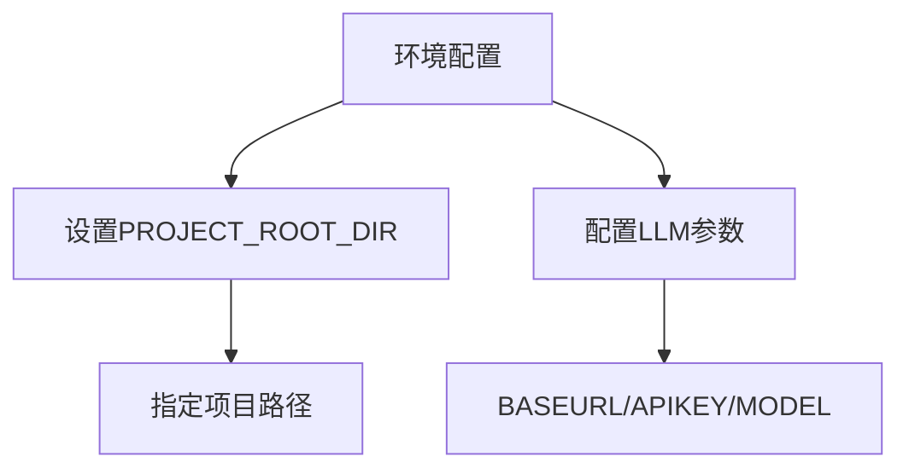
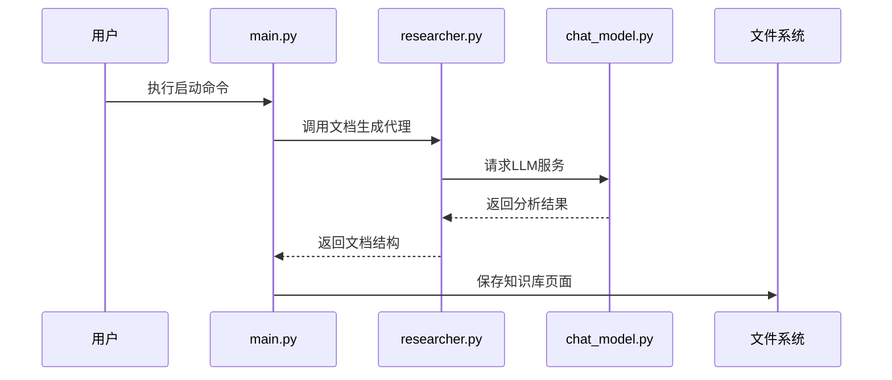
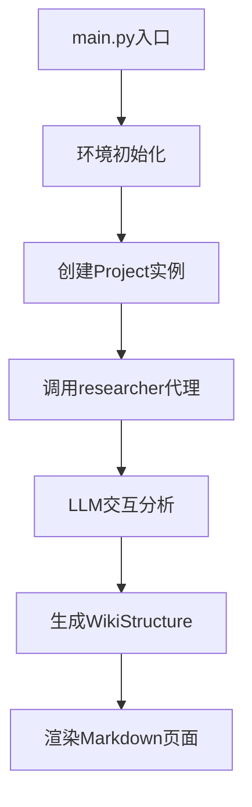
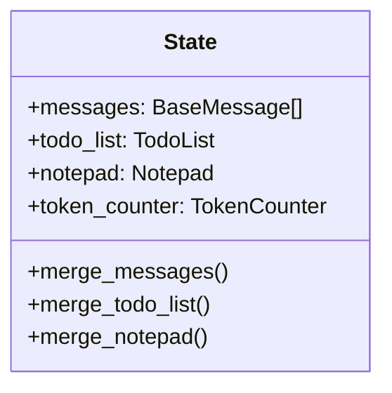

<details>
<summary>相关源文件</summary>

- [main.py:1-99]() 项目主入口，实现快速启动流程：环境初始化、知识库生成和页面渲染
- [README.md:1-100]() 提供完整的快速开始指南，包含环境配置、后端启动和前端部署步骤
- [backend/agent/researcher.py:1-94]() 文档生成核心代理，集成文件操作工具和状态管理机制
- [backend/llm/chat_model.py:1-23]() LLM服务封装，通过环境变量配置模型参数并优化调用
- [backend/model/state.py:1-100]() 实现运行时状态管理，包括消息合并、待办事项同步和笔记整合
</details>

# 快速开始

## 引言
Ace-DeepWiki 是一个基于LLM技术的智能项目文档生成系统，能够自动分析代码结构并生成结构化技术文档。本快速开始指南将帮助您快速配置环境、启动服务并生成第一个知识库页面。系统采用前后端分离架构，后端负责文档生成，前端提供可视化展示。

## 环境配置
### 必需环境变量
在启动前需配置以下环境变量：

| 变量名 | 类型 | 默认值 | 描述 |
|--------|------|--------|------|
| `PROJECT_ROOT_DIR` | 字符串 | 无 | 要分析的项目根目录路径 |
| `BASEURL` | 字符串 | 无 | LLM服务基础地址 |
| `APIKEY` | 字符串 | 无 | LLM API认证密钥 |
| `MODEL` | 字符串 | 无 | 使用的LLM模型名称 |



## 启动流程
### 1. 后端服务启动
执行主入口脚本启动文档生成服务：
```bash
python main.py
```
该命令将：
1. 创建知识库目录结构
2. 分析项目代码生成知识库结构
3. 渲染具体文档页面



### 2. 前端服务启动
进入前端目录并启动服务：
```bash
cd frontend
npm install
npm start
```
服务将在 http://localhost:3000 提供文档访问界面。

## 核心组件
### 文档生成流程


### 状态管理机制
系统通过State类管理运行时状态：


## 验证与访问
完成启动后，通过浏览器访问 http://localhost:3000 查看生成的知识库文档。系统将展示：
- 项目结构导航
- 自动生成的文档内容
- 交互式图表展示

## 总结
本快速开始指南详细介绍了Ace-DeepWiki系统的配置和启动流程。通过环境变量配置、后端服务启动和前端部署三个核心步骤，用户可以快速生成结构化技术文档。系统采用模块化设计，核心组件包括文档生成代理、LLM服务封装和状态管理机制，确保文档生成的准确性和可靠性。

<details>
<summary>相关源文件</summary>

- [main.py:85-87]() 创建知识库目录结构的实现
- [README.md:20-23]() 环境变量配置说明
- [backend/agent/researcher.py:60-66]() 文档生成代理的创建和工具集成
- [backend/llm/chat_model.py:9-16]() LLM服务封装的具体实现
- [backend/model/state.py:78-88]() State类的结构定义
</details>