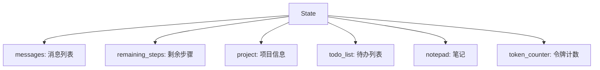
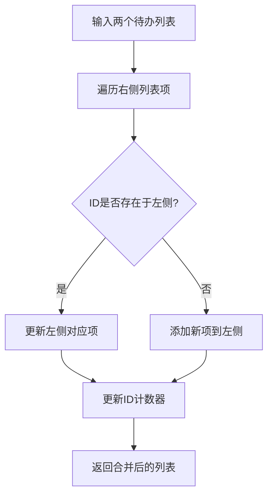
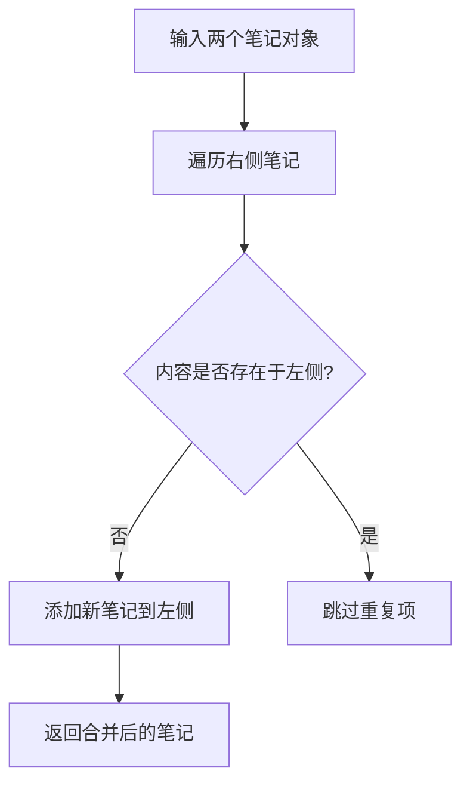
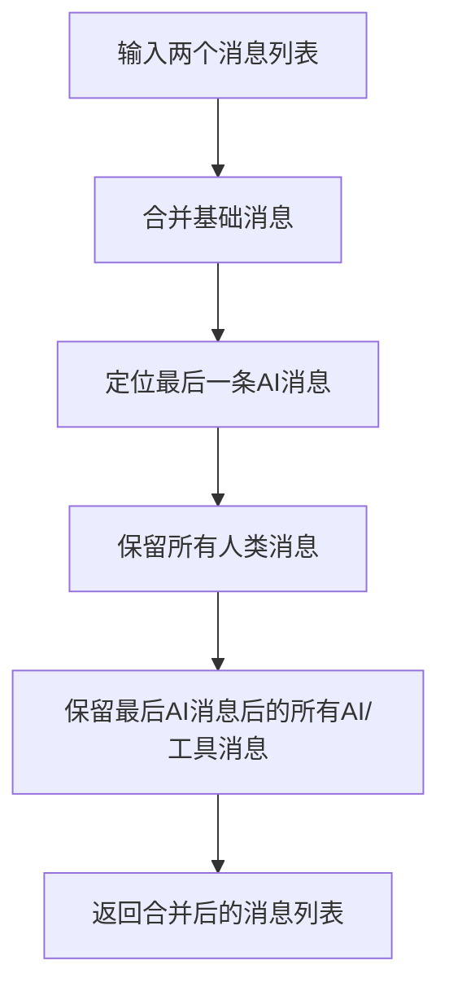
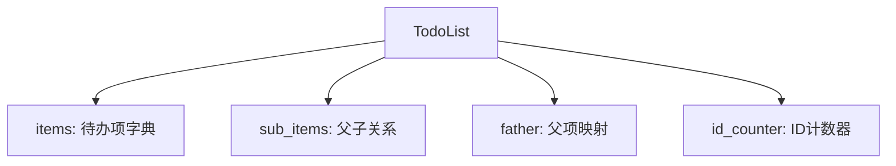
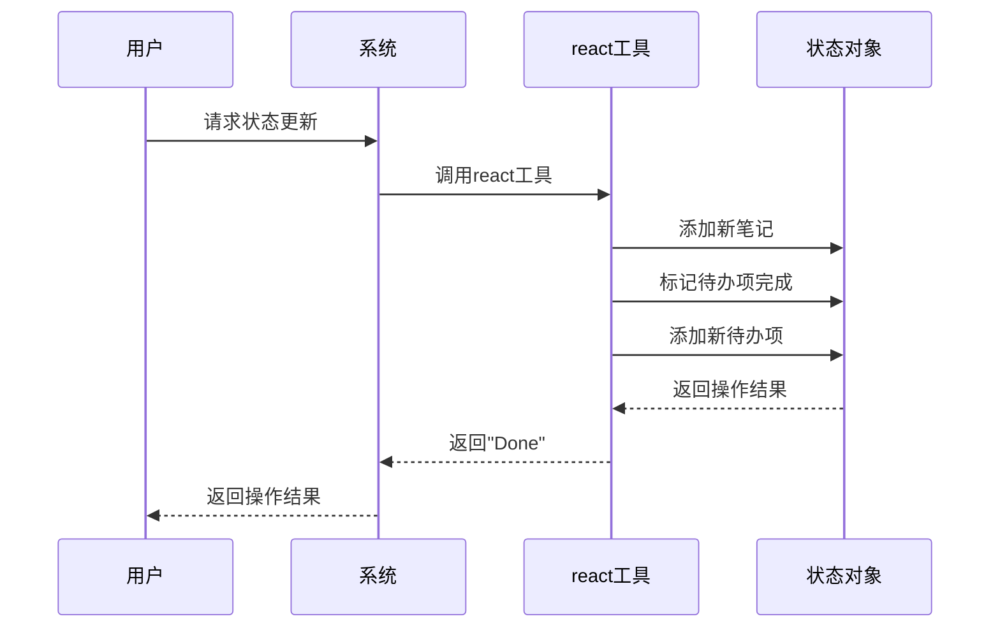

<details>
<summary>相关源文件</summary>

- [backend/model/state.py](backend/model/state.py) 定义了核心状态结构State和状态合并函数
- [backend/model/notepad.py](backend/model/notepad.py) 实现了笔记状态管理功能
- [backend/model/todo_list.py](backend/model/todo_list.py) 实现了待办事项状态管理功能
- [backend/tools/react_tools.py](backend/tools/react_tools.py) 提供了状态更新的核心工具
- [backend/workspace/project/project.py](backend/workspace/project/project.py) 实现了项目状态管理功能
</details>

# 状态管理

## 1. 引言

状态管理是该软件项目的核心机制，负责维护和协调系统运行过程中的各种状态信息。它采用分层结构组织状态数据，包括：

- **消息状态**：记录用户与AI的对话历史
- **任务状态**：管理待办事项列表及其完成状态
- **笔记状态**：保存系统运行过程中的关键发现和见解
- **项目状态**：维护工作空间和项目相关信息
- **令牌计数**：跟踪API调用消耗的令牌数量

状态管理通过合并函数实现状态的增量更新，确保系统在复杂任务处理过程中保持状态一致性。整个状态结构被设计为可序列化，便于持久化和恢复。

<details>
<summary>相关源文件</summary>

- [backend/model/state.py:1-104]() 定义了State结构和状态合并机制
- [backend/model/notepad.py:1-25]() 实现了笔记状态管理
- [backend/model/todo_list.py:1-76]() 实现了待办事项状态管理
</details>

## 2. 核心状态结构

状态管理的核心是`State`类（TypedDict），它包含以下关键组件：



每个组件的作用如下：

| 组件 | 类型 | 描述 |
|------|------|------|
| messages | List[BaseMessage] | 存储用户与AI的对话历史，包括HumanMessage、AIMessage和ToolMessage |
| remaining_steps | int | 记录剩余处理步骤数量 |
| project | Project | 包含项目工作空间信息，如文件树、搜索功能等 |
| todo_list | TodoList | 管理待办事项的树形结构 |
| notepad | Notepad | 存储系统运行过程中的关键笔记 |
| token_counter | TokenCounter | 跟踪API调用的令牌消耗 |

状态对象提供`to_markdown()`方法，可将当前状态转换为Markdown格式，便于展示和调试。

<details>
<summary>相关源文件</summary>

- [backend/model/state.py:1-104]() 定义了State结构和状态合并机制
- [backend/model/state.py:35-45]() 定义了TokenCounter类
- [backend/model/state.py:46-55]() 定义了State类及其to_markdown方法
</details>

## 3. 状态合并机制

状态管理采用增量更新策略，通过专门的合并函数处理状态更新：

### 3.1 待办列表合并 (merge_todo_list)



合并逻辑：
1. 保留左侧列表的基础结构
2. 更新右侧列表中已存在的项
3. 添加右侧列表中的新项
4. 更新全局ID计数器

### 3.2 笔记合并 (merge_notepad)



合并逻辑：
1. 保留左侧笔记的基础集合
2. 添加右侧笔记中的新内容
3. 忽略重复的笔记内容

### 3.3 消息合并 (merge_messages)



合并逻辑：
1. 保留所有人类消息
2. 只保留最近AI消息之后的AI/工具消息
3. 确保对话历史的连贯性

<details>
<summary>相关源文件</summary>

- [backend/model/state.py:5-34]() 实现了merge_todo_list, merge_notepad和merge_messages函数
- [backend/model/state.py:5-18]() merge_todo_list具体实现
- [backend/model/state.py:19-28]() merge_notepad具体实现
- [backend/model/state.py:29-45]() merge_messages具体实现
</details>

## 4. 子状态管理

### 4.1 笔记状态管理 (Notepad)

笔记状态由`Notepad`类管理，包含以下功能：

| 方法 | 参数 | 描述 |
|------|------|------|
| add_note | content: str | 添加新笔记 |
| clear | 无 | 清空所有笔记 |
| to_markdown | 无 | 将笔记转换为Markdown格式 |

笔记数据结构：
```python
class Note(BaseModel):
    content: str

class Notepad(BaseModel):
    notes: List[Note]
```

### 4.2 待办事项管理 (TodoList)

待办事项管理采用树形结构，支持父子任务关系：



关键方法：
- `add_todo(f_id, title)`: 添加新待办项，指定父ID
- `mark_todo_as_done(id)`: 标记待办项为完成
- `remove_todo(id)`: 删除待办项
- `to_markdown()`: 转换为树形Markdown结构

### 4.3 项目状态管理 (Project)

项目状态管理提供工作空间相关功能：

| 方法 | 描述 |
|------|------|
| file_tree() | 获取文件树结构 |
| file_outline() | 获取代码文件大纲 |
| search_in_folders() | 在文件夹中搜索关键词 |
| search_in_file() | 在文件中搜索关键词 |
| read_lines() | 读取文件内容 |
| ignore_rules() | 获取忽略规则 |

<details>
<summary>相关源文件</summary>

- [backend/model/notepad.py:1-25]() Notepad类实现
- [backend/model/todo_list.py:1-76]() TodoList类实现
- [backend/workspace/project/project.py:1-76]() Project类实现
</details>

## 5. 状态更新工具

状态更新通过`react`工具函数实现：



react工具参数：

| 参数 | 类型 | 描述 |
|------|------|------|
| thoughts | str | 当前思考内容 |
| add_note | str | 要添加的笔记内容 |
| mark_todo_as_done | List[int] | 要标记完成的待办项ID |
| ready_to_answer | bool | 是否准备生成最终答案 |
| father_id | int | 父任务ID |
| add_todo | List[str] | 要添加的新待办项 |

<details>
<summary>相关源文件</summary>

- [backend/tools/react_tools.py:1-36]() react工具实现
- [backend/tools/react_tools.py:10-25]() react函数参数说明
- [backend/tools/react_tools.py:26-30]() react函数实现逻辑
</details>

## 6. 总结

状态管理是该软件项目的核心基础设施，它通过分层结构组织各种状态信息，并通过合并机制实现状态的增量更新。关键特点包括：

1. **模块化设计**：将状态分为消息、任务、笔记、项目等独立模块
2. **合并机制**：通过专用函数实现状态的增量更新
3. **树形任务管理**：支持复杂任务的分解和跟踪
4. **工作空间集成**：提供文件操作和搜索能力
5. **可视化支持**：提供状态到Markdown的转换功能

状态管理机制确保了系统在复杂任务处理过程中保持状态的一致性和可追溯性，为AI代理的长期任务处理提供了可靠的基础。

<details>
<summary>相关源文件</summary>

- [backend/model/state.py]() 核心状态结构
- [backend/model/notepad.py]() 笔记状态管理
- [backend/model/todo_list.py]() 待办事项管理
- [backend/tools/react_tools.py]() 状态更新工具
- [backend/workspace/project/project.py]() 项目状态管理
</details>