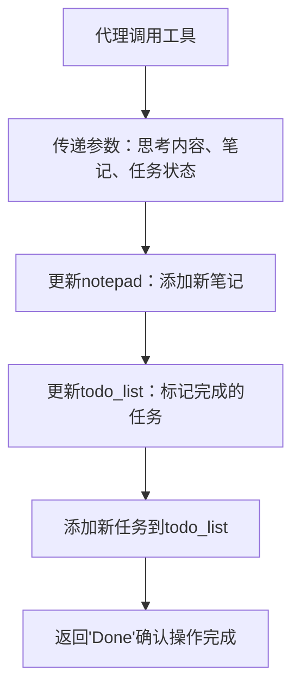
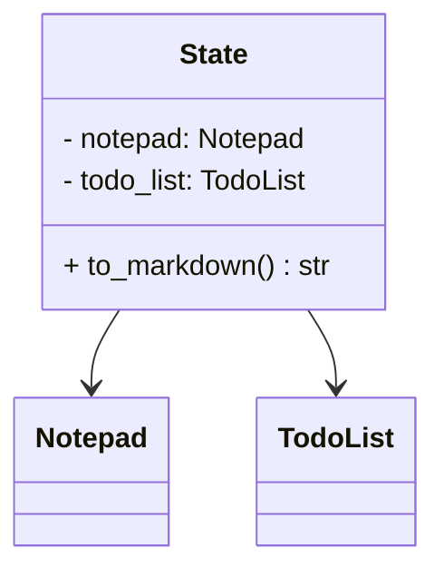
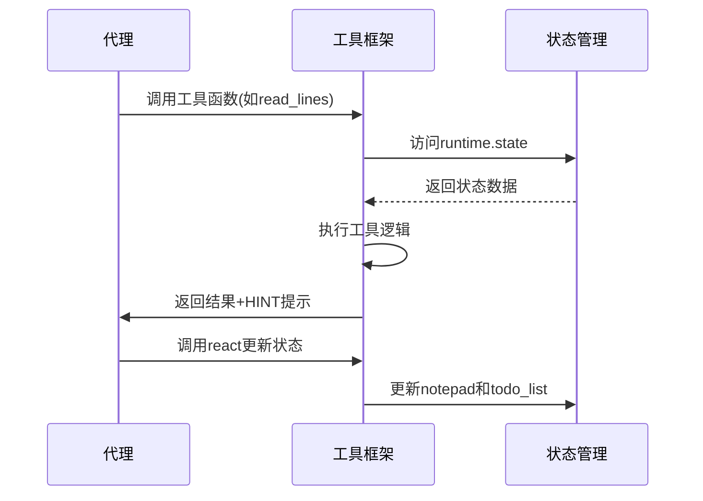

<details>
<summary>相关源文件</summary>

- [backend/tools/react_tools.py](react_tools.py) 包含工具框架的核心交互机制，实现react函数用于管理notepad和todo列表
- [backend/tools/code_rag_tools.py](code_rag_tools.py) 提供文件树、大纲、搜索和读取等基础工具函数
- [backend/agent/researcher.py](researcher.py) 展示工具框架的实际使用方式，包含工具调用和错误处理
- [backend/model/state.py](state.py) 实现工具框架的状态管理，包括notepad和todo列表的维护
- [backend/prompts/researcher.jinja-md](researcher.jinja-md) 包含工具框架的提示模板，指导工具使用流程
</details>

# 工具框架

## 引言
工具框架是本项目的核心交互机制，为智能代理提供了一套标准化的工具调用和状态管理能力。该框架通过`react`函数作为核心交互接口，结合`notepad`和`todo_list`实现状态持久化，支持文件操作、代码分析、搜索等多种工具功能。框架设计遵循"思考-行动-记录"的循环模式，确保工具调用的可追溯性和状态一致性，为复杂任务的分解和执行提供系统化支持。

## 核心交互机制
工具框架的核心是`react`函数，它作为所有工具调用的统一入口，负责管理代理的状态更新和任务调度。

### react函数工作流程


<details>
<summary>相关源文件</summary>

- [backend/tools/react_tools.py:6-34]() react函数的参数定义和实现逻辑
</details>

## 工具函数集
框架提供了一系列基础工具函数，涵盖文件操作、代码分析和搜索等核心功能，所有工具都通过统一的接口规范实现。

### 工具函数概览
| 工具名称 | 功能描述 | 关键参数 |
|---------|---------|---------|
| `file_tree` | 获取目录文件树 | path: 目录路径, max_depth: 最大深度 |
| `file_outline` | 获取Python文件大纲 | path: 文件路径 |
| `search_in_folders` | 文件夹内关键词搜索 | keyword: 关键词, folders: 文件夹列表, file_extensions: 文件扩展名 |
| `search_in_file` | 文件内关键词搜索 | keyword: 关键词, path: 文件路径 |
| `read_lines` | 读取文件指定行范围 | path: 文件路径, from_line: 起始行, to_line: 结束行 |

<details>
<summary>相关源文件</summary>

- [backend/tools/code_rag_tools.py:8-90]() 各工具函数的实现和参数定义
</details>

## 状态管理机制
工具框架通过`State`类统一管理代理的执行状态，确保notepad和todo_list的持久化和一致性。

### State类结构


<details>
<summary>相关源文件</summary>

- [backend/model/state.py:84-104]() State类的定义和to_markdown方法实现
</details>

## 代理集成模式
工具框架通过`create_researcher`函数集成到代理系统中，配置工具集并设置错误处理机制。

### 工具调用序列


<details>
<summary>相关源文件</summary>

- [backend/agent/researcher.py:72-94]() create_researcher函数实现工具集成
- [backend/agent/researcher.py:59-69]() handle_tool_errors工具错误处理机制
</details>

## 提示模板系统
工具框架通过Jinja模板提供标准化的提示指导，确保工具调用的规范性和一致性。

```jinja

您是一个技术文档专家，任务是生成准确的技术维基页面
您可以使用以下工具：
- react: 更新笔记和任务列表
- file_tree: 获取目录文件树
- file_outline: 获取Python文件大纲
- search_in_folders: 文件夹内关键词搜索
- search_in_file: 文件内关键词搜索
- read_lines: 读取文件指定行范围

请遵循以下工作流程：
1. 分析任务需求
2. 调用适当工具收集信息
3. 使用react记录发现和计划
4. 重复直到问题解决

```

<details>
<summary>相关源文件</summary>

- [backend/prompts/researcher.jinja-md]() 工具框架的提示模板内容
</details>

## 总结
工具框架为项目提供了标准化的工具交互机制，通过react函数实现状态管理，code_rag_tools提供基础能力，state模块确保状态一致性，researcher代理展示实际集成方式。该框架支持复杂任务的分解执行，通过标准化的工具调用接口和状态管理机制，确保任务执行的可追溯性和可恢复性，为智能代理的稳定运行提供基础设施支持。