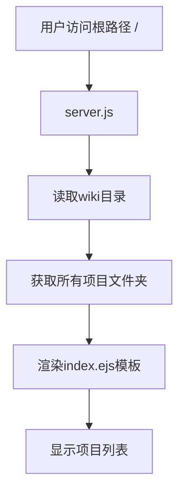
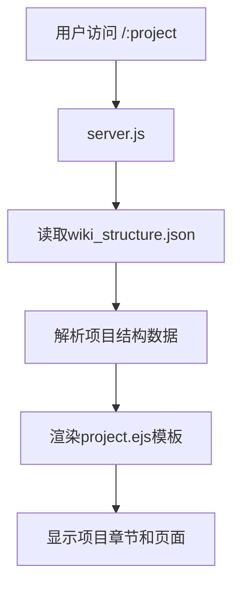
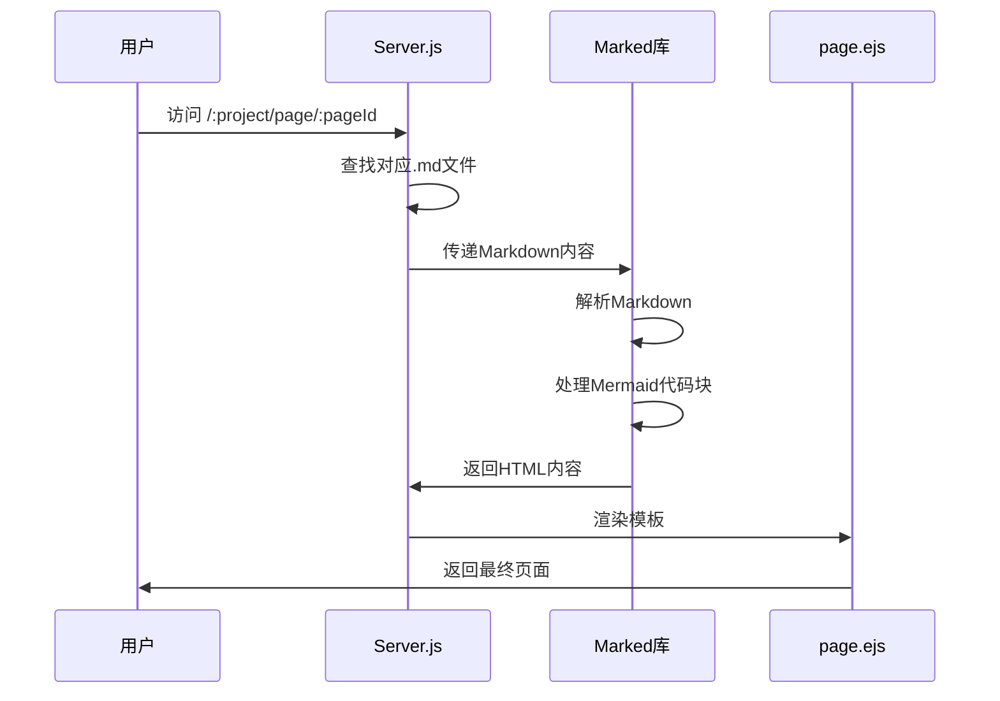
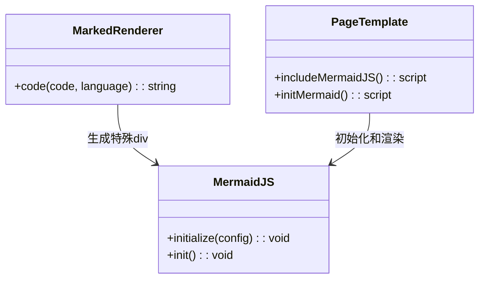
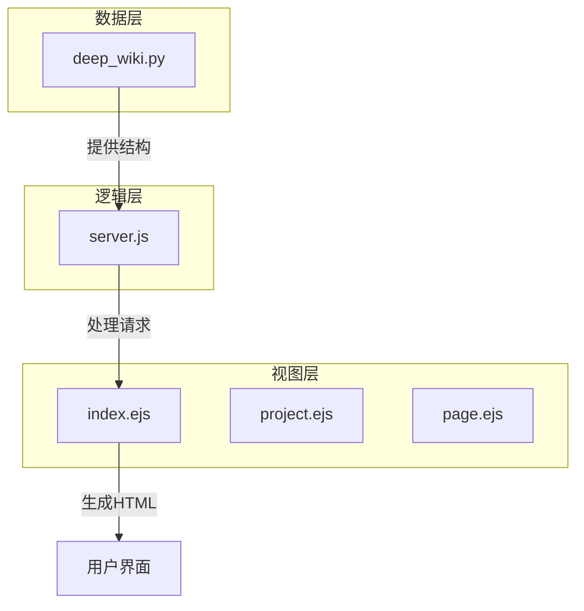

<details>
<summary>相关源文件</summary>

- [deep_wiki.py](./backend/model/deep_wiki.py) 定义Wiki核心数据结构模型
- [server.js](./frontend/server.js) 实现Wiki界面服务器逻辑和路由处理
- [index.ejs](./frontend/views/index.ejs) Wiki项目列表页面模板
- [project.ejs](./frontend/views/project.ejs) 项目概览页面模板
- [page.ejs](./frontend/views/page.ejs) Wiki页面内容展示模板

</details>

# Wiki界面组件

## 1. 介绍

Wiki界面组件是DeepWiki系统的核心用户界面模块，负责展示和管理技术文档内容。该组件采用三层架构设计：

1. **数据层**：定义Wiki内容的结构化数据模型
2. **逻辑层**：处理路由请求和内容渲染
3. **视图层**：提供用户友好的界面展示

整个组件基于Express.js框架构建，使用EJS模板引擎渲染动态内容，并集成Marked库实现Markdown解析，特别支持Mermaid图表渲染功能。用户可以通过该组件浏览项目列表、查看项目结构，并阅读详细的文档内容。

## 2. 核心功能

### 2.1 项目列表展示



- **功能说明**：展示所有可用的Wiki项目
- **实现要点**：
  - 服务器扫描`wiki`目录获取项目列表
  - 使用EJS模板动态生成项目链接
  - 简洁的列表布局，便于用户选择项目

<details>
<summary>相关源文件</summary>

- [server.js:44-50]() 读取wiki目录并获取项目列表
- [index.ejs:12-20]() 项目列表模板实现

</details>

### 2.2 项目结构概览



- **功能说明**：展示特定Wiki项目的整体结构
- **实现要点**：
  - 按章节组织页面内容
  - 显示页面重要性和描述信息
  - 提供直接访问页面的链接
- **界面特性**：
  - 章节标题使用H2标签
  - 页面列表使用卡片式布局
  - 重要性标签使用颜色编码（高=红色，中=橙色，低=绿色）

<details>
<summary>相关源文件</summary>

- [server.js:58-73]() 项目路由处理逻辑
- [project.ejs:14-35]() 项目概览模板实现
- [deep_wiki.py:22-26]() WikiStructure数据结构定义

</details>

### 2.3 页面内容渲染



- **功能说明**：渲染和展示Markdown格式的文档内容
- **核心特性**：
  - 完整支持Markdown语法
  - 特殊处理Mermaid图表代码块
  - 响应式设计适应不同设备
- **技术实现**：
  - 自定义Marked渲染器识别Mermaid代码
  - 客户端初始化Mermaid.js渲染图表
  - 三栏布局（标题栏+导航栏+内容区）

<details>
<summary>相关源文件</summary>

- [server.js:75-100]() 页面内容路由处理
- [page.ejs:14-50]() 页面内容模板
- [page.ejs:60-85]() Mermaid初始化脚本

</details>

### 2.4 Mermaid图表支持



- **实现机制**：
  1. 服务器端：自定义渲染器识别`mermaid`代码块
  2. 客户端：Mermaid.js库解析并渲染图表
  3. 主题配置：预设白天模式样式
- **配置参数**：
  - 主题颜色：`primaryColor: '#0366d6'`
  - 文字颜色：`primaryTextColor: '#000000'`
  - 字体家族：`fontFamily: '-apple-system, ...'`

<details>
<summary>相关源文件</summary>

- [server.js:18-35]() Marked渲染器配置
- [page.ejs:60-85]() Mermaid初始化和配置

</details>

## 3. 系统架构

### 3.1 组件关系



### 3.2 数据结构模型

| 类名 | 属性 | 描述 | 示例值 |
|------|------|------|--------|
| `WikiStructure` | title | 项目标题 | "DeepWiki系统" |
|  | description | 项目描述 | "技术文档管理系统" |
|  | sections | 章节列表 | `[Section1, Section2]` |
|  | pages | 页面列表 | `[Page1, Page2]` |
| `Section` | id | 章节ID | "architecture" |
|  | title | 章节标题 | "系统架构" |
|  | pages | 包含页面 | `["overview", "components"]` |
| `Page` | id | 页面ID | "overview" |
|  | title | 页面标题 | "系统概述" |
|  | importance | 重要性 | "high" |
|  | description | 页面描述 | "系统整体介绍" |

<details>
<summary>相关源文件</summary>

- [deep_wiki.py:1-26]() 完整数据结构定义

</details>

## 4. 关键实现细节

### 4.1 路由处理逻辑

服务器实现了三个核心路由：

1. **GET /** - 项目列表
2. **GET /:project** - 项目概览
3. **GET /:project/page/:pageId** - 页面内容

每个路由都包含错误处理：
- 检查文件是否存在
- 捕获并处理异常
- 返回友好的错误信息

### 4.2 视图模板设计

| 模板文件 | 功能 | 特点 |
|----------|------|------|
| index.ejs | 项目列表 | 简洁列表布局 |
| project.ejs | 项目概览 | 章节分组展示 |
| page.ejs | 页面内容 | 三栏响应式设计 |

所有模板都包含：
- 一致的页头和页脚
- 响应式CSS样式
- 语义化HTML结构

### 4.3 Mermaid集成方案

1. **服务器端**：
   ```javascript
   renderer.code = function(code, language) {
     if (language === 'mermaid') {
       return `<div class="mermaid">${code}</div>`;
     }
     // ...其他代码处理
   }
   ```

2. **客户端**：
   ```javascript
   mermaid.initialize({
     theme: 'default',
     themeVariables: {
       primaryColor: '#0366d6',
       primaryTextColor: '#000000'
     }
   });
   mermaid.init();
   ```

## 5. 总结

Wiki界面组件是DeepWiki系统的核心用户界面模块，它提供了完整的文档浏览和管理功能。通过精心设计的三层架构（数据层、逻辑层、视图层），该组件实现了：

1. **结构化内容展示**：基于JSON Schema的数据模型
2. **高效内容渲染**：Markdown解析和Mermaid图表支持
3. **用户友好界面**：响应式设计和直观导航

该组件不仅提升了技术文档的可读性，还通过可视化图表增强了复杂概念的传达效果。其模块化设计使得扩展和维护变得简单，为DeepWiki系统提供了坚实的前端基础。

<details>
<summary>相关源文件</summary>

- [deep_wiki.py]() 数据模型定义
- [server.js]() 核心逻辑实现
- [page.ejs]() 主界面模板
- [project.ejs]() 项目概览模板
- [index.ejs]() 项目列表模板

</details>